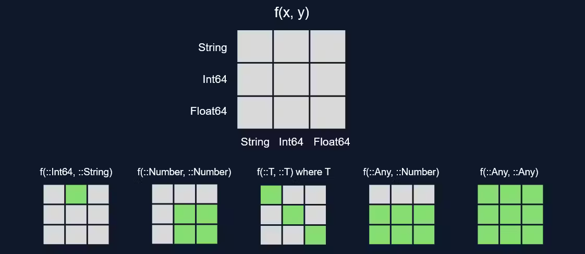
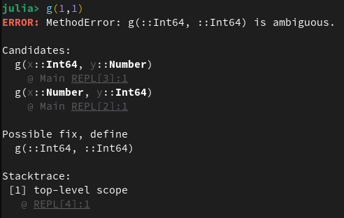
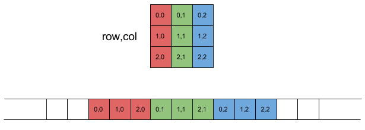

# Julia syntax

## Multiple dispatch

::: {style="text-align: center;"}

:::

## Multiple dispatch example

:::: {.columns}
::: {.column width="50%"}
Function vs method:
```{julia}
#| output: false
f(x) = 2x
f(x::Int) = x
```

:::
::: {.column width="50%"}

```{julia}
#| output-location: fragment
f(1)
```

::: {.fragment}
```{julia}
#| output-location: fragment
f(1.)
```
:::

:::
::::

:::: {.columns}

::: {.column width="35%"}
::: {.fragment}
```{julia}
#| eval: false
#| code-line-numbers: false
g(x::Int, y::Number) = x
g(x::Number, y::Int) = y
g(1,1)
```
:::
:::


::: {.column width="65%"}
::: {.fragment}

:::
:::
::::


## Defining functions

:::: {.columns}
::: {.column width="50%"}

```{julia}
f_in(x) = 2x # inline
```

```{julia}
function f_standard(x)
    2x
end
```

```{julia}
f_anon = x -> 2x # anonymous
```

```{julia}
f_in(1), f_standard(1), f_anon(1)
```

:::
::: {.column width="50%"}

::: {.fragment}
```{julia}
apply(f, x, y) = f(x, y)
```
:::
::: {.fragment}
```{julia}
apply(3, 4) do x1, x2
    x1 + x2
end
```
:::

::: {.fragment}
#### Piping and composing
```{julia}
#| eval: false
f1(x) = x + 1
f2(x) = x * 2
f21 = f1 ∘ f2 # f1(f2(x))
f12(x) = f1(x) |> f2 # f2(f1(x))
```
:::

:::
::::


## Map & reduce
```{julia}
#| output-location: fragment
map(x -> x^2, [1,2,3])
```

::: {.fragment}
```{julia}
#| output-location: fragment
reduce((x,y) -> (x+y)/2, [1,2,3])
```
:::

## Blocks

:::: {.columns}
::: {.column width="50%"}
```{julia}
if 2 >= 1
    println(42)
end
```
```{julia}
begin
    a=1
end
```
```{julia}
let
    a=2
end
```
:::

::: {.column width="50%"}

::: {.fragment}
```{julia}
let x=2
    a=2x
end
```
:::
::: {.fragment}
### Quiz
```{julia}
#| output-location: fragment
begin
    a=1
end
let
    a=2
end
a
```
:::

:::
::::

## If-else

```{julia}
#| eval: false
if x<3
    1
elseif x<5
    2
else
    3
end
```

::: {.fragment}
Ternary op.:
```{julia}
#| eval: false
x > 2 ? true : false
```
:::
::: {.fragment}
```{julia}
#| eval: false
x>2 ? 1 : x<4 ? 2 : 3
```
:::

::: {.fragment}
Julionic if (short-circuit logical operators):
```{julia}
#| eval: false
x>2 && 1
x>2 || 1
```
:::

## Loops

:::: {.columns}
::: {.column width="50%"}
```{julia}
x = 3
while x > 0
    println(x)
    x -= 1
end
```
```{julia}
for i in 1:3
    println(i)
end
```
:::

::: {.column width="50%"}

::: {.fragment}
```{julia}
for i in 1:2, j in 1:2:6
    println("i: ", i, "\tj: ", j)
end
```
:::

:::
::::

## Spaghetti code

::: {.fragment}
```{julia}
#| eval: false
let i = 1, j = 1
    @label start
    if i > 3
        @goto done
    end
    if j > 5
        i += 1
        j = 1
        @goto start
    end
    println(i, j)
    j += 2
    @goto start
    @label done
end
```
:::

## Tuples and keyword arguments

:::: {.columns}
::: {.column width="50%"}

```{julia}
typeof((1,2,3))
```
::: {.fragment}
```{julia}
typeof((a=1,b=2))
```
:::
::: {.fragment}
```{julia}
#| output: false
h(x; k, w) = x+2k/w
```
:::
::: {.fragment}
```{julia}
#| output-location: fragment
h(1, w=2, k=3)
```
:::

:::
::: {.column width="50%"}

::: {.fragment}
### Quiz
```{julia}
#| output-location: fragment
(1,2) < (1,3)
```
:::
::: {.fragment}
```{julia}
#| output-location: fragment
f(;a,b) = a/b
a, b = (1, 2)
f(;b,a)
```
:::
::: {.fragment}
```{julia}
#| output-location: fragment
(;a,b)=(b=1,a=2)
b
```
:::

:::
::::

## String manipulations

:::: {.columns}
::: {.column width="50%"}

```{julia}
'a'^5 * "bc"
```

::: {.fragment}
#### String interpolation
```{julia}
x = 3
s = "x = $x"
```
:::

::: {.fragment}
#### Regex
```{julia}
r = r"1|3"
match(r, "0987654321")
```
:::
:::

::: {.column width="50%"}
::: {.fragment}
`r` is a non-standard string literal:
```{julia}
macro b_str(x)
    parse(Int, x, base=2)
end
b"011"
```
:::

:::
::::


# Arrays

:::: {.columns}

::: {.column width="50%"}
```{julia}
#| output-location: fragment
[1 2]
```
::: {.fragment}
```{julia}
#| output-location: fragment
[1, 2]
```
:::
::: {.fragment}
```{julia}
#| output-location: fragment
[1; 2]
```
:::
::: {.fragment}
```{julia}
#| output-location: fragment
[1 2;
3 4]
```
:::
:::

::: {.column width="50%"}
::: {.fragment}
```{julia}
#| output-location: fragment
[1; 2;; 3; 4]
```
:::
::: {.fragment}
```{julia}
#| output-location: fragment
[1; 2;;
 3; 4;;;
 5; 6;;
 7; 8]
```
:::

:::
::::

## Building arrays
:::: {.columns}

::: {.column width="55%"}
```{julia}
zeros(Int, 1, 2)
```
::: {.fragment}
```{julia}
#| output-location: fragment
Array{Int}(undef, 2)
```
:::
::: {.fragment}
### Array comprehension
```{julia}
[1/(i+j) for i in 1:3, j in 1:3]
```
:::
:::

::: {.column width="45%"}
::: {.fragment}
```{julia}
#| eval: false
for x in (sqrt(x) for x in 2:4)
    println(x)
end
```
equivalent to
```{julia}
for x in Base.Generator(sqrt, 2:4)
    println(x)
end
```
:::
::: {.fragment}
### Quiz
```{julia}
#| output-location: fragment
typeof([;;;;])
```
:::
:::

::::

## Indexing

```{julia}
list = rand(3); # `;` suppresses output
```

Indexing in Julia starts from 1!
```{julia}
list[1] == first(list)
```

::: {.fragment}
```{julia}
list[end] == last(list)
```
:::

::: {.fragment}
```{julia}
#| output-location: fragment
list[:]
```
:::

## Copying

:::: {.columns}
::: {.column width="50%"}

```{julia}
1.0 == 1 # equality
```
::: {.fragment}
```{julia}
#| output-location: fragment
1.0 === 1 # identity
```
:::

:::
::: {.column width="50%"}

::: {.fragment}
```{julia}
#| output: false
A1 = [[1]]
A2 = copy(A1)
A3 = deepcopy(A1)
```
:::
::: {.fragment}
```{julia}
#| output-location: fragment
A1[1] === A2[1]
```
:::
::: {.fragment}
```{julia}
#| output-location: fragment
A1[1] === A3[1]
```
:::

:::
::::

## Array indexing

By default this generates a copy of the array’s data

```{julia}
#| output: false
x = rand(10)
a = x[1:10]
```

::: {.fragment}
To pass it as a “pointer” to the data, it is recommended to use `view`:

```{julia}
#| output: false
a = @view x[1:10]
a = view(x, 1:10)
```
:::


## Array operations

:::: {.columns}
::: {.column width="50%"}

Several array operations are as expected:
```{julia}
2*ones(2)
```
::: {.fragment}
In Julia, `1:3` is a *range*:
```{julia}
dump(1:3)
```
:::
::: {.fragment}
```{julia}
x = collect(1:2)
```
:::

:::
::: {.column width="50%"}

::: {.fragment}
### Broadcasting
`.` before an operation makes it element-wise:
```{julia}
x = x .+ rand(2) # x .+= rand(3)
```
:::
::: {.fragment}
```{julia}
sin.(x)
```
:::

:::
::::

## Column vs row major



## Column major example

```{julia}
using BenchmarkTools
A = rand(1000, 1000);
```

:::: {.columns}
::: {.column width="50%"}
```{julia}
function coliter(A)
    b = 0.
    for r in axes(A, 1), c in axes(A, 2)
        b += A[r, c]
    end
    return b
end
@btime coliter(A);
```
:::
::: {.column width="50%"}
::: {.fragment}
```{julia}
function rowiter(A)
    b = 0.
    for c in axes(A, 2), r in axes(A, 1)
        b += A[r, c]
    end
    return b
end
@btime rowiter(A);
```
:::
:::
::::


## Exception handling

```{julia}
try
    error("error")
catch e
    e
end
```

## Testing

```{julia}
using Test
@test 1 == 1
```

::: {.fragment}
```{julia}
@testset "Test set" begin
    @test 1 == 1
    @test 1 != 2
    @testset "Nested test set" begin
        @test 2 + 2 == 4
        @test 3 * 3 == 9
    end
end
```
:::

## File IO

```{julia}
open("test.txt", "w") do input
    write(input, "Hello World!")
end
```

```{julia}
rm("test.txt")
```
