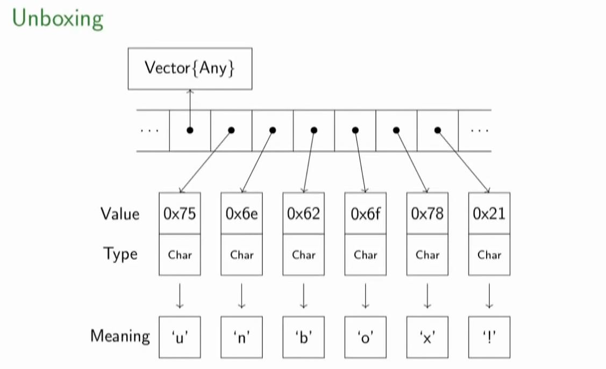

# Julia's type system

```{julia}
#| output-location: fragment
typeof([])
```
::: {.fragment}
```{julia}
typeof([1,2,3])
```
:::
::: {.fragment}
```{julia}
typeof(Float64[1,2,3])
```
:::

:::: {.columns}

::: {.column width="50%"}
::: {.fragment}
```{julia}
typeof(1)
```
```{julia}
typeof(1.)
```
:::
:::

::: {.column width="50%"}
::: {.fragment}
```{julia}
typemax(1)
```
:::
::: {.fragment}
```{julia}
eps(1.)
```
:::
:::

::::

## Julia's type hierarchy

:::: {.columns}
::: {.column width="50%"}
```{julia}
supertypes(Int32)
```

```{julia}
subtypes(Real)
```

```{julia}
typejoin(Rational,AbstractIrrational)
```

:::
::: {.column width="50%"}

::: {.fragment}
```{julia}
dump(2//3)
```
:::
::: {.fragment}
### Quiz
```{julia}
#| output-location: fragment
typeintersect(Integer, Rational)
```
:::
::: {.fragment}
```{julia}
#| output-location: fragment
Integer <: Rational
```
:::

:::
::::

## Beware of untyped containers

```{julia}
#| eval: false
function f()
    numbers = [] # Same as Any[]
    for i in 1:10
        push!(numbers, i)
    end
    return sum(numbers)
end
```

::: {.fragment}
::: {style="text-align: center;"}

:::
:::


## Beware of global variables

:::: {.columns}
::: {.column width="50%"}
Problem:
```{julia}
x = 10
f(n) = n + x
@code_warntype f(10)
```
:::
::: {.column width="50%"}
::: {.fragment}
Solution:
```{julia}
const y = 10
f(n) = n + y
@code_warntype f(10)
```
:::
:::
::::


## Enumerators
```{julia}
@enum Color red blue green
c = red
```

## Creating types
```{julia}
struct MyStruct # convention: type names start with capital letter
    field::Int
end

x = MyStruct(1)
```

::: {.fragment}
```{julia}
using Test
@test_throws ErrorException x.field = 2
```
:::

::: {.fragment}
```{julia}
mutable struct MyMutableStruct
    field::Float64
end
```
:::

## Concrete types

```{julia}
x = 2//3
dump(x)
```
::: {.fragment}
```{julia}
fieldnames(typeof(x))
```
```{julia}
x.den
```
:::

:::: {.columns}
::: {.column width="50%"}
::: {.fragment}
```{julia}
isconcretetype(typeof(x))
```
:::
:::

::: {.column width="50%"}
::: {.fragment}
```{julia}
isconcretetype(Real)
```
:::
:::
::::


## Abstract types

:::: {.columns}
::: {.column width="50%"}
```{julia}
abstract type Animal end
```

::: {.fragment}
```{julia}
#| output: false
struct Dog <: Animal
    breed::String
end

struct Cat <: Animal
    breed::String
end

pluto = Dog("Mixed")
gingi = Cat("Siberian")

talk(x::Animal) = "?"
talk(x::Cat) = "Meow"
```
:::

:::
::: {.column width="50%"}

::: {.fragment}
```{julia}
#| output-location: fragment
talk(gingi)
```
:::
::: {.fragment}
```{julia}
#| output-location: fragment
talk(pluto)
```
:::
::: {.fragment}
#### Callable structs (functors)
```{julia}
function (f::Cat)(x::Int)
    println("I'm a $(f.breed) cat!")
    println("Meow! "^x)
end
gingi(3)
```
:::

:::
::::

## Parametric types

:::: {.columns}

::: {.column width="50%"}
```{julia}
#| eval: false
struct X{T}
    field1::T
    field2::T
end
```
```{julia}
#| eval: false
struct Y{T<:Real}
    field::T
end
```
```{julia}
#| eval: false
Vector{T} where Int<:T<:Real
```
:::

::: {.column width="50%"}
::: {.fragment}
#### Quiz
```{julia}
#| output-location: fragment
Tuple{Real,Real} <: Tuple{T,T} where T
```
:::
::: {.fragment}
```{julia}
#| output-location: fragment
(1,1.) isa Tuple{Real,Real}
```
:::
::: {.fragment}
```{julia}
#| output-location: fragment
(1,1.) isa Tuple{T,T} where T
```
:::
:::

::::


## Beware of abstract field types

```{julia}
#| code-line-numbers: "1,3|4,5|"
#| output-location: fragment
struct MyNumber
    val::Number
end
f(number::MyNumber) = number.val^2 + sqrt(number.val)
number = MyNumber(3.0)
@code_warntype f(number)
```

## Concrete fields

```{julia}
struct MyNumConcrete
    val::Float64
end
```

```{julia}
f(num::MyNumConcrete) = num.val^2 + sqrt(num.val)
num = MyNumConcrete(3.0)
@code_warntype f(num)
```

## Parametric types

```{julia}
struct MyNumParametric{A <: Number}
    val::A
end
```

```{julia}
f(num::MyNumParametric) = num.val^2 + sqrt(num.val)
num = MyNumParametric(3.0)
@code_warntype f(num)
```

## Mutating functions

When the function is mutating the name ends with an exclamation point:
```{julia}
a = collect(1:2)
push!(a,1)
a
```

## Closures
```{julia}
fclose = let a=0
    function _fclose(x)
        a += 1
        a*x
    end
end
```

::: {.fragment}
```{julia}
#| output-location: fragment
fclose(1)
```
:::
::: {.fragment}
```{julia}
#| output-location: fragment
fclose(1)
```
:::
::: {.fragment}
```{julia}
fclose.a
```
:::

## Dictionaries (maps)

```{julia}
d = Dict()
d[3.14] = π
```

::: {.fragment}
Beware:
```{julia}
d = Dict{Int,Float64}(1 => π, 2 => ℯ)

using Test
@test_throws InexactError d[3.14] = π
```
:::


## Sets

```{julia}
a = Set([1,2,1])
b = Set([1,3])
intersect(a,b)
```

```{julia}
union(a,b)
```

# Linear algebra

```{julia}
H = [1/(i+j) for i in 1:2, j in 1:2]
```

::: {.fragment}
```{julia}
H*inv(H)
```
:::
::: {.fragment}
```{julia}
bH = big.(H)
bH*inv(bH)
```
:::

## Numerical precision

:::: {.columns}
::: {.column width="50%"}

```{julia}
#| output-location: fragment
bitstring(UInt8(3))
```

::: {.fragment}
```{julia}
#| output-location: fragment
bitstring(Float16(1+2^(-10)))
```
:::

::: {.fragment}
```{julia}
setprecision(32)
bigH = big.(H)
bigH*inv(bigH)
```
:::


:::
::: {.column width="50%"}

::: {.fragment}
```{julia}
#| code-line-numbers: "2|4|"
setprecision(512)
setrounding(BigFloat,RoundDown)
ans_down = bigH*inv(bigH)
setrounding(BigFloat,RoundUp)
ans_up = bigH*inv(bigH)
ans_down - ans_up
```
:::
::: {.fragment}
```{julia}
eps(bigH[1])
```
:::

:::
::::

::: {.fragment}
#### Quiz
```{julia}
#| output-location: fragment
1.0 + eps(0.) - 1.0 == 1.0 - 1.0 + eps(0.)
```
:::
