## Roadmap

:::: {.columns}
::: {.column width=70%}
<span style="font-size: 80%;">
<ul>
  <li>Introduction to the library</li>
  <li>Graph and message passing</li>
  <li>GNNs: definition and training</li>
  <li>What GNN can do?</li>
  <li>Popular GNN layers</li>
  <li>Heterogeneous graphs</li>
  <li>Hands on</li>
</ul>
</span>
:::
::: {.column width=30%}
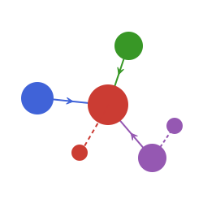
:::
::::

## Roadmap

<span style="font-size: 80%;">
<ul>
  <li style="font-weight: bold; color: red;">Introduction to the library</li>
  <li>Graph and message passing</li>
  <li>GNNs: definition and training</li>
  <li>What GNN can do?</li>
  <li>Popular GNN layers</li>
  <li>Heterogeneous graphs</li>
  <li>Temporal graphs</li>
  <li>Hands on</li>
</ul>
</span>

## GraphNeuralNetworks.jl

Open-source Julia framework for building and training GNNs.

:::: {.columns}
::: {.column width=80%}
<span style="font-size: 80%;">
  <ul>
  <li>Inspired by PyTorch Geometric, Deep Graph Library, and GeometricFlux.jl</li>
  <li>The mono-repository contains:</li>
    <ul>
      <li><code>GraphNeuralNetwork.jl</code>: Stateful graph convolutional layers based on Flux.jl</li>
      <li><code>GNNLux.jl</code>: Stateless graph convolutional layers based on Lux.jl</li>
      <li><code>GNNlib.jl</code>: Basic message passing functions and functional graph convolution layers</li>
      <li><code>GNNGraphs.jl</code>: Graph data structures and helper functions</li>
    </ul>
  </ul>
</span>
:::
::: {.column width=20%}

Created by Carlo Lucibello
:::
::::

## GraphNeuralNetworks.jl's Ecosystem

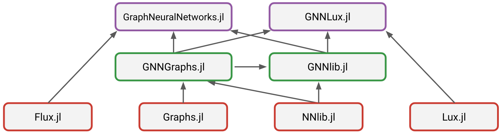

## Roadmap

<span style="font-size: 80%;">
<ul>
  <li>Introduction to the library</li>
  <li style="font-weight: bold; color: red;">Graph and message passing</li>
  <li>GNNs: definition and training</li>
  <li>What GNN can do?</li>
  <li>Popular GNN layers</li>
  <li>Heterogeneous graphs</li>
  <li>Temporal graphs</li>
  <li>Hands on</li>
</ul>
</span>

## What is a Graph?

A **graph** $G=(V,E)$ is a data structure where $V$ is the set of **nodes** and $E$ is the set of **edges** (connections between nodes)

:::: {.columns}

::: {.column width=60%}
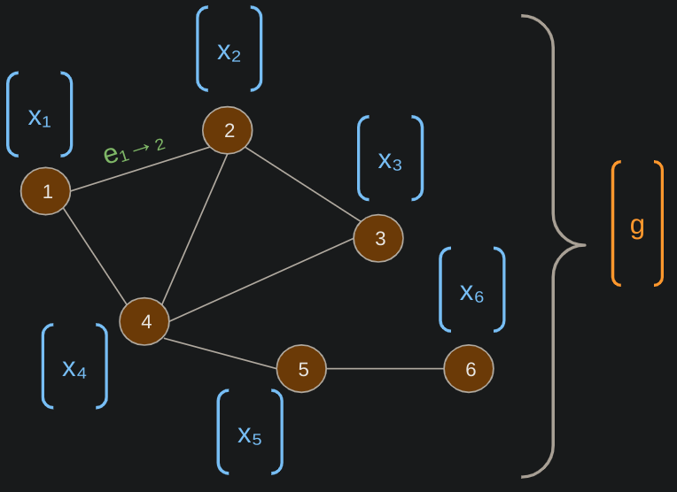
:::

::: {.column width=40%}
- Features can be associated with nodes, edges, and the whole graph
- $x_i$ are node features, and $g$ represents the graph feature.
:::

::::

## Graph creation: random
:::: {.columns}

::: {.column width=50%}
<span style="font-size: 100%;">
GNN graphs are symmetric directed
</span>
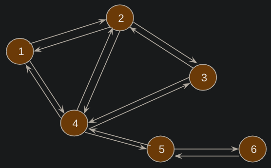

<span style="font-size: 100%;">
Let's create a random graph and add node, edge and graph features
</span>
:::
::: {.column width=50%}
::: {.fragment}
```{julia}
#| code-line-numbers: "1|2|4|5|6|"
#| output-location: fragment
using GraphNeuralNetworks
g = rand_graph(10,60)

g.ndata.x = rand(2, 10)
g.edata.e = rand(1, 60)
g.gdata.g = rand(3, 1)
g
```
:::
:::
::::

## Graph creation: from adjacency matrix and list

:::: {.columns}
::: {.column width=40%}
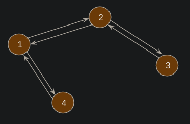
:::
::: {.column width=60%}
::: {.fragment}
```{julia}
#| code-line-numbers: "1-4|5|"
#| output-location: fragment
A = [0 1 0 1;
     1 0 1 0;
     0 1 0 0;
     1 0 0 0]
g_mat = GNNGraphs.GNNGraph(A);
```
:::
::: {.fragment}
```{julia}
#| code-line-numbers: "1|2|"
#| output-location: fragment
adjlist = [[2, 4], [1, 3], [2], [1]]
g_adj = GNNGraphs.GNNGraph(adjlist)
adjacency_matrix(g_adj)
```
:::
:::
::::

## Graph creation: from edge list

<div style="text-align: center;">

</div>

```{julia}
#| code-line-numbers: "1|2|3|4|5|"
#| output-location: fragment
source = [1, 1, 2, 2, 3, 4]
dest = [2, 4, 1, 3, 2, 1]
W = [1, 1, 1, 2.0, 1, 1]
g_list = GNNGraphs.GNNGraph(source, dest, W)
adjacency_matrix(g_list)
```

## Message Passing in GNNs

<span style="font-size: 85%;">
1. Every node computes a **message** for each of its neighbors
$$
m_{j \to i} = \phi(x_i, x^{(out)}_j, e_{ij})
$$
</span>

::: {.fragment}
<span style="font-size: 85%;">
2. Each node **aggregates** incoming messages using a permutation-invariant function
$$
\bar{m}_i = \operatorname{aggregate}_{j \in N(i)} m_{j \to i}
$$
</span>
:::

::: {.fragment}
<span style="font-size: 85%;">
3. Node **updates** its attributes based on current features and aggregated messages
$$
x_i = \operatorname{update}(x_i, \bar{m}_i)
$$
</span>
:::

## Plotting a graph

:::: {.columns}
::: {.column width=50%}
```{julia}
g = rand_graph(10, 30);

n = g.num_nodes
using Karnak, Colors
gdraw = @drawsvg begin
  sethue("white")
  drawgraph(g,
    layout=stress,
    vertexlabelfontsizes = 28,
    vertexshapesizes = 20,
    vertexlabels = 1:n,
    vertexfillcolors =
      distinguishable_colors(n;
        lchoices=50:1:100)
  )
end;
```
:::
::: {.column width=50%}
```{julia}
#| echo: false
gdraw
```
:::
::::

## The Message Passing Phase

- $x_i$ node feature,
- $x^{out}_j$ received feature from each neighbor,
- $e_{ij}$ edge feature
```{julia}
#| code-line-numbers: "1|2|3|5|6|"
#| output-location: fragment
ϕ(x_i, xout_j, eij) = xout_j
x_i, xout_j = rand(1,10), rand(1,10)
agg = +

mji = apply_edges(ϕ, g, xj = xout_j)
mbar = aggregate_neighbors(g, agg, mji)
```
::: {.fragment}
the last two can be combined with `propagate`
```jl
mbar = propagate(ϕ, g, agg, xj = xout_j)
```
:::

## The Update Phase

After
$$
\begin{align*}
m_{j \to i} = \phi(x_i, x^{(out)}_j, e_{ij}) \\
\bar{m}_i = \operatorname{aggregate}_{j \in N(i)} m_{j \to i}
\end{align*}
$$
we have to do
$$
x_i = \operatorname{update}(x_i, \bar{m}_i)
$$

```{julia}
relu(x) = max(0, x) # or `using Flux: relu`
update(x, mbar) = relu(mbar)
x_i = update.(x_i, mbar)
```

## Roadmap

<span style="font-size: 80%;">
<ul>
  <li>Introduction to the library</li>
  <li>Graph and message passing</li>
  <li style="font-weight: bold; color: red;">GNNs: definition and training</li>
  <li>What GNN can do?</li>
  <li>Popular GNN layers</li>
  <li>Heterogeneous graphs</li>
  <li>Hands on</li>
</ul>
</span>

## What is a Graph Neural Network (GNN)?

:::: {.columns}
::: {.column width=50%}
<div style="margin-top: 20%; margin-left: -10%;">
$$
\begin{align*}
& \text{Message Passing} \\
m_{j \to i} &= \phi(x_i, x^{(out)}_j, e_{ij}) \\
\bar{m}_i &= \operatorname{agg}_{j \in N(i)} m_{j \to i} \\
x_i' &= \operatorname{update}(x_i, \bar{m}_i)
\end{align*}
$$
</div>
:::
::: {.column width=50%}
where `agg` and `update` are neural networks
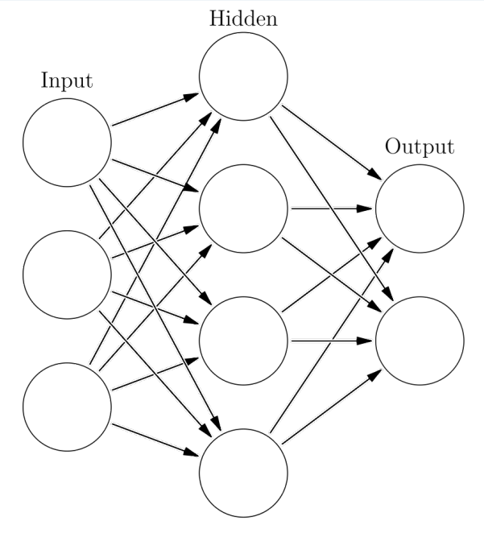
:::
::::

## Training

:::: {.columns}
::: {.column width=65%}
- GNN input: **graph** and its *features*
- GNN output: some prediction
$\hat{y} = f_W(g, x)$
- Predictions compared to true target via **loss** $L(y, \hat{y})$
- loss optimized w.r.t. **parameters** $W$ via **gradient descent**.
$$
W' = W - \alpha \nabla_W L(y, \hat{y})
$$
:::
::: {.column width=35%}
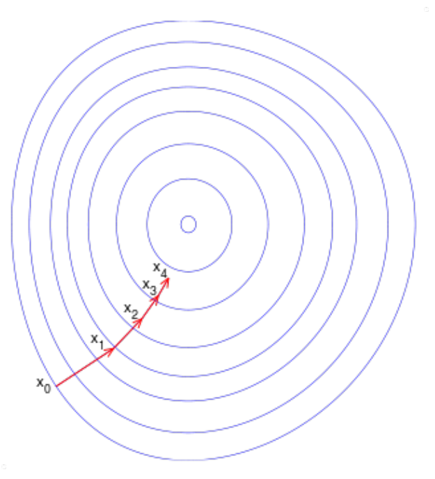
:::
::::

## Node and Matrix Form

:::: {.columns}
::: {.column width=50%}
Example:

- $x_i$ node features of node $i$,
- $W_1$ and	$W_2$ learnable parameters
$$
x'_i = \sigma(W_1 x_i + \sum_{j \in N(i)} W_2 x_j)
$$
:::
::: {.column width=50%}
::: {.fragment}
### Matrix form
- $X$ matrix of node features
- $A$ adjacency matrix
$$
X' = \sigma(W_1 X +  W_2 X A)
$$
:::
:::
::::

## Roadmap

<span style="font-size: 80%;">
<ul>
  <li>Introduction to the library</li>
  <li>Graph and message passing</li>
  <li>GNNs: definition and training</li>
  <li style="font-weight: bold; color: red;">What GNN can do?</li>
  <li>Popular GNN layers</li>
  <li>Heterogeneous graphs</li>
  <li>Hands on</li>
</ul>
</span>

## What Can GNNs Do?

<div style="font-size: 85%;">
GNNs can be used for:

- **Graph Classification**: Assign a label to an entire graph
- **Node Classification**: Predict the label of individual nodes
- **Link Prediction**: Determine the likelihood of an edge existing between two nodes
</div>

<div style="text-align: center;">
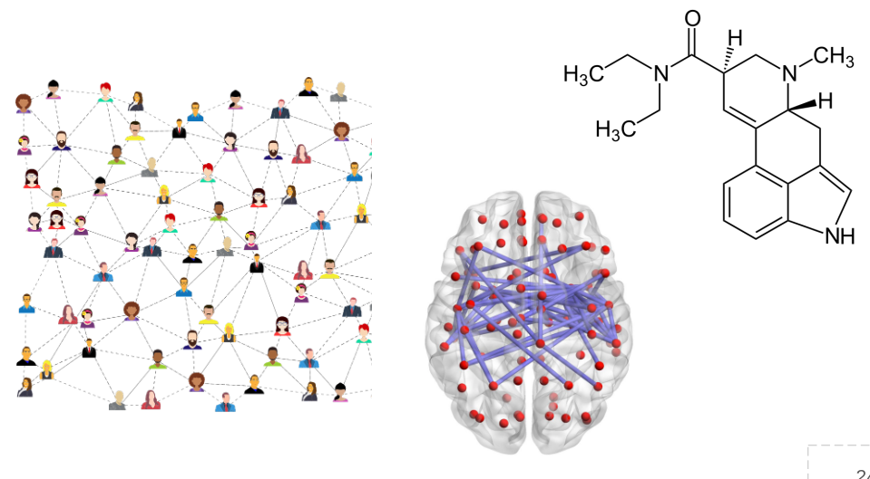
</div>

## Graph Classification

Determining the category of the graph: e.g., what kind of molecule.

Classic approach: `pooling` of final node features

<div style="text-align: center;">
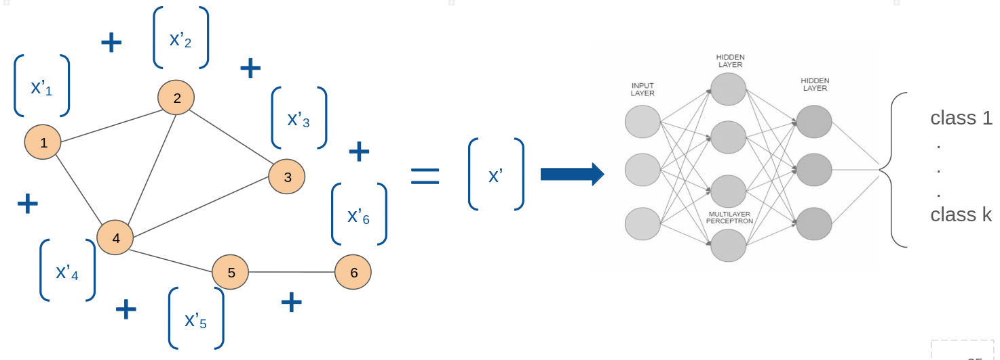
</div>

## Node Classification

<div style="text-align: center;">
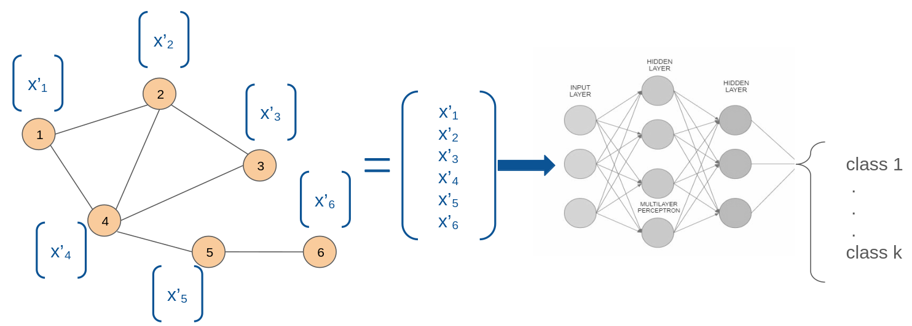
</div>

## Link Prediction

<div style="text-align: center;">
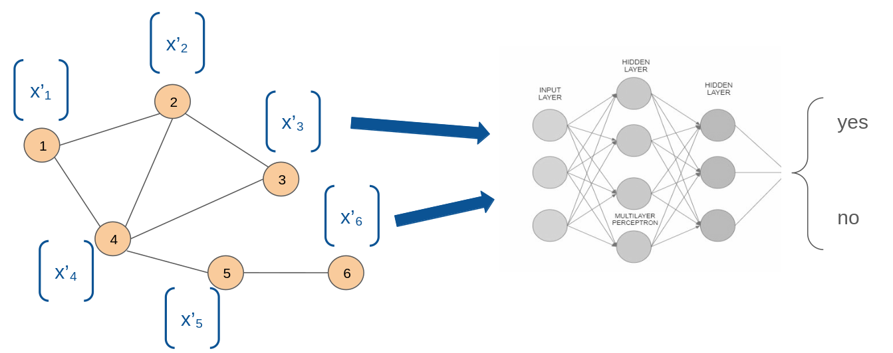
</div>

## Roadmap

<span style="font-size: 80%;">
<ul>
  <li>Introduction to the library</li>
  <li>Graph and message passing</li>
  <li>GNNs: definition and training</li>
  <li>What GNN can do?</li>
  <li style="font-weight: bold; color: red;">Popular GNN layers</li>
  <li>Heterogeneous graphs</li>
  <li>Hands on</li>
</ul>
</span>

## Popular GNN Layers

- **Graph Convolutional Networks (GCN)** (Kipf & Welling)
- **Graph Isomorphism Networks (GIN)** (Xu et al.)
- **GraphSAGE** (Hamilton et al.)
- **Graph Attention Networks (GAT)** (Velickovic et al.)

## Graph Convolutional Networks (GCN)

:::: {.columns}
::: {.column width=50%}
<div style="font-size: 85%;">
[Semi-Supervised Classification with Graph Convolutional Network](https://openreview.net/forum?id=SJU4ayYgl)<br>- Kipf & Welling 2017 (43k cit.s)
$$
\begin{cases}
x'_i &= \sum_{j \in N(i) \cup \{i\}} a_{ij} W x_j \\
a_{ij} &= \frac{1}{\sqrt{|N(i)||N(j)|}}
\end{cases}
$$
$$
\begin{cases}
X' &= \sigma(\tilde{D}^{-\frac{1}{2}} \tilde{A} \tilde{D}^{-\frac{1}{2}} X W)\\
\tilde{A} &= A + I_N
\end{cases}
$$
</div>
:::
::: {.column width=50%}
<div style="text-align: center;">
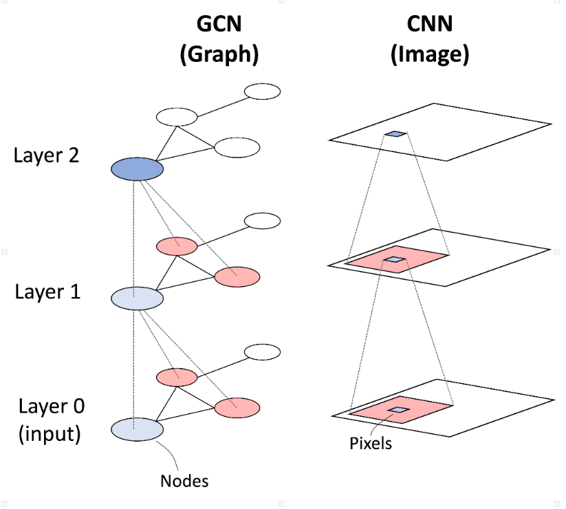
</div>
:::
::::

## Graph Isomorphism Network (GIN)

[How Powerful are Graph Neural Networks?](https://openreview.net/forum?id=ryGs6iA5Km), Xu et al. 2018 (10k cit.s)

$$
\begin{align*}
x'_i &= f_{\theta} \left( (1 + \epsilon) x_i + \sum_{j \in N(i)} x_j \right)\\
X' &= f_{\theta} \left( [(1 + \epsilon) I_N + A] X \right)
\end{align*}
$$
$f_{\theta}$ learnable function

Theoretical results: GIN is as powerful as Weisfeiler-Lehman graph isomorphism test

## Graph SAmple and AggreGatE (GraphSAGE)

[Inductive Representation Learning on Large Graphs](https://dl.acm.org/doi/10.5555/3294771.3294869), Hamilton et al. (18k cit.s)
$$
\begin{align*}
x^k_{N(i)} &= \text{AGGREGATE}_k \left( x_j^{k-1} : j \in N(i) \right) \\
x^k_i &= f \left( x_i^{k-1} \, || \, x^k_{N(i)} \right)
\end{align*}
$$
$||$ is the concatenation operator

## Graph Attention Networks (GAT)

[Graph Attention Networks](https://openreview.net/forum?id=rJXMpikCZ), Velickovic et al. (14k cit.s)

$$
x'_i = \sigma\left(\sum_{j \in N(i)} \alpha_{ij} W x_j\right)
$$
where importance $\alpha_{ij}$ of node $j$ to node $i$ uses self attention
$$
\alpha_{ij} = \frac{\exp(e_{ij})}{\sum_{k \in N(i)} \exp(e_{ik})}~, \quad e_{ij} = \phi(x_i, x_j)
$$

## and other layers...

<div style="text-align: center;">
<a href="https://juliagraphs.org/GraphNeuralNetworks.jl/docs/GraphNeuralNetworks.jl/stable/api/conv/#Convolutional-Layers">
  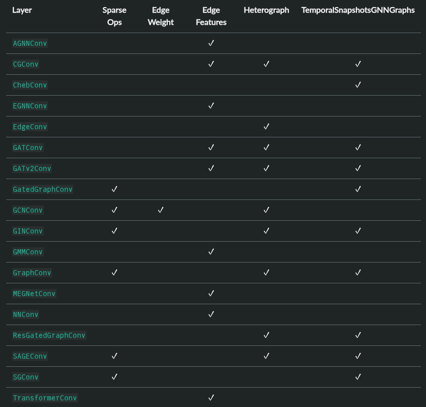
</a>
</div>

## Create a GNN

```{julia}
using GraphNeuralNetworks: GNNChain, GCNConv, Dense
model = GNNChain(
  GCNConv(3 => 16, relu),
  Dense(16 => 8, relu),
  Dense(8, 2, identity)
)
```

::: {.fragment}
```{julia}
y = model(g, rand(Float32, 3, 10))
```
:::

## Roadmap

<span style="font-size: 80%;">
<ul>
  <li>Introduction to the library</li>
  <li>Graph and message passing</li>
  <li>GNNs: definition and training</li>
  <li>What GNN can do?</li>
  <li>Popular GNN layers</li>
  <li style="font-weight: bold; color: red;">Heterogeneous graphs</li>
  <li>Hands on</li>
</ul>
</span>

## Heterogeneous Graphs

Multiple node and edge types, useful for multi-relational data (e.g. user-item interactions...)

Implemented with `GNNHeteroGraph` type.

<div style="text-align: center;">
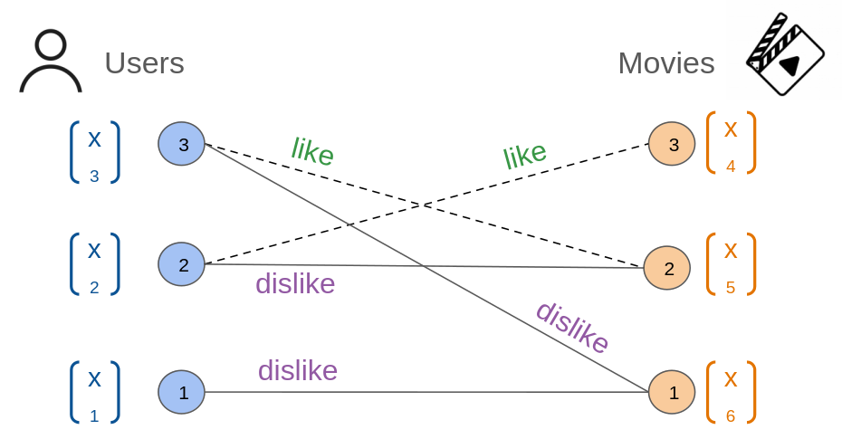
</div>

## Creating Heterogeneous Graphs

```{julia}
hg = GNNHeteroGraph(
  (:user, :like, :movie) => ([2,3], [3,2]),
  (:user, :dislike, :user) => ([1,2,3], [1,2,1])
)
```

```{julia}
hg = add_edges(hg, (:user, :like, :movie) => ([2], [1]))
```

## Basic queries

```{julia}
hg.num_nodes
```

```{julia}
hg.num_edges
```

```{julia}
hg.ntypes
```

```{julia}
hg.etypes
```

## Data features

```{julia}
hg[:user].age = rand(18:100, 1, 3)
```

```{julia}
hg[:movie].year = rand(1990:2025, 1, 3)
```

```{julia}
hg
```

## Roadmap

<span style="font-size: 80%;">
<ul>
  <li>Introduction to the library</li>
  <li>Graph and message passing</li>
  <li>GNNs: definition and training</li>
  <li>What GNN can do?</li>
  <li>Popular GNN layers</li>
  <li>Heterogeneous graphs</li>
  <li style="font-weight: bold; color: red;">Hands on</li>
</ul>
</span>

## Hands on

[Hands on tutorial in the docs](https://juliagraphs.org/GraphNeuralNetworks.jl/docs/GraphNeuralNetworks.jl/stable/tutorials/gnn_intro_pluto/)

Recall:
$$
\mathbf{x}_i^{(\ell + 1)} = f^{(\ell + 1)}_{\theta} \left( \mathbf{x}_i^{(\ell)}, \left\{ \mathbf{x}_j^{(\ell)} : j \in \mathcal{N}(i) \right\} \right)
$$

## [Zachary's Karate Club](https://en.wikipedia.org/wiki/Zachary%27s_karate_club)

<div style="font-size: 85%;">
Famous social network of 34 members of a karate club and links between members who interacted outside the club.

**Story**: the club split into two after a conflict between the instructor and the club president.

**Task**: detecting communities that arise from the member's interaction.
</div>
<div style="text-align: center;">
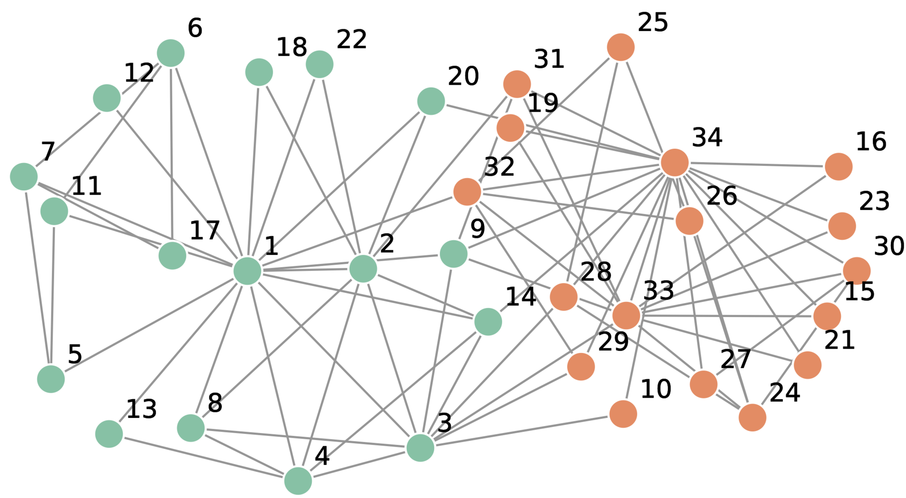
</div>

## Import packages

:::: {.columns}
::: {.column width=50%}
```{julia}
#| eval: false
using Pkg
Pkg.add([
  "Flux",
  "MLDatasets",
  "LinearAlgebra",
  "Random",
  "Statistics",
  "GraphMakie",
  "CairoMakie",
  "Graphs",
  "GraphNeuralNetworks"
])
```
:::
::: {.column width=50%}
Then use them
```{julia}
using Flux
using Flux: onecold, onehotbatch, logitcrossentropy
using MLDatasets
using LinearAlgebra, Random, Statistics
import GraphMakie
import CairoMakie as Makie
using Graphs
using GraphNeuralNetworks
```
:::
::::

## Import the dataset

```{julia}
dataset = MLDatasets.KarateClub()
```

```{julia}
karate = dataset[1]
```

```{julia}
println(karate.node_data.labels_comm)
```

## Create the `GNNGraph` and features

```{julia}
g = mldataset2gnngraph(dataset)

x = zeros(Float32, g.num_nodes, g.num_nodes)
x[diagind(x)] .= 1

labels = g.ndata.labels_comm
y = onehotbatch(labels, 0:3)
```

## How are graphs represented?

**COO (coordinate) format**. For each edge, two node indices `(source, dest)`

```{julia}
edge_index(g)
```

Good for **sparse** graphs.

## Semi-supervised node classification

Add **mask** selecting the nodes to be used for training

```{julia}
train_mask = fill(false, g.num_nodes)
train_mask[[1, 5, 9, 25]] .= true
g = GNNGraph(g, ndata = (; x, y, train_mask))
```

## Inspect data

```{julia}
#| output-location: column
@show g.num_nodes
@show g.num_edges
@show g.num_edges / g.num_nodes
@show sum(g.ndata.train_mask)
@show mean(g.ndata.train_mask)
@show has_isolated_nodes(g)
@show has_self_loops(g)
@show is_bidirected(g);
```

## [Graphs.jl](https://juliagraphs.org/Graphs.jl/stable/)

```{julia}
using GraphNeuralNetworks, Graphs
GNNGraph <: AbstractGraph
```

All graph algorithms available!

```{julia}
#| output-location: column
GraphMakie.graphplot(
    g |> to_unidirected,
    node_size = 20,
    node_color = labels,
    arrow_show = false
  )
```

## Implementing the GNN

Graph conv. layer `GCNConv`: $\mathbf{x}_v^{(\ell + 1)} = \mathbf{W}^{(\ell + 1)} \sum_{w \in \mathcal{N}(v) \, \cup \, \{ v \}} \frac{1}{c_{w,v}} \cdot \mathbf{x}_w^{(\ell)}$

:::: {.columns}
::: {.column width=50%}
```{julia}
struct GCN
    layers::NamedTuple
end
# parameter collection,
#gpu movement etc.
Flux.@layer GCN

function GCN(num_features,
              num_classes)
  layers = (
    conv1 = GCNConv(num_features => 4),
    conv2 = GCNConv(4 => 4),
    conv3 = GCNConv(4 => 2),
    classifier = Dense(2, num_classes))
  return GCN(layers)
end;
```
:::
::: {.column width=50%}
```{julia}
function (gcn::GCN)(
              g::GNNGraph,
              x::AbstractMatrix
            )
  l = gcn.layers
  x = l.conv1(g, x)
  x = tanh.(x)
  x = l.conv2(g, x)
  x = tanh.(x)
  x = l.conv3(g, x)
  x = tanh.(x)
  out = l.classifier(x)
  return out, x
end
```
:::
::::

## Embedding of the Karate Club

```{julia}
num_features, num_classes = 34, 4
gcn = GCN(num_features, num_classes)
_, h = gcn(g, g.ndata.x);
```

```{julia}
#| output-location: column
function visualize(h;
          colors = nothing)
    xs = h[1, :] |> vec
    ys = h[2, :] |> vec
    Makie.scatter(xs, ys,
                color = labels,
                markersize = 20)
end
visualize(h, colors = labels)
```

Observation: strong inductive bias

## Training the GNN

<!-- - Data: ✅
- Model: ✅
- Loss: $\mathcal{L}(z,y) = - y \log \sigma(z) - (1 - y) \log (1 - \sigma(z))$
- Optimizer: Adam -->

```{julia}
#| code-line-numbers: "1|2|"
#| output-location: slide
model = GCN(num_features, num_classes)
opt = Flux.setup(Adam(1e-2), model)
epochs = 2000
emb = h
report(epoch, loss, h) = @info (; epoch, loss)
report(0, 10.0, emb)

for epoch in 1:epochs
  loss, grad = Flux.withgradient(model) do model
    ŷ, emb = model(g, g.ndata.x)
    logitcrossentropy(ŷ[:, train_mask],
                      y[:, train_mask])
  end
  Flux.update!(opt, model, grad[1])

  (epoch % 100 == 0) && report(epoch, loss, emb)
end
```

## Post-training analysis

```{julia}
ŷ, emb_final = model(g, g.ndata.x);
```

Train accuracy:
```{julia}
mean(onecold(ŷ[:, train_mask]) .== onecold(y[:, train_mask]))
```

*Test* accuracy:
```{julia}
mean(onecold(ŷ[:, .!train_mask]) .== onecold(y[:, .!train_mask]))
```

## Visualize the final embedding

```{julia}
visualize(emb_final, colors = labels)
```
