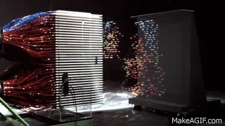
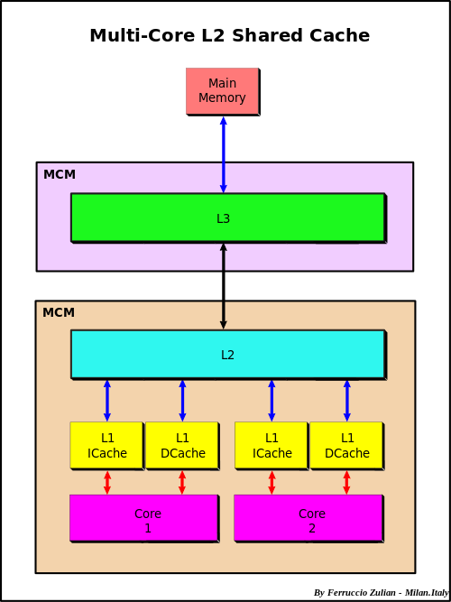
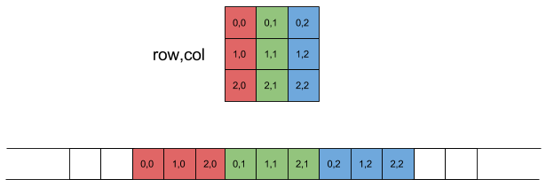
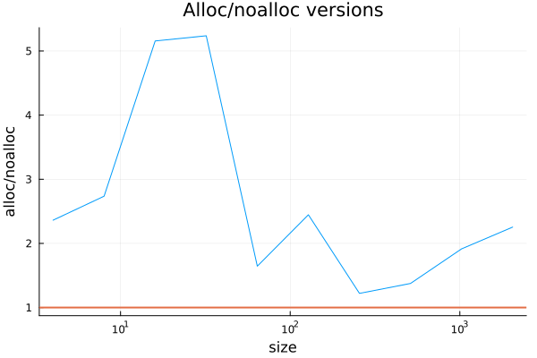
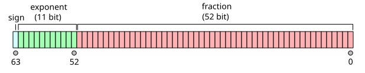
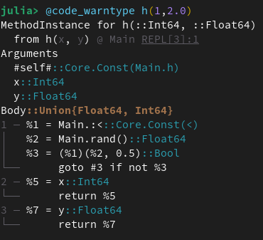
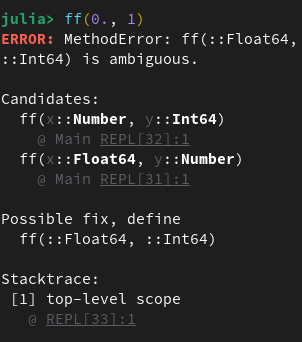
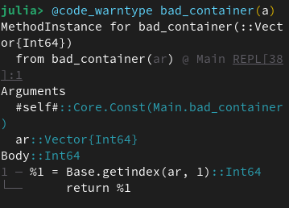
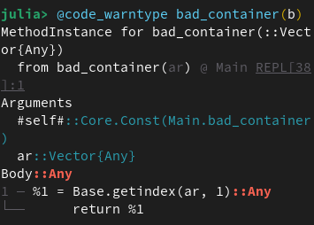

## Preliminary additional warning on Floats

:::: {.columns}

::: {.column width="80%"}
::: {style="font-size: 90%;"}
> You first deposit e−1\$ on your account, where e = 2.7182818 . . . is the base of the natural logarithms. The first year, we take 1\$ from your account as banking charges. The second year is better for you: We multiply your capital by 2, and we take 1\$ of banking charges. The third year is even better: We multiply your capital by 3, and we take 1\$ of banking charges. And so on: The n-th year, your capital is multiplied by n and we just take 1\$ of charges. Interesting, isn’t it?
:::
:::

::: {.column width="20%"}

:::

::::

## Simulation

```c
#include <stdio.h>

int main(void)
{
  double account = 1.71828182845904523536028747135;
  int i;
  for (i = 1; i <= 25; i++)
    {
      account = i*account - 1;
    }
  printf("You will have $%1.17e.\n", account);
}
```

::: {.fragment}
Ans: $1.20180724741044855e+09 !!
:::
::: {.fragment}
25 years later... $0.0399 !!!
:::

## Analysis of previous example

$$
\begin{align*}
&a_n \\
&= n \times a_{n-1} - 1 \\
&= n! \times \left( a_0 - 1 - \frac{1}{2!} - \frac{1}{3!} - \dots - \frac{1}{n!} \right)\\
& = {\small n! \times \left( a_0 - (e - 1) + \frac{1}{(n+1)!} + \frac{1}{(n+2)!} + \frac{1}{(n+3)!} + \dots \right)}~,
\end{align*}
$$

- if $a_0 < e - 1$, then $a_n$ goes to $-\infty$;
- if $a_0 = e - 1$, then $a_n$ goes to $0$;
- if $a_0 > e - 1$, then $a_n$ goes to $+\infty$.


## Let's start serial

::: {style = "text-align: center;"}

:::

## Memory

::: {style="text-align: center;"}

:::

## Cache lines

::: {style="font-size: 80%;"}
- Modern CPUs try to predict which data will be needed next and load it into the cache.

::: {.fragment}
- Cache lines are small unit of data that are loaded into the cache (typically 64 bytes).
:::

::: {.fragment}
- Matrices are stored in contiguous blocks of memory, and portions of it are loaded at once as cache lines.

::: {style="text-align: center;"}

:::
:::
:::

## Row vs Column major


```{julia}
A = rand(100,100)
B = rand(100,100)
C = rand(100,100)
using BenchmarkTools
```

```{julia}
#| output-location: fragment
function inner_rows!(C,A,B)
  for i in 1:100, j in 1:100
    C[i,j] = A[i,j] + B[i,j]
  end
end
@btime inner_rows!(C,A,B)
```

::: {.fragment}
```{julia}
#| output-location: fragment
function inner_cols!(C,A,B)
  for j in 1:100, i in 1:100
    C[i,j] = A[i,j] + B[i,j]
  end
end
@btime inner_cols!(C,A,B)
```
:::

## Stack vs Heap

:::: {.columns}
::: {.column width="50%"}

- **Stack**: fast access, const. size, memory is managed by the compiler.
- **Heap**: slower access, dynamic size, memory is managed by the programmer.

:::
::: {.column width="50%"}

::: {.fragment}
- Arrays, Dicts, and mutable structs are on the heap
- StaticArrays, Tuples, Named Tuples and non-mutable structs are on the stack (but sometimes never exist at all)
:::

:::
::::

## Examples

```{julia}
function normal_array()
    arr = [1,2,3]
    return arr.^2
end

@btime normal_array();
```

::: {.fragment}
```{julia}
#| output: false
using Pkg
Pkg.add("StaticArrays")
using StaticArrays
```

```{julia}
function static_array()
    arr = SVector(1,2,3)
    return arr.^2
end

@btime static_array();
```
:::


## Heap allocations are costly

Pointer indirections, memory fragmentation, cache misses...

:::: {.columns}
::: {.column width="46%"}
```{julia}
#| code-line-numbers: "3,11|"
#| output-location: fragment
function inner_alloc!(C,A,B)
  for j in 1:100, i in 1:100
    val = [A[i,j] + B[i,j]]
    C[i,j] = val[1]
  end
end
@btime inner_alloc!(C,A,B)

function inner_noalloc!(C,A,B)
  for j in 1:100, i in 1:100
    val = A[i,j] + B[i,j]
    C[i,j] = val[1]
  end
end
@btime inner_noalloc!(C,A,B)
```
:::
::: {.column width="54%"}
::: {.fragment}
```{julia}
#| code-line-numbers: "4|"
using StaticArrays
function static_inner_alloc!(C,A,B)
  for j in 1:100, i in 1:100
    val = @SVector [A[i,j] + B[i,j]]
    C[i,j] = val[1]
  end
end
@btime static_inner_alloc!(C,A,B)
```
:::
:::
::::

## How to write into array without allocation?

Mutation: changing the values of **already existing** array

:::: {.columns}
::: {.column width="50%"}
```{julia}
#| code-line-numbers: "|3|"
function inner_alloc(A,B)
  n, m = size(A)
  C = similar(A)
  for j in 1:m, i in 1:n
    val = A[i,j] + B[i,j]
    C[i,j] = val[1]
  end
end

function inner_noalloc!(C,A,B)
  n, m = size(A)
  for j in 1:m, i in 1:n
    val = A[i,j] + B[i,j]
    C[i,j] = val[1]
  end
end;
```
:::
::: {.column width="50%"}
::: {.fragment}
```{julia}
#| output-location: fragment
n = 100
A, B = rand(n, n), rand(n, n)
C = similar(A)
@btime inner_alloc(A,B)
@btime inner_noalloc!(C,A,B)
```
:::
:::
::::

## Broadcasting ("vectorization")

### loop fusion

```{julia}
function unfused(A,B,C)
  tmp = A .+ B
  tmp .+ C
end
@btime unfused(A,B,C);
```
::: {.fragment}
```{julia}
fused(A,B,C) = A .+ B .+ C
@btime fused(A,B,C);
```
:::
::: {.fragment}
```{julia}
D = similar(A)
fused!(D,A,B,C) = (D .= A .+ B .+ C)
@btime fused!(D,A,B,C);
```
:::

## Broadcasting > vectorization

:::: {.columns}
::: {.column width="60%"}

`f.(args...)`  equivalent to `broadcast(f, args...)`:
```{julia}
#| output-location: fragment
sum(sin.(A).^2 .+ cos.(A).^2)
```

::: {.fragment}
```{julia}
string("one", ": ", 1)
```
#### Quiz
```{julia}
#| output-location: fragment
string.(("one","two","three"), ": ", 1:3)
```
:::

:::
::: {.column width="40%"}

::: {style="font-size: 90%;"}
::: {.fragment}
In MATLAB, Python, R, etc., vectorization = someone compiled C/Fortran loop.

Specific C kernels vs combinatorial explosion of cases => allocation of lots of temp variables (no fusion)
:::
:::

:::
::::

## References and copies

:::: {.columns}

::: {.column width="50%"}
```{julia}
#| output-location: fragment
b = [1]
a = b
b[1] = 2
a
```
::: {.fragment}
```{julia}
#| output-location: fragment
b = [1]
a = copy(b) # a = b[:]
b[1] = 2
a
```
:::
:::

::: {.column width="50%"}
::: {.fragment}
```{julia}
#| output-location: fragment
b = [[1]]
a = b[:]
b[1][1] = 2
a
```
:::
::: {.fragment}
```{julia}
b = [[1]]
a = deepcopy(b)
b[1][1] = 2
a
```
:::
:::

::::

## Views

:::: {.columns}
::: {.column width="50%"}

Indexing in Julia is very expressive
```{julia}
a[1:1] # "slice"
```
```{julia}
#| output-location: fragment
a[1] == a[1:1]
```
::: {.fragment}
```{julia}
a = collect(1:3)
a[a .> 1]
```
:::

:::
::: {.column width="50%"}

::: {.fragment}
`@view` only allocate a pointer if escape analysis can't prove elision.
```{julia}
A = rand(3,3)
B = @view A[1:2,1:2]
B[1] = 2.0
A[1]
```
:::

:::
::::


## Asymptotic Cost of Heap Allocations

Heap alloc. prepare space in RAM proportional to needed memory: $O(n)$ (large const.) for array.

As RAM fills up, cost increases!
When out of RAM, computer uses swap...

::: {.fragment}
:::: {.columns}

::: {.column width="55%"}
```{julia}
#| eval: false
using LinearAlgebra, BenchmarkTools
function alloc_timer(n)
    A = rand(n,n)
    B = rand(n,n)
    C = rand(n,n)
    t1 = @belapsed $A .* $B
    t2 = @belapsed ($C .= $A .* $B)
    t1,t2
end
ns = 2 .^ (2:11)
res = [alloc_timer(n) for n in ns]
alloc   = [x[1] for x in res]
noalloc = [x[2] for x in res]
```
:::
::: {.column width="45%"}

:::

::::
:::

## Optimizing use of Memory

::: {style="font-size: 75%;"}
::: {.fragment}
- Avoid cache misses: reuse values
- Iterate along columns
- Avoid heap alloc. in inner loops
- Heap alloc. occur when size of things not proven at compile-time: use fused broadcasts (with mutated outputs)
- Julia loops are as fast as C: no benefit for (array) vectorization
- Prefer views over slices
- Avoid heap alloc. especially for linear or small-array algorithms: use `StaticArrays.jl` for small arrays in inner loops
:::
:::


## Type Inference and the Compiler

Why is Julia fast?

::: {.fragment}
Type inference and + Type specialization in functions<br>
(= multiple dispatch)
:::

::: {.fragment}
In the computer, everything is bits.<br>
How to interpret the memory?
:::

::: {.fragment}
Everything has a type, e.g.

:::

## Importance of Types

If types unknown $\implies$ Impossible to interpret the memory.

::: {.fragment}
How much memory a value takes is determined by its type.
:::

::: {.fragment}
- C language: types given by programmer
- Python: types inferred at runtime (everything heap allocated!)
:::

::: {.fragment}
Julia's hybrid approach: first infer types, then compile methods.
:::

## Type Stability

:::: {.columns}
::: {.column width="40%"}
**Type of the output should be inferable from type of  inputs.**

```{julia}
#| eval: false
function h(x,y)
  if rand() < 0.5
    return x
  else
    return y
  end
end
```
:::
::: {.column width="60%"}

:::
::::

## Inference Problems

:::: {.columns}

::: {.column width="50%"}
`f(x,y) = ...` equivalent to `f(x::Any, y::Any) = ...` (but compiler specializes: no penalty)

- Inferece $\approx$ C
- No inference $\approx$ Python

::: {.fragment}
Problem:
```{julia}
#| eval: false
ff(x::Float64,y::Number) =
  5x + 2y
ff(x::Number,y::Int) =
  x - y
```
:::
:::

::: {.column width="50%"}
::: {.fragment}

:::
:::

::::

## Untyped containers

```{julia}
#| eval: false
a = [1, 2]
b = [1, "2"];
```
```{julia}
#| eval: false
bad_container(ar) = ar[1];
```

::: {.fragment}
:::: {.columns}
::: {.column width="50%"}

:::
::: {.column width="50%"}

:::
:::
::::
::: {.fragment}
Use `isbits(object)` and `isbitstype(T)` to check if a type is "bits": can compile to GPU kernels through `CUDA.jl`.
:::

## Specialization at Compile Time

Don't over-optimize: compiler will do the work in obvious cases
```{julia}
#| output-location: column
function fff(x)
  if x isa Int
    y = 2
  else
    y = 4.0
  end
  x + y
end
@code_llvm fff(5)

```
