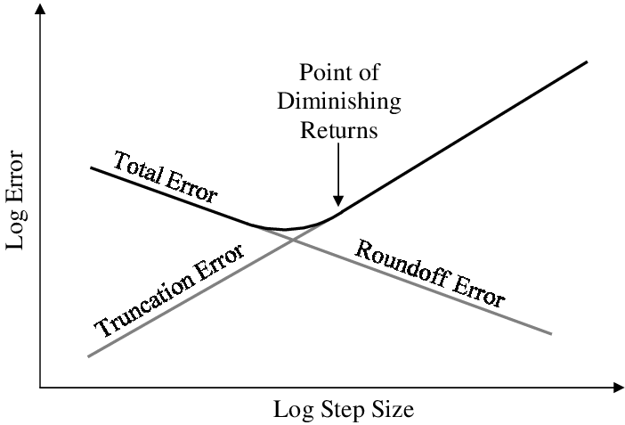
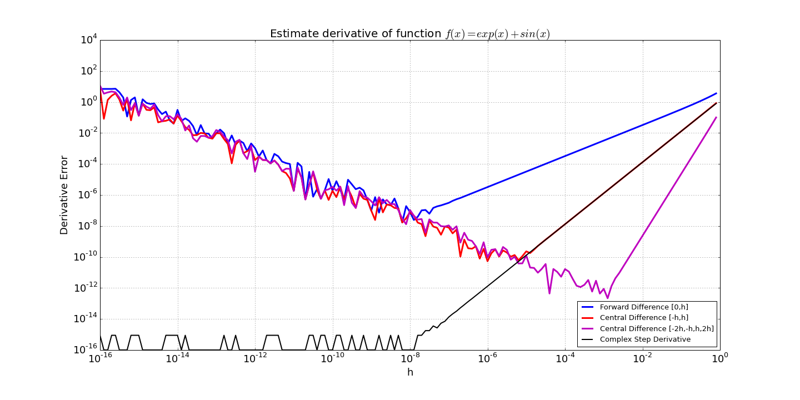
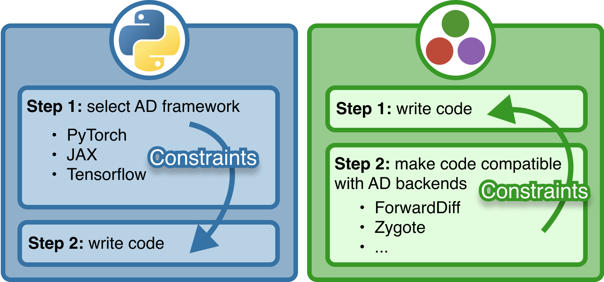

Part of this lecture is based on [GDalle's lecture on algorithmic differentiation](https://gdalle.github.io/JuliaOptimizationDays2024-AutoDiff/#/title-slide).

## Motivation

### What is a derivative?

A linear approximation of a function around a point.

### Why do we care?

Derivatives of complex programs are essential in optimization and machine learning.

### What do we need to do?

Not much: Automatic Differentiation (AD) computes derivatives for us!

## Bibliography

- @blondelElementsDifferentiableProgramming2024: the most recent book
- @griewankEvaluatingDerivativesPrinciples2008: the bible of the field
- @baydinAutomaticDifferentiationMachine2018, @margossianReviewAutomaticDifferentiation2019: concise surveys

## Derivatives: formal definition

Derivative of $f$ at point $x$: linear map $\partial f(x)$ such that
$$f(x + v) = f(x) + \partial f(x)[v] + o(\lVert v \rVert)$$

In other words,

$$\partial f(x)[v] = \lim_{\varepsilon \to 0} \frac{f(x + \varepsilon v) - f(x)}{\varepsilon}$$


## Various flavors of differentiation

- **Manual**: work out $\partial f$ by hand
- **Numeric**: $\partial f(x)[v] \approx \frac{f(x+\varepsilon v) - f(x)}{\varepsilon}$
- **Symbolic**: enter a formula for $f$, get a formula for $\partial f$
- **Automatic**[^a]: code a program for $f$, get a program for $\partial f(x)$

[^a]: or algorithmic


# Developing AD from scratch


## Automatic Differentiation (AD)

- To make derivative calculations efficient, move to higher dim. numbers
- multiple directional derivatives computed simultaneously (Jacobian of a function $f$ on single input)
- Direct application of using compiler as part of a math. framework


## Machine Epsilon and Roundoff Error

- Floating point arithmetic is *relatively scaled*: precision depends on size of arguments.
- Ca. 16 digits of accuracy (double precision)
- *machine epsilon*: value s.t. `1 + E = 1`


```{julia}
@show eps(1.0)
@show eps(0.1)
@show eps(0.01);
```

## Numerical Stability

:::: {.columns}
::: {.column width="70%"}
Issues with **roundoff error** when one subtracts out higher digits:
$$(x + \epsilon) - x \neq \epsilon$$

If $x = 1$ and $\epsilon \approx 10^{-10}$, $x+ \epsilon$  correct for ca. 10 digits. Smallest 6 dropped due to error in  addition to $1$, and when you subtract $x$, you don't get them back!
:::
::: {.column width="30%"}
::: {.fragment}
```{julia}
#| output-location: fragment
1 + eps(1.) ≈ 1
```
:::
::: {.fragment}
```{julia}
#| output-location: fragment
10 + eps(1.) - 10
```
:::
::: {.fragment}
```{julia}
#| output-location: fragment
10 - 10 + eps(1.)
```
:::
:::
::::

## Finite Differencing

$$f'(x) = \lim_{\epsilon \rightarrow 0} \frac{f(x+\epsilon)-f(x)}{\epsilon}$$

::: {.fragment}
- $\epsilon$ too large: truncation (approximation) error
- $\epsilon$ too small: roundoff error
:::

## Truncation + Roundoff Error

:::: {.columns}
::: {.column width="70%"}

:::
::: {.column width="30%"}
Arguably, $\epsilon = \sqrt{E}$ ($E$ machine error) balances  $\mathcal{O}(\epsilon)$ truncation with $O(E/\epsilon)$ roundoff.
:::
::::

## Truncation + Roundoff in practice

```{julia}
eps(Float64), sqrt(eps(Float64))
```

Do not expect better than 8 digits of accuracy!

::: {.fragment}
Can we do better?
:::

## Differencing in a Different Dimension

💡 keep small perturbation completely separate

::: {.fragment}
$$\small
\begin{align}
f(x + i h) &= f(x) + i h f'(x) - \frac{h^2}{2!} f''(x)- i \frac{h^3}{3!} f^{(3)}(x)  + \cdots \\
\operatorname{Im}[f(x + i h)] &= h f'(x) - \frac{h^3}{3!} f^{(3)}(x) + \cdots\\
\frac{\operatorname{Im}[f(x + i h)]}{h} &= f'(x) - \frac{h^2}{3!} f^{(3)}(x) + \cdots \underset{h\approx 0}{\approx} f'(x)
\end{align}
$$
:::

## Complex Step Differentiation




## Nilpotent sensitivities

Derivatives measure **sensitivity** of function:

$$f(a + \epsilon) = f(a) + f'(a) \epsilon + \mathcal O(\epsilon^2).$$

::: {.fragment}
Let's **assume**
$\epsilon^2 = 0$
([Smooth Infinitesimal Analysis](https://en.wikipedia.org/wiki/Smooth_infinitesimal_analysis))

Then, coefficient of $\epsilon$ = derivative of $f$
:::

## Dual numbers

**[Dual number](https://en.wikipedia.org/wiki/Dual_number)**: multidimensional number s.t. the derivative  is propagated along dual portion

$$f(x + \epsilon) = f(x) + \epsilon f'(x)$$

::: {.fragment}
$$
\begin{align}
&f(x+\epsilon) + g(x+\epsilon) \\
&\qquad= [f(x) + g(x)] + \epsilon[f'(x) + g'(x)]\\
&f(x+\epsilon) \cdot g(x+\epsilon) \\
&\qquad =[f(x) \cdot g(x)] + \epsilon[f(x) \cdot g'(x) + g(x) \cdot f'(x) ]
\end{align}
$$
:::

## Calculemus

::: {.fragment}
```{julia}
struct Dual{T}
    val::T
    der::T
end
```
:::

::: {.fragment}
```{julia}
Base.:+(f::Dual, g::Dual) = Dual(f.val + g.val, f.der + g.der)
Base.:+(f::Dual, α::Number) = Dual(f.val + α, f.der)
Base.:+(α::Number, f::Dual) = f + α
```
:::
::: {.fragment}
```{julia}
Base.:-(f::Dual, g::Dual) = Dual(f.val - g.val, f.der - g.der)
```
:::
::: {.fragment}
```{julia}
Base.:*(f::Dual, g::Dual) = Dual(f.val*g.val, f.der*g.val + f.val*g.der)
Base.:*(α::Number, f::Dual) = Dual(f.val * α, f.der * α)
Base.:*(f::Dual, α::Number) = α * f
Base.:^(f::Dual, n::Integer) = Base.power_by_squaring(f, n)
```
:::
::: {.fragment}
```{julia}
Base.:/(f::Dual, g::Dual) =
            Dual(f.val/g.val, (f.der*g.val - f.val*g.der)/(g.val^2))
Base.:/(α::Number, f::Dual) = Dual(α/f.val, -α*f.der/f.val^2)
Base.:/(f::Dual, α::Number) = f * inv(α)
```
:::

## Testing

```{julia}
#| output-location: fragment
fd = Dual(3, 2)
gd = Dual(2, 4)

fd + gd
```

::: {.fragment}
```{julia}
#| output-location: fragment
fd * gd
```
:::

::: {.fragment}
```{julia}
#| output-location: fragment
fd * (gd + gd)
```
:::

## Performance

```{julia}
add(a1, a2, b1, b2) = (a1+b1, a2+b2)
add(j1, j2) = j1 + j2
```

```{julia}
using BenchmarkTools
a, b, c, d = 1, 2, 3, 4
ad = Dual(1, 2)
bd = Dual(3, 4)
@btime add($a, $b, $c, $d)
@btime add($ad, $bd);
```

## Generated code comparison

:::: {.columns}
::: {.column width="50%"}
```{julia}
@code_native add(1, 2, 3, 4)
```
:::
::: {.column width="50%"}
```{julia}
@code_native add(a, b)
```
:::
::::


## Higher Order Primitives

Functions of `Dual` objects: chain rule + hardcoded derivatives of known functions (*primitives*)

```{julia}
import Base: exp
exp(f::Dual) = Dual(exp(f.val), exp(f.val) * f.der)
```

```{julia}
fd
```

```{julia}
#| output-location: fragment
exp(fd)
```

## Differentiating arbitrary functions

Recursively do dual number arithmetic within function until primitives, then use chain rule to propagate

We **use the compiler to transform equations into dual number arithmetic**

```{julia}
hf(x) = x^2 + 2
x = 3
xx = Dual(x, 1)
```

```{julia}
#| output-location: fragment
hf(xx)
```

## Automatic Differentiation

```{julia}
derivative(f, x) = f(Dual(x, one(x))).der
derivative(x -> 3x^5 + 2, 2)
```

## Example: sqrt with Babylonian method

```{julia}
function newtons(x)
   a = x
   for i in 1:300
       a = 0.5 * (a + x/a)
   end
   a
end
newtons(2.0)
```
```{julia}
(newtons(2.0+sqrt(eps())) - newtons(2.0))/ sqrt(eps())
```
```{julia}
newtons(Dual(2.0,1.0))
```

```{julia}
1/2sqrt(2) # exact derivative
```

## Higher dimensions

```{julia}
fquad(x, y) = x^2 + x*y
```

Look at partial derivatives
```{julia}
a, b = 3.0, 4.0
fquad_1(x) = fquad(x, b)
derivative(fquad_1, a)
```

::: {.fragment}
Equivalent to
```{julia}
fquad(Dual(a, one(a)), b)
```
:::

::: {.fragment}
```{julia}
fquad_2(y) = fquad(a, y)
derivative(fquad_2, b)
```
:::


## Dual vectors

We can implement derivatives of functions $f: \mathbb{R}^n \to \mathbb{R}$ by having several a dual vector
$\vec \epsilon$ s.t. $\epsilon_i^2 = \epsilon_i \epsilon_j = 0$
$$f(x + \vec\epsilon) = f(x) + \nabla f(x) \cdot \vec \epsilon ,$$

::: {.fragment}
Then
$$
\begin{align}
&(f + g)(x + \epsilon) \\
&\quad = [f(x) + g(x)] + [\nabla f(x) + \nabla g(x)] \cdot \epsilon\\
&(f \cdot g)(x + \epsilon) \\
&\quad = [f(x) + \nabla f(x) \cdot \epsilon ] \, [g(x) + \nabla g(x) \cdot \epsilon ] \\
&\quad = f(x) g(x) + [f(x) \nabla g(x) + g(x) \nabla f(x)] \cdot \epsilon.
\end{align}
$$
:::

## Implementation of dual vectors

```{julia}
using StaticArrays

struct MultiDual{N,T}
    val::T
    derivs::SVector{N,T}
end

function Base.:+(f::MultiDual{N,T}, g::MultiDual{N,T}) where {N,T}
    return MultiDual{N,T}(f.val + g.val, f.derivs + g.derivs)
end

function Base.:*(f::MultiDual{N,T}, g::MultiDual{N,T}) where {N,T}
    return MultiDual{N,T}(f.val * g.val, f.val .* g.derivs + g.val .* f.derivs)
end
```

## Testing dual vectors

```{julia}
gcubic(x, y) = x*x*y + x + y

(a, b) = (1.0, 2.0)

xx = MultiDual(a, SVector(1.0, 0.0))
yy = MultiDual(b, SVector(0.0, 1.0))

gcubic(xx, yy)
```

## `ForwardDiff.jl`

Better to store all partials in a matrix
```{julia}
using ForwardDiff, StaticArrays

ForwardDiff.gradient( v -> gcubic(v...), [1, 2])
```

## Jacobian of a $f:\mathbb{R}^n \to \mathbb{R}^m$

```{julia}
fsvec(x, y) = SVector(x*x + y*y , x + y)

fsvec(xx, yy)
```


# Another way to do it

## Two ingredients of AD

Any derivative can be obtained from:

1. Derivatives of **basic functions**: $\exp, \log, \sin, \cos, \dots$
2. Composition with the **chain rule**:

$$\partial (f \circ g)(x) = \partial f(g(x)) \circ \partial g(x)$$

or its adjoint[^b]

$$\partial (f \circ g)^*(x) = \partial g(x)^* \circ \partial f(g(x))^*$$

[^b]: the "transpose" of a linear map

## Homemade AD (1)

Basic functions
```{julia}
#| output: false
double(x) = 2x
∂(::typeof(double)) = x -> (v -> 2v)  # independent from x
```


```{julia}
#| output: false
square(x) = x .^ 2
∂(::typeof(square)) = x -> (v -> v .* 2x)  # depends on x
```

Chain rule

```{julia}
typeof(square ∘ double)
```

```{julia}
#| output: false
function ∂(c::ComposedFunction)
    f, g = c.outer, c.inner
    return x -> ∂(f)(g(x)) ∘ ∂(g)(x)
end
```

## Homemade AD (2)

Let's try it out

```{julia}
complicated_function = square ∘ double ∘ square ∘ double
x = [3.0, 5.0]
v = [1.0, 0.0];
∂(complicated_function)(x)(v)
```
```{julia}
ε = 1e-5
(complicated_function(x + ε * v) - complicated_function(x)) / ε
```


# Jacobians

## What about Jacobian matrices?

We could multiply matrices instead of composing linear maps:

$$J_{f \circ g}(x) = J_f(g(x)) \cdot J_g(x)$$

where the Jacobian matrix is

$$J_f(x) = \left(\partial f_i / \partial x_j\right)_{i,j}$$

- very wasteful in high dimension (think of $f = \mathrm{id}$)
- ill-suited to arbitrary spaces

## Matrix-vector products

We don't need Jacobian matrices as long as we can compute their products with vectors:

:::: {.columns}

::: {.column width="50%"}
**Jacobian-vector products**

$$J_{f}(x) v = \partial f(x)[v]$$

Propagate a perturbation $v$ from input to output

:::

::: {.column width="50%"}
**Vector-Jacobian products**

$$w^\top J_{f}(x) = \partial f(x)^*[w]$$

Backpropagate a sensitivity $w$ from output to input

:::

::::

## Forward mode

Consider $f = f_L \circ \dots \circ f_1$ and its Jacobian $J = J_L \cdots J_1$.

Jacobian-vector products decompose from layer $1$ to layer $L$:

$$J_L(J_{L-1}(\dots \underbrace{J_2(\underbrace{J_1 v}_{v_1})}_{v_2}))$$

Forward mode AD relies on the chain rule.

## Reverse mode

Consider $f = f_L \circ \dots \circ f_1$ and its Jacobian $J = J_L \cdots J_1$.

Vector-Jacobian products decompose from layer $L$ to layer $1$:

$$((\underbrace{(\underbrace{w^\top J_L}_{w_L}) J_{L-1}}_{w_{L-1}} \dots ) J_2 ) J_1$$

Reverse mode AD relies on the adjoint chain rule.

## Jacobian matrices are back

Consider $f : \mathbb{R}^n \to \mathbb{R}^m$. How to recover the full Jacobian?

:::: {.columns}

::: {.column width="50%"}
**Forward mode**

Column by column:

$$J = \begin{pmatrix} J e_1 & \dots & J e_n \end{pmatrix}$$

where $e_i$ is a basis vector.

:::

::: {.column width="50%"}
**Reverse mode**

Row by row:

$$J = \begin{pmatrix} e_1^\top J \\ \vdots \\ e_m^\top J \end{pmatrix}$$

:::

::::

## Complexities

Consider $f : \mathbb{R}^n \to \mathbb{R}^m$. How much does a Jacobian cost?

### Theorem

Each JVP or VJP takes as much time and space as $O(1)$ calls to $f$.


| sizes | jacobian | forward | reverse | best mode
|---|---|---|---|---|
| generic | jacobian | $O(n)$ | $O(m)$ | depends |
| $n = 1$ | derivative | $O(1)$ | $O(m)$ | forward |
| $m = 1$ | gradient | $O(n)$ | $O(1)$ | reverse |

**Fast reverse mode gradients make deep learning possible.**


# Using AD

## Three types of AD users

1. **Package users** want to differentiate through functions
2. **Package developers** want to write differentiable functions
3. **Backend developers** want to create new AD systems

## Python vs. Julia: users {.smaller}


## Python vs. Julia: developers {.smaller}



## Why so many packages?

- Conflicting **paradigms**:
  - numeric vs. symbolic vs. algorithmic
  - operator overloading vs.  source-to-source
- Cover varying **subsets of the language**
- Historical reasons: developed by **different people**

Full list available at <https://juliadiff.org/>.

## Meaningful criteria

- Does this AD package **execute** **without error**?
- Does it return the **right derivative**?
- Does it run **fast enough** for me?

## A simple decision tree

1. **Follow recommendations** of high-level library (e.g. [Flux.jl](https://github.com/FluxML/Flux.jl)).
2. Otherwise, **choose mode** from input/output dimensions.
3. Then try the most **thoroughly tested** packages:
   - [ForwardDiff.jl](https://github.com/JuliaDiff/ForwardDiff.jl) or [Enzyme.jl](https://github.com/EnzymeAD/Enzyme.jl) in forward mode,
   - [Zygote.jl](https://github.com/FluxML/Zygote.jl), [Enzyme.jl](https://github.com/EnzymeAD/Enzyme.jl) or [Mooncake.jl](https://github.com/compintell/Mooncake.jl) in reverse mode.
4. If nothing works, finite differences ($\sim$ forward mode).


# Enabling AD

## Each package has demands

- ForwardDiff: generic number types
- Zygote: no mutation
- Enzyme: correct activity annotations, type stability (not covered here)

## Typical ForwardDiff issue

```{julia}
import ForwardDiff

badcopy(x) = copyto!(zeros(size(x)), x)

ForwardDiff.jacobian(badcopy, ones(2))
```

## ForwardDiff troubleshooting

Allow numbers of [type `Dual`](https://juliadiff.org/ForwardDiff.jl/stable/dev/how_it_works/) to pass through your functions.

```{julia}
goodcopy(x) = copyto!(zeros(eltype(x), size(x)), x)

ForwardDiff.jacobian(goodcopy, ones(2))
```

## Typical Zygote issue

```{julia}
import Zygote

Zygote.jacobian(badcopy, ones(2))
```

## Zygote troubleshooting

Define a [custom rule](https://juliadiff.org/ChainRulesCore.jl/stable/) with [ChainRulesCore](https://github.com/JuliaDiff/ChainRulesCore.jl):

```{julia}
using ChainRulesCore, LinearAlgebra

badcopy2(x) = badcopy(x)

function ChainRulesCore.rrule(::typeof(badcopy2), x)
    y = badcopy2(x)
    badcopy2_vjp(dy) = NoTangent(), I' * dy
    return y, badcopy2_vjp
end

Zygote.jacobian(badcopy2, ones(2))
```


# DifferentiationInterface

## Goals

- [DifferentiationInterface.jl](https://github.com/JuliaDiff/DifferentiationInterface.jl) (DI) offers a **common syntax** for all AD packages[^c]
- AD users can compare correctness and performance **without reading each documentation**

[^c]: inspired by [AbstractDifferentiation.jl](https://github.com/JuliaDiff/AbstractDifferentiation.jl)

### The fine print

DI may be slower than a direct call to the package's API (mostly with Enzyme).


## Supported packages

:::: {.columns}

::: {.column width="50%"}
* [ChainRulesCore.jl](https://github.com/JuliaDiff/ChainRulesCore.jl)
* [Diffractor.jl](https://github.com/JuliaDiff/Diffractor.jl)
* [Enzyme.jl](https://github.com/EnzymeAD/Enzyme.jl)
* [FastDifferentiation.jl](https://github.com/brianguenter/FastDifferentiation.jl)
* [FiniteDiff.jl](https://github.com/JuliaDiff/FiniteDiff.jl)
* [FiniteDifferences.jl](https://github.com/JuliaDiff/FiniteDifferences.jl)
* [ForwardDiff.jl](https://github.com/JuliaDiff/ForwardDiff.jl)
:::

::: {.column width="50%"}
* [PolyesterForwardDiff.jl](https://github.com/JuliaDiff/PolyesterForwardDiff.jl)
* [ReverseDiff.jl](https://github.com/JuliaDiff/ReverseDiff.jl)
* [Symbolics.jl](https://github.com/JuliaSymbolics/Symbolics.jl)
* [Mooncake.jl](https://github.com/compintell/Mooncake.jl)
* [Tracker.jl](https://github.com/FluxML/Tracker.jl)
* [Zygote.jl](https://github.com/FluxML/Zygote.jl)
:::

::::

## Getting started

1. Load the necessary packages
```{julia}
#| output: false
using DifferentiationInterface; import ForwardDiff, Enzyme, Zygote
f(x) = sum(abs2, x)
x = [1.0, 2.0, 3.0, 4.0]
```

2. Use one of DI's operators with a backend from [ADTypes.jl](https://github.com/SciML/ADTypes.jl)

```{julia}
value_and_gradient(f, AutoForwardDiff(), x)
```
```{julia}
value_and_gradient(f, AutoEnzyme(), x)
```
```{julia}
value_and_gradient(f, AutoZygote(), x)
```

3. Increase performance via DI's preparation mechanism.

## Features

- Support for functions with **scalar/array inputs & outputs**:
  - `f(x, args...)`
  - `f!(y, x, args...)`
- Eight standard **operators** including `derivative`, `gradient`, `jacobian` and `hessian`
- **Combine** different backends using `SecondOrder`
- **Translate** between backends using `DifferentiateWith`
- Exploit Jacobian / Hessian **sparsity** with `AutoSparse`

# Sparse AD

## Sparse differentiation

If two Jacobian columns don't overlap:

1. evaluate their sum in 1 JVP instead of 2
2. redistribute the nonzero coefficients.

$$J = \begin{pmatrix}
1 & \cdot & 5 \\
\cdot & 3 & 6 \\
2 & \cdot & 7 \\
\cdot & 4 & 8
\end{pmatrix} \quad \implies \quad J(e_1 + e_2) \text{ and } J e_3$$

## Prerequisite 1: pattern detection

Find which coefficients _might_ be nonzero.

:::: {.columns}

::: {.column width="40%"}

```{julia}
#| output: false
struct T <: Real  # tracer
    set::Set{Int}
end
```

:::

::: {.column width="60%"}
```{julia}
#| output: false
Base.:+(a::T, b::T) = T(a.set ∪ b.set)
Base.:*(a::T, b::T) = T(a.set ∪ b.set)
Base.sign(x::T) = T(Set{Int}())
```
:::

::::

Trace dependencies on inputs during function execution.

```{julia}
f(x) = x[1] + sign(x[2]) * x[3]

xt = T.([Set(1), Set(2), Set(3)])
yt = f(xt)
```

## Prerequisite 2: pattern coloring

Split columns into non-overlapping groups.

```{julia}
#| echo: false
#| output: false
using SparseMatrixColorings, Images, ColorSchemes
function show_colors(A; kwargs...)
    problem = ColoringProblem{:nonsymmetric,:column}()
    algo = GreedyColoringAlgorithm()
    result = coloring(A, problem, algo)
    ncolors = maximum(column_colors(result)) # for partition=:column
    background=RGB(1, 1, 1)
    colorscheme = get(ColorSchemes.rainbow, range(0.0, 1.0, length=ncolors))
    @info "Colored a $(size(A)) matrix with $ncolors colors"
    return SparseMatrixColorings.show_colors(result; colorscheme, background, kwargs...)
end
```

:::: {.columns}

::: {.column width="50%"}
```{julia}
using SparseArrays
J = sprand(30, 30, 0.2)
show_colors(J; scale=10, pad=2)
```
:::

::: {.column width="50%"}
```{julia}
using BandedMatrices
J = brand(30, 30, 3, 3)
show_colors(J; scale=10, pad=2)
```
:::

::::

## New sparse AD ecosystem

- [SparseConnectivityTracer.jl](https://github.com/adrhill/SparseConnectivityTracer.jl): pattern detection
- [SparseMatrixColorings.jl](https://github.com/gdalle/SparseMatrixColorings.jl): coloring and decompression
- [DifferentiationInterface.jl](https://github.com/JuliaDiff/DifferentiationInterface.jl): compressed differentiation

Already used by [SciML](https://github.com/SciML) and [JuliaSmoothOptimizers](https://github.com/JuliaSmoothOptimizers).


## Going further

- [x] AD through a simple function
- [ ] AD through an expectation [@mohamedMonteCarloGradient2020]
- [ ] AD through a convex solver [@blondelEfficientModularImplicit2022]
- [ ] AD through a combinatorial solver [@mandiDecisionFocusedLearningFoundations2023]

## Take-home message

Computing derivatives is **automatic** and efficient.

Each AD system comes with **limitations**.

Learn to recognize and overcome them.

## References

::: {#refs}
:::
