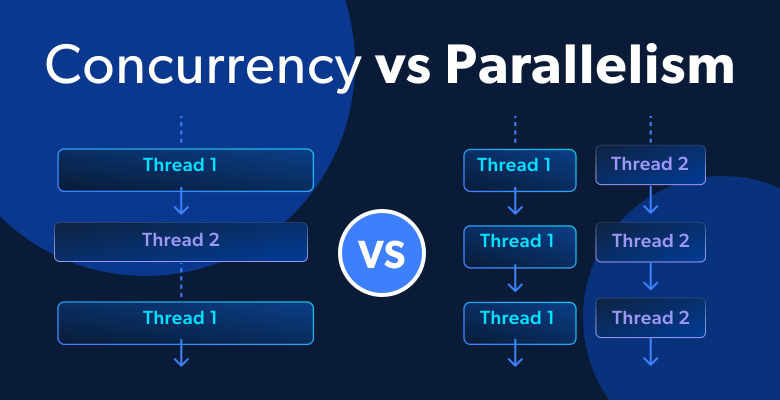

# Introduction to Parallel Computing

## Moore's law

::: {style="text-align: center;"}
  
:::

## Why parallel computing is hard

* We don't think in parallel
* We learn to write and reason about programs serially
* The desire for parallelism often comes _after_ we've written the algorithm

## Two types of "multitasking"

- Concurrency: Interruptability
- Parallelism: Independentability

::: {style="text-align: center;"}
  
:::

## Many types of parallelism

:::: {.columns}

::: {.column width="50%"}
* SIMD
* Multi-threading
* Tasks
* Multi-process
    * Shared memory
    * Distributed memory
* GPU programming
:::

::: {.column width="50%"}
::: {.fragment}
Right type of parallelism depends on

- machine capabilities
- problem at hand
:::
:::

::::

## Processes vs Threads

::: {.columns}
::: {.column width="50%"}
### Processes
- Top-level execution container
- Runs inside a process
- Separate memory space
:::

::: {.column width="50%"}
### Threads
- Shared memory space
- Communicate via Inter-Process Communication (IPC)
- Plethora of communication options, runtime dependent
:::
:::

## (Non-)Blocking and (A)synchronous

<div ...
## (Non-)Blocking and (A)synchronous

<div style="text-align: center;">
  
  
</div>

## Examples of (non-)blocking and (a)synchronous calls

::: {.incremental}
- Synchronous = Thread will complete an action
- Blocking = Thread will wait until action is completed
- Asynchronous + Non-Blocking: I/O
- Asynchronous + Blocking: Threaded *atomics*
- Synchronous + Blocking: Standard computing (`@sync`)
- Synchronous + Non-Blocking: Webservers where an I/O operation can be performed, but one never checks if the operation is completed.
:::

## The Main Event Loop

- Julia, like other languages with a runtime (JavaScript, Go, etc.), runs a single process event loop.

::: {.fragment}
- The "Julia program" runs in a green thread controlled by this main event loop.
:::
::: {.fragment}
- The event loop takes over when the program hits a yield point.
:::
::: {.fragment}
- More yield points allow more task switching but can slow down numerical tasks.
:::

## Yield Points

- Languages like JavaScript have yield points at every line due to their structure for I/O.
- In Julia, yield points are minimized with common ones at allocations and I/O (e.g., `println`).
- Tight non-allocating loops in Julia have no yield points, enhancing numerical performance.
- Long, tight loops may not respond to `Ctrl + C` because interrupts are managed by the event loop.

## Asynchronous I/O Operations

- The same can be done for writing to the disk:
  - `@async` is a quick shorthand for spawning a green thread to handle I/O operations.
  - The main event loop switches between them until all are handled.

- `@sync` ensures all green threads are handled before continuing.


## Quiz on @threads

:::: {.columns}

::: {.column width="50%"}
```{julia}
#| output-location: fragment
nth = Threads.nthreads()
@time begin
  Threads.@spawn sleep(0.25)
  Threads.@threads for i in 1:nth
    sleep(0.25)
  end
end
```

::: {.fragment}
```{julia}
function busywait(s)
  tstart = time_ns()
  while (time_ns() - tstart)/1e9 < s
  end
end
```
:::
:::

::: {.column width="50%"}
::: {.fragment}
```{julia}
#| output-location: fragment
@time begin
  Threads.@spawn busywait(0.25)
  Threads.@threads for i in 1:nth
    busywait(0.25)
  end
end
```
:::
:::

::::

# Study Case: Sum

## Example: Sum

$$
\mathrm{sum}(a) = \sum_{i=1}^n a_i,
$$
where $n$ is length of `a`.

## Julia built-in

```{julia}
#| output-location: fragment
using BenchmarkTools
d = Dict()
a = rand(10^7)

j_builtin = @benchmark sum($a)
d["Julia built-in"] = minimum(j_builtin.times) / 1e6
```

## Julia hand-written

```{julia}
function mysum(A)
    s = 0.0
    for a in A
        s += a
    end
    return s
end
```

::: {.fragment}
```{julia}
#| output-location: fragment
j_hand = @benchmark mysum($a)

d["Julia hand-written"] = minimum(j_hand.times) / 1e6
d
```
:::

## C version


```{julia}
using Libdl
C_code = """
    #include <stddef.h>
    double c_sum(size_t n, double *X) {
        double s = 0.0;
        for (size_t i = 0; i < n; ++i) {
            s += X[i];
        }
        return s;
    }
"""

const Clib = tempname()   # make a temporary file

# compile to a shared library by piping C_code to gcc
open(`gcc -fPIC -O3 -msse3 -xc -shared -o $(Clib * "." * Libdl.dlext) -`, "w") do f
    print(f, C_code)
end

# define a Julia function that calls the C function:
c_sum(X::Array{Float64}) = ccall(("c_sum", Clib), Float64, (Csize_t, Ptr{Float64}), length(X), X)
```

## C benchmark

```{julia}
#| output-location: fragment
c_sum(a) == sum(a)
```

::: {.fragment}
```{julia}
c_sum(a) ≈ sum(a)
```
:::

::: {.fragment}
```{julia}
#| output-location: fragment
c_bench = @benchmark c_sum($a)
d["C"] = minimum(c_bench.times) / 1e6
d
```
:::

## Python built-in

```{julia}
using PyCall
pysum = pybuiltin("sum")
pysum(a) ≈ sum(a)
```

::: {.fragment}
```{julia}
py_builtin = @benchmark pysum($a)
d["Python built-in"] = minimum(py_builtin.times) / 1e6
d
```
:::

## Numpy

```{julia}
using Conda
numpy_sum = pyimport("numpy")["sum"]
numpy_sum(a) ≈ sum(a)
```

::: {.fragment}
```{julia}
#| output-location: fragment
py_numpy = @benchmark numpy_sum($a)
d["Python numpy"] = minimum(py_numpy.times) / 1e6
d
```
:::

## Python hand-written

```{julia}
py"""
def py_sum(A):
    s = 0.0
    for a in A:
        s += a
    return s
"""

sum_py = py"py_sum"
sum_py(a) ≈ sum(a)
```

::: {.fragment}
```{julia}
#| output-location: fragment
py_hand = @benchmark sum_py($a)
d["Python hand-written"] = minimum(py_hand.times) / 1e6
d
```
:::

## Floating point associativity


```{julia}
#| eval: false
s = 0.0
for a in A # strict order of summation
    s += a
end
```

::: {.fragment}
relax that rule
with `@fastmath` macro

```{julia}
#| output-location: column-fragment
function mysum_fast(A)
    s = 0.0
    for a in A
        @fastmath s += a
    end
    s
end

j_hand_fast = @benchmark mysum_fast($a)
d["Julia hand-written fast"] =
    minimum(j_hand_fast.times) / 1e6
d
```
:::
