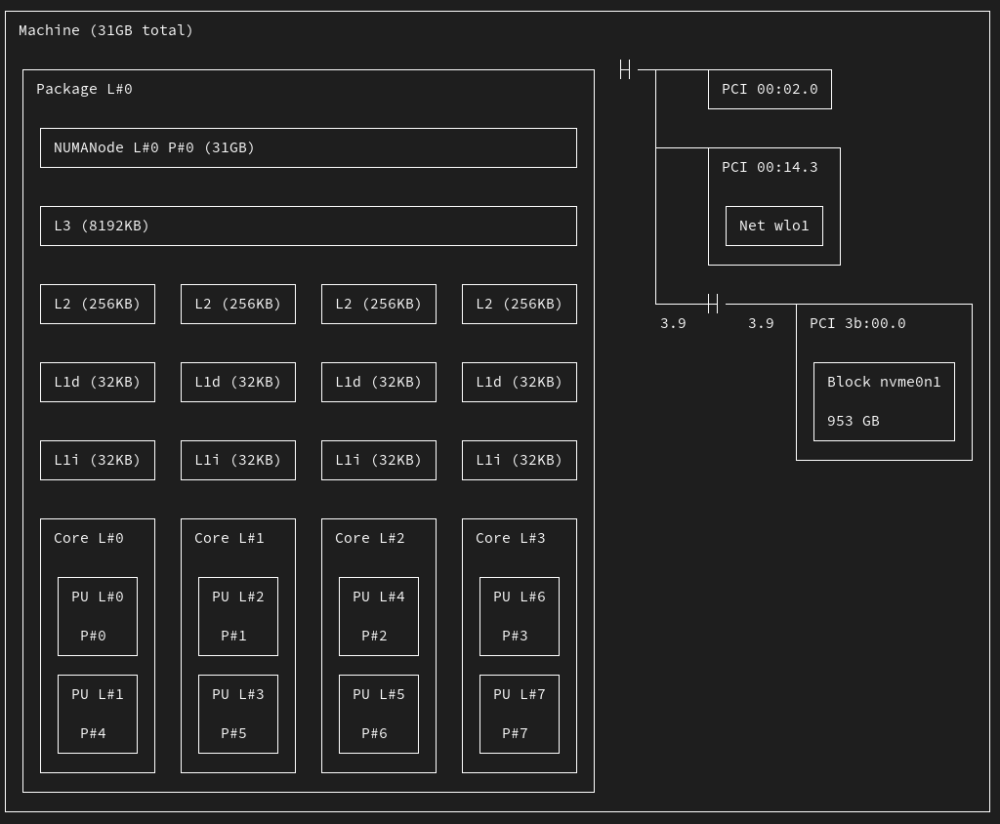

# SIMD (Single Instruction, Multiple Data)

## Summary of Study Case on `sum`

:::: {.columns}
::: {.column width="50%"}
```{julia}
#| output: false
using Plots
d = [
    ("Python hand-written", 1.22258),
    ("Python numpy", 0.00443508),
    ("Julia hand-written fast", 0.00499006),
    ("Julia hand-written", 0.0102286),
    ("Julia built-in", 0.00515328),
    ("Python built-in", 0.967172),
    ("C", 0.0113466)
]
sort!(d, by=x -> x[2])
```
:::
::: {.column width="50%"}
```{julia}
#| output: false
plot_args = (
    yscale=:log10,
    legend=false,
    xlabel="Method",
    ylabel="Time (s)",
    title="Performance Comparison (Log Scale)",
    rotation=10,
)
```
:::
::::
```{julia}
#| output-location: slide
bar(getindex.(d,1), getindex.(d,2); plot_args...)
```

## SIMD

:::: {.columns}
::: {.column width="50%"}

Instead of computing four sums sequentially:

\begin{align}
x_1 + y_1 &\rightarrow z_1 \\
x_2 + y_2 &\rightarrow z_2 \\
x_3 + y_3 &\rightarrow z_3 \\
x_4 + y_4 &\rightarrow z_4
\end{align}

:::
::: {.column width="50%"}

Modern processors have vector processing units that can do it all at once:

$$
\left(\begin{array}{cc}
x_1 \\
x_2 \\
x_3 \\
x_4
\end{array}\right)
+
\left(\begin{array}{cc}
y_1 \\
y_2 \\
y_3 \\
y_4
\end{array}\right)
\rightarrow
\left(\begin{array}{cc}
z_1 \\
z_2 \\
z_3 \\
z_4
\end{array}\right)
$$

:::
::::

## Back to the `sum` example

```{julia}
A = rand(10_000_000)
function simplesum(A)
    result = 0.0
    for i in eachindex(A)
        @inbounds result += A[i]
    end
    return result
end
```

```{julia}
using BenchmarkTools
@btime simplesum($A)
@btime sum($A);
```

## SIMD sum

What if we use single-precision floats?
```{julia}
A32 = rand(Float32, length(A)*2)
@btime simplesum($A32)
@btime sum($A32);
```
Why?

::: {.fragment}
```{julia}
#| output-location: column
function simdsum(A)
    result = 0.0
    @simd for i in eachindex(A)
        @inbounds result += A[i]
    end
    return result
end
@btime simdsum($A)
@btime simdsum($A32);
```
:::

## Warnings

Why not using `@simd` all the time?
```{julia}
simplesum(A), simdsum(A), sum(A)
```

```{julia}
simplesum(A32), simdsum(A32), sum(A32)
```

::: {.fragment}
<!-- Sometimes Julia knows it can vectorize -->

```{julia}
#| output-location: column
B = rand(1:10, 100_000)
@btime simplesum($B)
@btime sum($B)
B32 = rand(Int32(1):Int32(10), length(B)*2)
@btime simplesum($B32)
@btime simdsum($B32);
```
:::

## Generated code

```{julia}
@code_llvm simdsum(A32)
```

## A tricky example

```{julia}
function diff!(A, B)
    A[1] = B[1]
    for i in 2:length(A)
        @inbounds A[i] = B[i] - B[i-1]
    end
    return A
end
A = zeros(Float32, 100_000)
B = rand(Float32, 100_000)

diff!(A, B)
[B[1];diff(B)] == A
```

```{julia}
@btime diff!($A, $B)
@btime diff($B);
```

## In-place diff

```{julia}
Bcopy = copy(B)
@btime diff!($Bcopy, $Bcopy);
```
Why?

## Forcing SIMD

:::: {.columns}
::: {.column width="50%"}

```{julia}
function unsafe_diff!(A, B)
    A[1] = B[1]
    @simd ivdep for i in 2:length(A)
        @inbounds A[i] = B[i] - B[i-1]
    end
    return A
end
@btime unsafe_diff!($A, $B);
```

:::
::: {.column width="50%"}

::: {.fragment}
```{julia}
[B[1];diff(B)] == A
```
:::

::: {.fragment}
```{julia}
Bcopy = copy(B)
unsafe_diff!(Bcopy, Bcopy)
[B[1];diff(B)] == Bcopy
```
:::

:::
::::

## SIMD in practice

::: {style="font-size: 80%;"}

* Exploits built-in parallelism in processor
* Best for small, tight innermost loops
* Often happens automatically if you're careful
    * Follow [perforance best practices](https://docs.julialang.org/en/v1/manual/performance-tips/)
    * `@inbounds` array accesses
    * No branches or (non-inlined) function calls
* Can force it with `@simd` but be careful (`@simd ivdep`)
* Depending on processor and types, can yield 2-16x gains with little overhead
    * Use `Float32` instead of `Float64`
      if possible, etc.
    * When choosing processor, look for [AVX-512](https://en.wikichip.org/wiki/x86/avx-512) support

:::

# Distributed computing

## Julia distributed

```{julia}
#| eval: false
using Distributed
using DistributedArrays
addprocs(4)
@everywhere using DistributedArrays
```


```{julia}
#| eval: false
A = rand(10_000_000)
adist = distribute(A)
# can't run in quarto
newt = ("Julia 4x built-in", @belapsed sum($adist))
# 0.00353425
```

```{julia}
#| output: false
push!(d, ("Julia 4x built-in", 0.00353425)); sort!(d, by=x -> x[2])
```


## Julia distributed hand-written

```{julia}
#| eval: false
function mysum_dist(A::DArray)
    r = Array{Future}(undef, length(procs(A)))
    for (i, id) in enumerate(procs(A))
        r[i] = @spawnat id sum(localpart(A))
    end
    return sum(fetch.(r))
end
```

::: {.fragment}
```{julia}
#| eval: false
# can't run in quarto
newt = ("Julia 4x hand-written", @belapsed mysum_dist($adist))
# 0.004236119
```

```{julia}
#| output: false
push!(d, ("Julia 4x hand-written", 0.004236119)); sort!(d, by=x -> x[2])
```
:::

## Summary

```{julia}
#| echo: false
bar(getindex.(d,1), getindex.(d,2); plot_args...)
```

## Memory latencies

::: {style="font-size: 80%;"}

| System Event                   | Actual Latency | Scaled Latency |
| ------------------------------ | -------------- | -------------- |
| One CPU cycle                  |     0.4 ns     |     1 s        |
| Level 1 cache access           |     0.9 ns     |     2 s        |
| Level 2 cache access           |     2.8 ns     |     7 s        |
| Level 3 cache access           |      28 ns     |     1 min      |
| Main memory access (DDR DIMM)  |    ~100 ns     |     4 min      |
| Intel Optane memory access     |     <10 μs     |     7 hrs      |
| NVMe SSD I/O                   |     ~25 μs     |    17 hrs      |
| SSD I/O                        |  50–150 μs     | 1.5–4 days     |
| Rotational disk I/O            |    1–10 ms     |   1–9 months   |
| Internet call: SF to NYC       |      65 ms     |     5 years    |
| Internet call: SF to Hong Kong |     141 ms     |    11 years    |

:::

## Know your hardware

```{julia}
versioninfo() # more with verbose = true
```

More details with `;cat /proc/cpuinfo`

## Hwloc

:::: {.columns}

::: {.column width="30%"}
```{julia}
#| eval: false
using Hwloc
```
:::

::: {.column width="70%"}

:::

::::

# Multithreading

## Some multithreading by default

```{julia}
using LinearAlgebra, BenchmarkTools
B = rand(2000, 2000);
C = rand(2000, 2000);
BLAS.set_num_threads(1)
@btime $B*$C
BLAS.set_num_threads(4)
@btime $B*$C
BLAS.set_num_threads(8)
@btime $B*$C;
```

## Multithreading in Julia

```{julia}
using .Threads # Base.Threads
nthreads()
```

What will this do?

:::: {.columns}

::: {.column width="50%"}
```{julia}
#| output-location: fragment
M = zeros(1, nthreads())
for i in 1:nthreads()
    M[threadid()] = threadid()
end
M
```
:::

::: {.column width="50%"}
::: {.fragment}
```{julia}
@threads for i in 1:nthreads()
    M[threadid()] = threadid()
end
M
```
:::
:::

::::

## Back to `sum`

```{julia}
function mthr_sum1(A)
    r = 0.0
    @threads for i in eachindex(A)
        @inbounds r += A[i]
    end
    return r
end

@show mthr_sum1(A) ≈ sum(A)
newt = ("Julia threaded wrong", @belapsed mthr_sum1($A))
```

## Summary

```{julia}
#| echo: false
push!(d, newt); sort!(d, by=x -> x[2])
bar(getindex.(d,1), getindex.(d,2); plot_args...)
```

## Thread-safe operations

```{julia}
function mthr_sum2(A)
    r = Atomic{eltype(A)}()
    @threads for i in eachindex(A)
        @inbounds atomic_add!(r, A[i])
    end
    return r[]
end

mthr_sum2(A)
@show mthr_sum2(A) ≈ sum(A)
newt = ("Julia threaded atomic", @belapsed mthr_sum2($A))
```

```{julia}
#| output: false
push!(d, newt); sort!(d, by=x -> x[2])
```

## Efficient multithreading

:::: {.columns}
::: {.column width="50%"}
```{julia}
function mthr_sum3(A)
    r = Atomic{eltype(A)}()
    len, rem = divrem(length(A), nthreads())
    @threads for t in 1:nthreads()
        rₜ = 0.0
        @simd for i in (1:len) .+ (t-1)*len
            @inbounds rₜ += A[i]
        end
        atomic_add!(r, rₜ)
    end
    # catch up any stragglers
    result = r[]
    @simd for i in length(A)-rem+1:length(A)
        @inbounds result += A[i]
    end
    return result
end
```
:::
::: {.column width="50%"}
```{julia}
#| output: false
# quarto problem?
#@show mthr_sum3(A) ≈ sum(A)
push!(d, ("Julia threaded 3", 0.002938303)); sort!(d, by=x -> x[2])
```
:::
::::

## Summary

```{julia}
#| echo: false
push!(d, newt); sort!(d, by=x -> x[2])
bar(getindex.(d,1), getindex.(d,2); plot_args...)
```

## Limit of `mthr_sum3`

```{julia}
mthr_sum3(rand(10) .+ rand(10)im)
```

## Better ways to multithread?

```{julia}
function mthr_sum4(A)
    R = zeros(eltype(A), nthreads())
    @threads for i in eachindex(A)
        @inbounds R[threadid()] += A[i]
    end
    r = 0.0
    for i in eachindex(R)
        @inbounds r += R[i]
    end
    return r
end

@show mthr_sum4(A) ≈ sum(A)
newt = ("Julia threaded 4", @belapsed mthr_sum4($A))
```

## Summary

```{julia}
#| echo: false
push!(d, newt); sort!(d, by=x -> x[2])
bar(getindex.(d,1), getindex.(d,2); plot_args...)
```

## `mthr_sum4`

- no `@simd` (slower)
- don't need to worry about indices
- don't need to worry about atomics
- can support arrays of any elements
```{julia}
#| eval: false
mthr_sum4(rand(10) .+ rand(10)im)
```
