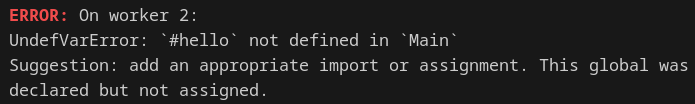
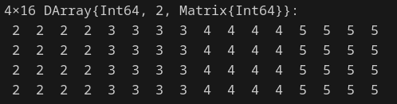

# Distributed computing - II

:::: {.columns}
::: {.column width="50%"}

```{julia}
using Distributed
nprocs()
# addprocs(4)
```


```{julia}
myid()
```

:::
::: {.column width="50%"}

::: {.fragment}
```{julia}
#| eval: false
r = @spawnat 2 (myid(), rand())
fetch(r)
# (2, 0.6818163113888619)
```
:::
::: {.fragment}
```{julia}
#| eval: false
@elapsed r = @spawnat 2 (sleep(1), rand())
# 0.000340812
```

```{julia}
#| eval: false
@elapsed fetch(r)
# 0.000326885
```
:::

:::
::::

## `@spawnat` vs `@async`

:::: {.columns}
::: {.column width="40%"}
```{julia}
#| eval: false
@elapsed for i in 2:nprocs()
  @spawnat i sleep(1)
end
# 0.000689852
```

```{julia}
#| eval: false
@elapsed begin
  @sync for i in 2:nprocs()
    @spawnat i sleep(1)
  end
end
# 1.012463476
```
:::
::: {.column width="60%"}
::: {.fragment}
```{julia}
#| eval: false
@everywhere function work(N)
  series = 1.0
  for i in 1:N
    series += (isodd(i) ? -1 : 1) / (i*2+1)
  end
  return 4*series
end
work(1_000_000_000)

@elapsed @sync for i in workers()
  @spawnat i work(1_000_000_000)
end
# 1.068717001
```
:::
:::
::::

## Back to $\pi$

```{julia}
#| eval: false
@everywhere function part_pi(r)
  series = 0.0
  for i in r
    series += (isodd(i) ? -1 : 1) / (i*2+1)
  end
  return 4*series
end
a = part_pi(0:999)
a, a-pi
# (3.140592653839794, -0.000999999749998981)
```


```{julia}
#| eval: false
b = part_pi(1000:9999)
(a + b), (a+b) - pi
# (3.1414926535900443, -9.999999974885654e-5)
```

## Hand-crafted distributed $\pi$

```{julia}
#| eval: false
r = 0:nextpow(nprocs(),1_000_000_000)

futures = Array{Future}(undef, nworkers())
t = @elapsed begin
  for (i, id) in enumerate(workers())
    part_len = length(r) ÷ nworkers()
    batch = 0:(part_len-1)
    part_r = batch .+ (i-1)*(part_len)
    futures[i] = @spawnat id part_pi(part_r)
  end
  p = sum(fetch.(futures))
end

t, p - pi
# (0.616588778, -8.195844003466846e-10)
```

## Better distributed $\pi$

```{julia}
#| eval: false
part_r = [(0:9999) .+ offset for offset in 0:10000:r[end]-1]
t = @elapsed begin
  p = @distributed (+) for r in part_r
    part_pi(r)
  end
end
t, p - pi
# (0.657746915, -8.19201151358584e-10)
```
::: {.fragment}
- Why is this different from `@threads for` and `@simd for`?
- Why not just
`@distributed for`?
- Why the `@distributed (+) for`?
:::

## Recall: memory latencies

::: {style="font-size: 80%;"}

| System Event                   | Actual Latency | Scaled Latency |
| ------------------------------ | -------------- | -------------- |
| One CPU cycle                  |     0.4 ns     |     1 s        |
| Level 1 cache access           |     0.9 ns     |     2 s        |
| Level 2 cache access           |     2.8 ns     |     7 s        |
| Level 3 cache access           |      28 ns     |     1 min      |
| Main memory access (DDR DIMM)  |    ~100 ns     |     4 min      |
| Intel Optane memory access     |     <10 μs     |     7 hrs      |
| NVMe SSD I/O                   |     ~25 μs     |    17 hrs      |
| SSD I/O                        |  50–150 μs     | 1.5–4 days     |
| Rotational disk I/O            |    1–10 ms     |   1–9 months   |
| Internet call: SF to NYC       |      65 ms     |     5 years    |
| Internet call: SF to Hong Kong |     141 ms     |    11 years    |

:::

## Distributed: large comp., small comm.


```{julia}
#| eval: false
part_len = 100_000
part_r = ((0:part_len-1) .+ offset for offset in 0:part_len:r[end]-1)
t = @elapsed begin
  ans = sum(pmap(part_pi, part_r))
end
t, ans - pi
# (1.707175279, -8.192082567859416e-10)
```

::: {.fragment}
```{julia}
#| eval: false
part_len = 10_000_000
part_r = ((0:part_len-1) .+ offset for offset in 0:part_len:r[end]-1)
t = @elapsed begin
  ans = sum(pmap(part_pi, part_r))
end
t, ans - pi
# (0.981242102, -8.130087714164347e-10)
```
:::

## `@everywhere`

Each process in `procs()` is _independent_, e.g. remote machine via SSH

```{julia}
#| eval: false
hello() = "hello world"
r = @spawnat 2 hello()
fetch(r)
```


::: {.fragment}
```{julia}
#| eval: false
@everywhere hello(x) = "hello $x"
fetch(@spawnat 2 hello("world"))
# equivalent to
# remotecall_fetch(hello, 2, "world")
```
:::

## No shared memory: Pros and Cons

- Harder to make mistakes (as in multithreading)
- Harder to write algorithms

### Shared arrays
:::: {.columns}

::: {.column width="50%"}
```{julia}
#| eval: false
using SharedArrays
A = SharedArray(rand(Bool,4,10))
A
# 4×10 SharedMatrix{Bool}:
#  0  1  1  1  0  0  0  0  0  1
#  0  0  1  0  0  1  1  1  0  1
#  1  0  0  1  0  0  1  1  1  0
#  1  1  0  0  0  0  0  0  0  0
```
:::

::: {.column width="50%"}
::: {.fragment}
```{julia}
#| eval: false
remotecall_fetch(1) do
  A[1,:] .= true
end
remotecall_fetch(2) do
  A[:,1] .= true
end
A
# 4×10 SharedMatrix{Bool}:
#  1  1  1  1  1  1  1  1  1  1
#  1  0  1  0  0  1  1  1  0  1
#  1  0  0  1  0  0  1  1  1  0
#  1  1  0  0  0  0  0  0  0  0
```
:::
:::

::::

## DistributedArrays

:::: {.columns}

::: {.column width="50%"}
```{julia}
#| eval: false
@everywhere using Distributed
@everywhere using DistributedArrays
A = DArray((4, 16)) do I
  fill(myid(), length.(I))
end
```


:::

::: {.column width="50%"}
::: {.fragment}
```{julia}
#| eval: false
@everywhere using BenchmarkTools
remotecall_fetch(2) do
  println(@belapsed $A[1,1])
end
remotecall_fetch(2) do
  println(@belapsed $A[end,end])
end
# From worker 2: 2.021732142857143e-7
# From worker 2: 5.7175e-5
```
:::
:::

::::

## Distributed across machines

We can add workers on remote machines using SSH
```{julia}
#| eval: false
addprocs([("foo@bar",1)];
          tunnel=true,
          topology=:master_worker,
          exeflags="--threads=auto")
```

::: {.fragment}
```{julia}
#| eval: false
@everywhere using Sockets
remotecall_fetch(getipaddr, 1), remotecall_fetch(getipaddr, 2)
# (ip"192.168.1.25", ip"138.96.202.136")
```


:::

## Summary

* `@distributed`: good for reductions and relatively fast inner loops with limited data transfer
* `pmap`: great for expensive inner loops that return a value
* `SharedArray`: drop-in replacement for threading-like behaviors (single machine)
* `DistributedArray`: let the data do the work splitting
