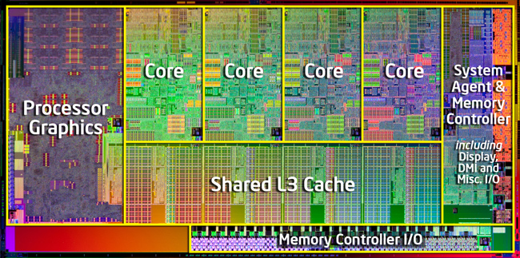
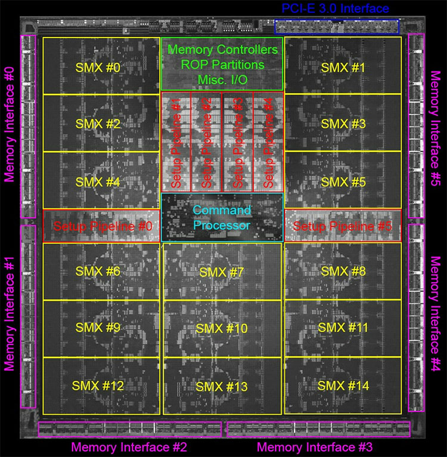
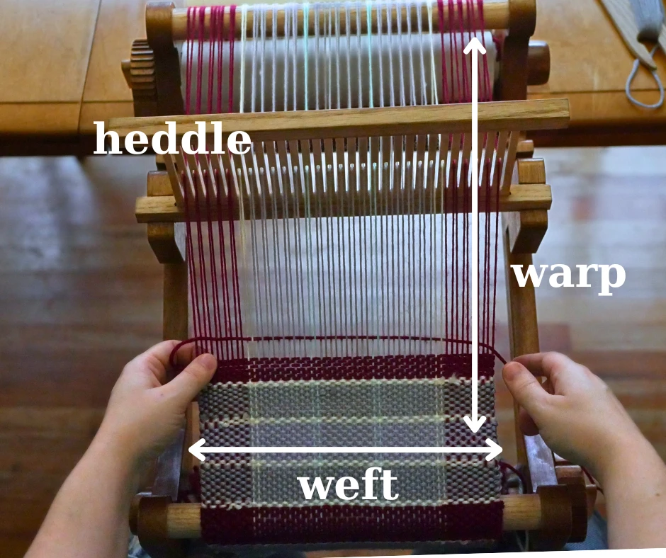
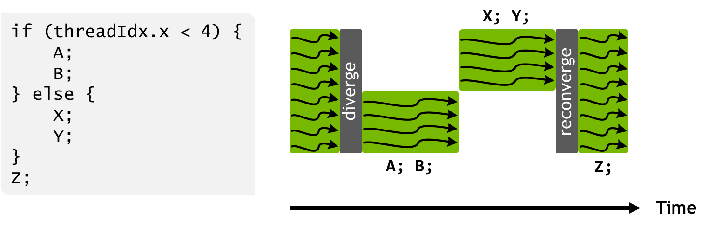
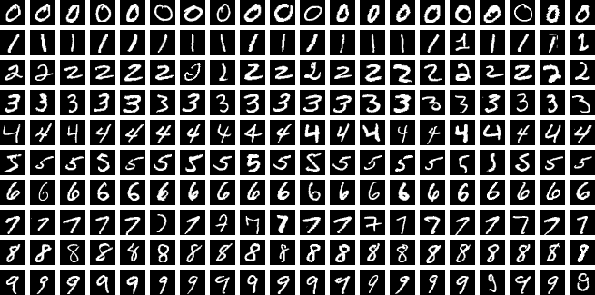

## i7 CPU



## GK110 GPU

:::: {.columns}

::: {.column width="62%"}

:::

::: {.column width="38%"}
::: {.fragment}


15 SMX multiproc.s<br>
x 6 warps<br>
x 32 threads each<br>
= 2880 threads
:::
:::

::::

## Recommended video



## GPU warps

Warps: similar to SIMD unit with branching, but executs only ONE instruction



::: {.fragment}
Check your GPU with `nvidia-smi`.
:::

## Back to the $\pi$ example

```{julia}
function serialpi(n)
  inside = 0
  for i in 1:n
    x, y = rand(), rand()
    inside += (x^2 + y^2 <= 1)
  end
  return 4 * inside / n
end
```

## GPU kernels: CuArrays + broadcast

```{julia}
using CUDA: rand as curand
function findpi_gpu(n)
  4 * sum(curand(Float64, n).^2 .+ curand(Float64, n).^2 .<= 1) / n
end
```

::: {.fragment}

```{julia}
using BenchmarkTools
@btime serialpi(10_000_000)
@btime findpi_gpu(10_000_000);
```
:::

::: {.fragment}
To go deeper: [CUDAnative.jl](https://github.com/JuliaGPU/CUDAnative.jl)
:::

# CPU training of LeNet

## MNIST dataset



::: {.fragment}
```{julia}
using MLDatasets
train_data = MLDatasets.MNIST()
test_data = MLDatasets.MNIST(split=:test)
```
:::

## LeNet architecture


## data loader implementation

```{julia}
using Flux, CUDA
using Flux: setup, update!, DataLoader, onehotbatch, onecold, logitcrossentropy, gradient

function loader(data=train_data; bsize=64)
  x4dim = reshape(data.features, 28,28,1,:)
  yhot = onehotbatch(data.targets, 0:9)
  DataLoader((x4dim, yhot); batchsize=bsize, shuffle=true)
end
```

## model implementation

```{julia}
#| output-location: column
# cfr. Flux.@autosize (28, 28, 1, 1)
lenet = Chain(
  Conv((5, 5), 1=>6, relu),
  MaxPool((2, 2)),
  Conv((5, 5), 6=>16, relu),
  MaxPool((2, 2)),
  Flux.flatten,
  Dense(256 => 120, relu),
  Dense(120 => 84, relu),
  Dense(84 => 10),
)
```

## training setup

```{julia}
settings = (;
  eta = 3e-4, # learning rate
  lambda = 1e-2, # for weight decay
  bsize = 128,
  epochs = 10,
)

opt_rule = OptimiserChain(
              WeightDecay(settings.lambda),
              Adam(settings.eta)
            )
opt_state = setup(opt_rule, lenet);
```

## accuracy and loss

```{julia}
using Statistics: mean

function accuracy(model, data=train_data)
  (x,y) = only(loader(data; bsize=length(data)))
  ŷ = model(x)
  acc = round(100 * mean(onecold(ŷ) .== onecold(y)); digits=2)
  acc
end
```

## training loop

```{julia}
#| output-location: column
using .Iterators: take
for epoch in 1:settings.epochs
  batches = loader(train_data;
          bsize=settings.bsize)
  batchnum = length(batches)
  subset = take(batches, batchnum÷10)

  @time for (x,y) in subset
    gr = gradient(lenet) do m
      logitcrossentropy(m(x), y)
    end
    update!(opt_state, lenet, gr[1])
  end

  acc = accuracy(lenet)
  t_acc = accuracy(lenet, test_data)
  @info "logging:" epoch acc t_acc
end
```

## post-training checks

:::: {.columns}
::: {.column width="50%"}
```{julia}
using ImageCore
xtest, ytest = only(loader(
      test_data,
      bsize=length(test_data))
    );
x1, y1 = xtest[:,:,1,5], ytest[:,5]
x1 .|> Gray |> transpose
```
:::
::: {.column width="50%"}
```{julia}
onecold(y1, 0:9)
```

```{julia}
# sanity-check of predictions:
y1hat = lenet(reshape(x1,28,28,1,1))
hcat(
  onecold(y1hat, 0:9),
  onecold(y1, 0:9)
)
```
:::
::::

## worst classified image

:::: {.columns}

::: {.column width="50%"}
```{julia}
ptest = softmax(lenet(xtest))
max_p = maximum(ptest; dims=1)
_, i = findmin(vec(max_p))
xtest[:,:,1,i] .|> Gray |> transpose
```
:::

::: {.column width="50%"}
```{julia}
onecold(ytest, 0:9)[i]
```

```{julia}
ptest[:,i]
```

```{julia}
onecold(ptest[:,i], 0:9)
```
:::
::::

## Inspections

```{julia}
lenet[1]
```

```{julia}
lenet[1].weight |> summary
```

```{julia}
lenet[1](reshape(x1,28,28,1,1)) |> size
```

```{julia}
lenet[2]
```

```{julia}
lenet[1:2](reshape(x1,28,28,1,1)) |> size
```

## GPU implementaion

### data loader
```{julia}
function gpuloader(data=train_data; bsize=64)
  return gpu(loader(data; bsize))
end
```

### model
```{julia}
glenet = gpu(lenet)
```

## GPU accuracy and loss

```{julia}
function g_acc(model, data=train_data)
  (x,y) = only(gpuloader(data; bsize=length(data)))
  ŷ = model(x)
  acc = round(100 * mean(onecold(ŷ) .== onecold(y)); digits=2)
  acc
end
```

## training loop (GPU)

```{julia}
#| output-location: column
g_opt = setup(opt_rule, glenet);

for epoch in 1:settings.epochs
  gbatches = gpuloader(train_data;
            bsize=settings.bsize)
  @time for (x,y) in gbatches
    gr = gradient(glenet) do m
      logitcrossentropy(m(x), y)
    end
    update!(g_opt, glenet, gr[1])
  end

  acc = g_acc(glenet)
  t_acc = g_acc(glenet, test_data)
  @info "logging:" epoch acc t_acc
end
```
