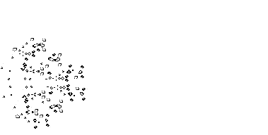
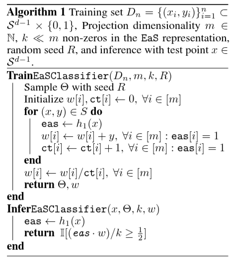
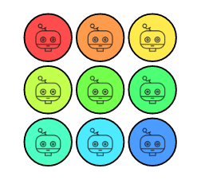
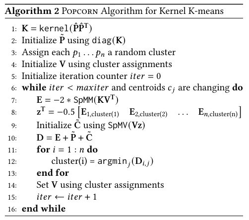

# Distributed Computing

## [Conway's Game of Life](https://en.wikipedia.org/wiki/Conway%27s_Game_of_Life)


:::: {.columns}

::: {.column width="25%"}
 
:::

::: {.column width="75%"}
::: {style="font-size: 90%;"}
- Underpopulation: any live cell with fewer than two live neighbours dies
- Stability: Any live cell with two or three live neighbours lives on to the next generation
- Overpopulation: any live cell with more than three live neighbours dies
- Reproduction: any dead cell with exactly three live neighbours becomes a live cell

:::
:::

::::

Implement it using Julia's `Distributed` library.

**Difficulty**: Easy

## Classification via LSH

:::: {.columns}
::: {.column width="50%"}
Reproduce the experiment of the [Neurips'25 paper "Non-parametric classification via expand-and-sparsify representation"](https://openreview.net/forum?id=0d50Il6enG) (at least 2 of the 8 datasets), using Julia's `Distributed` library (or GPU computing).

**Difficulty**: Medium (read and understand a part of a recent paper)
:::
::: {.column width="50%"}

:::
::::

# Multithreading

## AdaBoost: Motivation

- You have a **pool of weak classifiers** ("experts")
- Goal: build a **committee** to win a classification competition
- Each expert votes +1 or -1; the committee votes by **weighted majority**
- Key: combine classifiers that **complement** each other

## Formal Setup

Final classifier:
$$
K(x) = \text{sign}\left(\sum_{j=1}^{M} \alpha_j k_j(x)\right)
$$

- $k_j(x) \in \{-1, 1\}$: opinion of expert $j$
- $\alpha_j$: weight of expert $j$
- Drafting = selecting which experts join the team and how much we trust them


## Scouting the Pool

- Use training set $(x_i, y_i)$, $y_i \in \{-1, 1\}$
- Assign initial equal weights to data points
- Use **exponential loss**:
  - Hit (correct): cost $e^{-\beta}$
  - Miss (wrong): cost $e^\beta$
- Construct scouting matrix $S$: where each classifier fails


## Drafting Strategy

At iteration $m$:

$$
C^{(m)}(x) = C^{(m-1)}(x) + \alpha_m k_m(x)
$$

Minimize total exponential loss:
$$
E = \sum_{i=1}^{N} w_i^{(m)} e^{-y_i \alpha_m k_m(x_i)}
$$

where:
$$
w_i^{(m)} = e^{-y_i C^{(m-1)}(x_i)}
$$

## Selecting the Best Draft Pick

Split loss:
$$
E = W_c e^{-\alpha_m} + W_e e^{\alpha_m}
$$

- $W_c$: weighted sum of correct classifications
- $W_e$: weighted error of the candidate
- Choose $k_m$ that minimizes $W_e$


## Computing the Classifier Weight

Minimize $E$:
$$
\frac{dE}{d\alpha_m} = 0 \Rightarrow \alpha_m = \frac{1}{2} \ln \left( \frac{W_c}{W_e} \right)
$$

Or using error rate $e_m = W_e / (W_c + W_e)$:
$$
\alpha_m = \frac{1}{2} \ln \left( \frac{1 - e_m}{e_m} \right)
$$


## Updating Data Weights

- If $k_m(x_i) \ne y_i$:
  $$
  w_i^{(m+1)} = w_i^{(m)} e^{\alpha_m}
  $$
- If $k_m(x_i) = y_i$:
  $$
  w_i^{(m+1)} = w_i^{(m)} e^{-\alpha_m}
  $$
- Normalize weights (optional but useful)


## AdaBoost Algorithm (Summary)

For $m = 1$ to $M$:

1. Choose classifier $k_m$ with minimal weighted error
2. Set $\alpha_m = \frac{1}{2} \ln \left( \frac{1 - e_m}{e_m} \right)$
3. Update weights of data points
4. Build final classifier:
$$
K(x) = \text{sign}\left( \sum_{m=1}^{M} \alpha_m k_m(x) \right)
$$


## Intuition & Insights

- Focuses on hard examples
- Uses exponential loss → simple, clean updates
- Builds diverse, complementary ensemble
- Poor classifiers (error ≥ 0.5) are discarded or inverted

## Project: solve MNIST with AdaBoost

- Solve even-vs-odd MNIST by using AdaBoost
- Each weak classifier is a random labeling of data points
- Use Julia's `Threads` to parallelize the training of weak classifiers
- Bonus: explore different weak classifiers

**Difficulty**: Easy

# Netflix Prize

## The Netflix Prize

:::: {.columns}
::: {.column width="50%"}
- Launched in 2006 by Netflix
- Goal: Improve Cinematch algorithm by 10%
- Prize: $1,000,000
- Dataset: 100 million ratings from ~500,000 users
- Evaluation metric: Root Mean Squared Error (RMSE)
:::
::: {.column width="50%"}

:::
::::

## Competition Rules

- Predict ratings for 3 million (user, movie, date) triples
- Submissions initially limited to once per week, later increased to once per day
- Public leaderboard based on half of the test data
- Private leaderboard (used to determine winner) based on the other half

Inspired Kaggle competitions.

## Success of Simple Methods

- Notable submission by "simonfunk": SVD with Stochastic Gradient Descent (SGD)

```{julia}
#| eval: false
for (user, movie, rating) in rating_tuples
    err = rating - dot(movieEmbedding[movie], userEmbedding[user])
    uE = userEmbedding[user]
    userEmbedding[user] += lrate * err * movieEmbedding[movie]
    movieEmbedding[movie] += lrate * err * uE
end
```

- Achieved 9th place with a straightforward implementation
- Demonstrated the effectiveness of simple, well-tuned models


## Matrix Factorization for Recommendation Systems

- Generate a random *low-rank* matrix $M$: we imagine that entry $(i,j)$ is the rating of user $i$ for movie $j$
- Sample a *dataset* of random triples $(i,j,r)$ where $r=M_{i,j}$
- Now try to reconstruct $M$ from the dataset using *Funk Matrix Factorization*
- find ways to parallelize the algorithm

**Difficulty**: Medium (some unfamiliar things to learn)

# GPU Computing

## GPU Puzzles

Solve many [GPU puzzles](https://github.com/srush/GPU-Puzzles) (e.g. 10) ousing [CUDA.jl](https://github.com/JuliaGPU/CUDA.jl) (or [KernelAbstractions.jl](https://juliagpu.github.io/KernelAbstractions.jl/stable/))



**Difficulty**: Easy

## Kernel K-means on GPU

:::: {.columns}
::: {.column width="50%"}
Implement the GPU K-means algorithm in [Bellavita et al. PPoPP'25](https://dl.acm.org/doi/10.1145/3710848.3710887) in Julia.

**Difficulty**: Hard (read and understand recent paper)
:::

::: {.column width="50%"}

:::
::::
