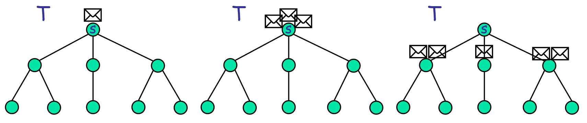

```table-of-contents
title: 
style: nestedList # TOC style (nestedList|nestedOrderedList|inlineFirstLevel)
minLevel: 0 # Include headings from the specified level
maxLevel: 0 # Include headings up to the specified level
include: 
exclude: 
includeLinks: true # Make headings clickable
hideWhenEmpty: false # Hide TOC if no headings are found
debugInConsole: false # Print debug info in Obsidian console
```
# Problema dello SP egoistico

Il problema si colloca in un ambiente decentralizzato dove le risorse (gli archi della rete) sono controllate da agenti razionali ed egoisti.

- **Input del problema:** Viene fornito un grafo orientato o non orientato $G=(V,E)$, un nodo sorgente $s$ e un nodo destinazione $t$.
- **Agenti:** Ogni arco $e\in E$ rappresenta un singolo agente.
- **Asimmetria Informativa:** Ogni arco ha un costo di utilizzo intrinseco. Questo costo è informazione privata (il _tipo_ dell'agente) ed è noto solo all'agente stesso, non al meccanismo centrale. Il tipo è strettamente positivo (tipo$\gt0$).
- **Obiettivo (Social Choice Function - SCF):** Il meccanismo deve calcolare un _vero_ cammino minimo tra $s$ e $t$ sul grafo $G$, valutato rispetto ai pesi reali (tipi) degli archi, e non rispetto ai valori che gli archi potrebbero strategicamente dichiarare.

Per poter progettare un meccanismo, dobbiamo mappare gli elementi del problema su reti nei parametri standard del Mechanism Design.

In maniera più formale, possiamo definire il problema in questione nel seguente modo:

- **Spazio delle Soluzioni Ammissibili ($F$):** L'insieme $F$ è l'insieme di tutti i possibili cammini semplici nel grafo $G$ che connettono il nodo $s$ al nodo $t$. Una specifica soluzione $P\in F$ è quindi un sottoinsieme degli archi $E$.
- **Il Tipo dell'Agente** ($\tau_e$​): Viene introdotta la notazione $\tau_e$​ per indicare il tipo privato dell'agente $e$. Matematicamente, $\tau_e$ è il peso reale dell'arco, ovvero il costo operativo che l'agente sostiene se il suo arco viene inserito nella soluzione finale.
- **Funzione di Valutazione** ($v_e$​): Questa è la metrica fondamentale. Come valuta l'agente $e$ una data soluzione globale $P$? $$v_e​(\tau_e​,P)=\begin{cases}\tau_e&​e\in P\\0&\text{altrimenti}\end{cases}​$$Questa funzione a gradino è tipica dei **One-Parameter Mechanisms** (Meccanismi a Singolo Parametro): l'agente ha un solo valore di interesse ($\tau_e$​) e la sua valutazione dipende esclusivamente dall'essere selezionato o meno nella soluzione, indipendentemente da quali altri agenti vengano scelti.
- **Funzione di Utilità (ue​):** L'utilità quasi-lineare dell'agente, se dichiara un costo (possibilmente falso) e riceve un pagamento $p_e$​, è definita come $$u_e​=\begin{cases}p_{e}-\tau_e&\text{se arco "e" selezionato}\\0&\text{altrimenti}\end{cases}$$


Ci poniamo quindi una domanda architetturale fondamentale: _"Come progettare un meccanismo truthful per questo problema?"_.

La risposta risiede nell'osservazione cruciale che collega la metrica di rete alla metrica economica.

Dobbiamo calcolare la lunghezza totale di un generico cammino $P$.
Nel contesto dei grafi, la lunghezza è banale: $\sum\limits_{e\in P}​\tau_{e}$​.
Nel contesto del Mechanism Design, se sommiamo le _valutazioni_ di tutti gli agenti nel sistema $E$ rispetto alla soluzione $P$, otteniamo: $$\sum\limits_{e\in E}​v_e​(\tau_e​,P)$$
Data la definizione della funzione di valutazione $v_e$​ (che si annulla per gli archi non in $P$), l'equazione diventa: $$\sum\limits_{e\in P}​\tau_e​=\sum\limits_{e\in E}​v_e​(\tau_e​,P)$$
**Perché questa osservazione è fondamentale?**

Un problema di ottimizzazione si definisce **utilitario** se e solo se la funzione obiettivo da minimizzare (o massimizzare) coincide esattamente con la somma delle valutazioni degli agenti. 
Poiché minimizzare lo shortest path significa minimizzare $\sum\limits_{e\in P}​\tau_{e}$​, e questo equivale a minimizzare $\sum\limits_{e\in E}​v_e​(\tau_e​,P)$, abbiamo appena dimostrato formalmente che il problema dello Shortest Path egoistico è un problema utilitario.

Poiché il problema è utilitario, per il teorema dimostrato in precedenza, possiamo applicare direttamente l'infrastruttura dei **Meccanismi VCG**.
## Meccanismo VCG - $M_{SP}$

Prima di tutto ricordiamo la formulazione per un meccanismo VCG, $M=\langle g(r),p(r)\rangle$:

- **Regola di allocazione $g(r)$:** Viene definita come $x^{\star}=arg\min_{x\in F}​\sum\limits_{j}​v_j​(r_j​,x)$. In parole povere, l'algoritmo sceglie la soluzione $x^{\star}$ (il cammino) che minimizza la somma delle valutazioni (ovvero la somma dei pesi dichiarati).
- **Regola di pagamento $p_e​(r)$ (Pivot di Clarke):** Questa è la traduzione matematica dell'esternalità che abbiamo discusso in precedenza. Il pagamento per un agente $e$ è: $$p_e​(r)=\sum\limits_{j\neq e}​v_j​(r_j​,g(r_{-e}​))-\sum\limits_{j\neq e}​v_j​(r_j​,x^{\star})$$ 
Il primo termine è il costo totale che gli _altri_ agenti avrebbero sostenuto nella soluzione ottima calcolata ignorando $e$ ($g(r_{-e}​)$). Il secondo termine è il costo totale sostenuto dagli _altri_ agenti nella soluzione ottima effettiva con $e$ ($x^{\star}$).

Applichiamo ora la formula generale al caso specifico dei grafi.

- **L'allocazione $g(r)$:** Diventa semplicemente il calcolo di un cammino minimo, indicato con $P_G​(s,t)$, sul grafo $G$ utilizzando i pesi dichiarati $r$.
- **Il pagamento $p_e​(r)$:** Viene analizzato in due casi distinti:
    1. **Se $e\not\in P_G​(s,t)$:** L'arco non fa parte del cammino minimo. In questo caso, la sua assenza non altera la soluzione ottima ($g(r_{-e}​)=g(r)$). L'esternalità è nulla e il pagamento è **0**.
    2. **Se $e\in P_G​(s,t)$:** L'arco è nel cammino minimo. Dobbiamo tradurre i due termini della formula di Clarke in metriche di grafo:
        - Il termine $\sum\limits_{j\neq e}=​v_j​(r_j​,g(r_{-e}​))$ rappresenta la lunghezza del cammino minimo da $s$ a $t$ se l'arco $e$ venisse fisicamente rimosso dal grafo. Questo viene definito **Cammino di Rimpiazzo** (Replacement Path) e la sua lunghezza è denotata come $d_{G-e}​(s,t)$.
        - Il termine $\sum\limits_{j\neq e}=​v_j​(r_j​,P_G​(s,t))$ è la somma dei costi di tutti gli _altri_ archi presenti nel cammino minimo effettivo. Matematicamente, questo equivale alla lunghezza totale del cammino minimo ($d_G​(s,t)$) meno il costo dichiarato dall'arco $e$ ($r_e$​).
- **La formula finale del pagamento:** Sostituendo i termini, otteniamo la formula calcolabile: $$p_e​(r)=\begin{cases}d_{G-e​}(s,t)-(d_G​(s,t)-r_e​)&e\in P_{G}(s,t)\\0&\text{altrimenti}\end{cases}$$L'implicazione algoritmica è severa: per calcolare i pagamenti di _tutti_ gli archi nel cammino minimo originale, l'algoritmo deve calcolare un ***cammino di rimpiazzo*** $P_{G-e}​(s,t)$ per ciascuno di essi.

Mostriamo ora un esempio numericp della formula appena derivata su una specifica topologia di rete, per calcolare il pagamento dell'arco centrale $e$ (dichiarato con costo $r_e​=2$).

1. **Analisi del Cammino Ottimo Originale ($P_G$​):** Il cammino minimo primario $P_G​(s,t)$ scende verticalmente passando per $e$. I costi degli archi che lo compongono sono: 4 (nodo superiore $\to$ medio), 2 (l'arco $e$), e 5 (nodo medio $\to t$). La lunghezza totale è: $d_G​(s,t)=4+2+5=11$. Il costo degli _altri_ archi nel cammino è $d_G-r_e​=11−2=9$.
2. **Analisi del Cammino di Rimpiazzo ($P{G-e}$​):** Immaginiamo di rimuovere l'arco $e$ (la "X" blu). Qual è il nuovo cammino minimo per andare da $s$ a $t$? Il percorso evidenziato in rosso aggira la rimozione: va a sinistra (costo 2), scende diagonalmente verso il nodo centrale inferiore (costo 5), e poi va a $t$ (costo 5). La lunghezza del cammino di rimpiazzo è: $d_{G-e}​(s,t)=2+5+5=12$.
3. **Calcolo del Pagamento ($p_e$​):** Applicando rigorosamente la formula di Clarke derivata precedentemente otteniamo:$$\begin{align}&p_e​=d_{G-e​}(s,t)-(d_G​(s,t)-r_e​)\\&p_e​=12-(11-2)\\& p_e​=12-9=3\end{align}$$

L'agente $e$ ha dichiarato un costo di 2, e il meccanismo lo ripaga con $3$. Possiamo notare immediatamente che l'utilità dell'agente è positiva ($u_e​=p_e​-r_e​=3-2=1$). 

L'agente trae un profitto netto pari esattamente a 1, confermando la proprietà di Razionalità Individuale del meccanismo VCG.


### Analisi: Complessità Temporale

Affrontiamo ora l'analisi della **complessità temporale** e dei **vincoli topologici** del meccanismo $M_{SP}​$.

Prima di valutare le prestazioni, introduciamo un'ipotesi di lavoro fondamentale: **i nodi sorgente $s$ e destinazione $t$ devono essere $2$-edge connessi**.

Questo significa che nel grafo $G$ devono esistere almeno due cammini tra $s$ e $t$ disgiunti sugli archi. La necessità di questa assunzione emerge chiaramente analizzando il caso contrario:

- **Definizione di Ponte (Bridge):** Se $s$ e $t$ non sono $2$-edge connessi, esiste per forza almeno un arco nel cammino minimo $P_G​(s,t)$ la cui rimozione disconnette il grafo in due componenti separate $C_1$​ e $C_2$​ (con $s\in C_1$​ e $t\in C_2$​). 
- **Conseguenza Algoritmica:** Se l'arco $e$ è un ponte, non esiste alcun cammino di rimpiazzo in $G-e$. Matematicamente, la distanza di rimpiazzo diverge all'infinito: $d_{G-e}​(s,t)=\infty$.
- **Conseguenza Economica (Il Monopolio Assoluto):** Inserendo $\infty$ nella formula del pagamento VCG, otteniamo $p_e​=\infty$. L'agente che controlla un arco ponte possiede un monopolio assoluto sulla connessione tra $s$ e $t$. Il meccanismo collassa poiché l'agente "tiene in pugno" il sistema e può esigere una cifra arbitrariamente alta, distruggendo l'utilità del pianificatore centrale. La ridondanza strutturale (2-edge connectivity) è quindi obbligatoria per spezzare i monopoli e limitare i pagamenti.

Assunta la connettività necessaria, come calcoliamo i pagamenti? Si definisce l'approccio ingenuo (brute-force) per determinare il limite superiore della complessità temporale.

Siano $n=|V|$ i nodi e $m=|E|$ gli archi.

1. Calcoliamo il cammino minimo $P_G​(s,t)$ usando l'algoritmo di Dijkstra. Questo definisce l'allocazione e seleziona $k$ archi vincenti. Nel caso peggiore, il cammino contiene $k=O(n)$ archi.
2. Per calcolare i pagamenti, dobbiamo trovare il cammino di rimpiazzo $P_{G-e}​(s,t)$ per ciascuno di questi $O(n)$ archi.
3. La soluzione banale consiste nel rimuovere l'arco $e$, applicare Dijkstra da zero sul grafo decurtato $G-e$, e ripetere questo processo $\forall e\in P_G​(s,t)$.

Poiché l'algoritmo di Dijkstra ha una complessità di $O(m+n\log(n))$, iterarlo $O(n)$ volte produce una complessità temporale complessiva pari a:
$$O(n)\cdot O(m+n\log(n))=O(mn+n^2\log(n))$$

Sebbene sia una complessità polinomiale, un limite di $O(mn)$ è computazionalmente inaccettabile per il routing su reti su larga scala 

**Il Teorema di Ottimalità Computazionale**

Concludiamo enunciando un teorema fondamentale per l'Algorithmic Mechanism Design applicato ai grafi: **$M_{SP}$​ è calcolabile in tempo $O(m+n\log(n))$.**

Questo teorema dimostra che il limite asintotico di $O(mn+n^{2}\log(n))$ non è stretto. Esistono algoritmi avanzati che permettono di calcolare **simultaneamente** tutti i cammini di rimpiazzo necessari per i pagamenti VCG.

Invece di eseguire Dijkstra da zero per ogni arco rimosso, questi algoritmi sfruttano la struttura ad albero dei cammini minimi e riutilizzano gli stati di rilassamento degli archi non influenzati dalla rimozione di $e$.

Il risultato è straordinario: il tempo necessario per risolvere l'intero problema del Mechanism Design collassa esattamente alla stessa classe di complessità necessaria per calcolare un singolo Shortest Path in un ambiente non strategico: $O(m+n\log(n))$.

---
# Meccanismi One-Parameter

Abbandoniamo le basi e affrontiamo uno degli snodi teorici più complessi dell'Algorithmic Mechanism Design: il limite strutturale dei meccanismi VCG e la necessità di introdurre la teoria dei **Meccanismi One-Parameter** (a singolo parametro).

Fino a questo momento, abbiamo goduto di un lusso matematico: i problemi analizzati (come il Minimum Spanning Tree o lo Shortest Path) erano **utilitari**. 

Ricordiamo, un problema è strettamente utilitario quando la funzione di scelta sociale $f(t)$ che vogliamo ottimizzare coincide _esattamente_ con la minimizzazione della somma delle valutazioni individuali degli agenti:

$$f(t) = \arg\min_{o \in F} \sum_i v_i(t_i, o)$$

Quando questa uguaglianza è verificata, la teoria VCG ci garantisce la possibilità di implementare la soluzione in strategie dominanti usando i pagamenti di Clarke.

Ma cosa succede quando l'obiettivo del sistema disallinea matematicamente rispetto alla somma dei costi individuali? 

Dimostriamo proprio questo collasso analizzando lo **Shortest Path Tree (SPT)** in uno scenario di network routing.

Ecco l'analisi rigorosa del perché VCG fallisce e ci costringe a cambiare paradigma.

## Shortest Path Tree (SPT) non cooperativo

Ci troviamo in uno scenario di **broadcasting**. Un nodo sorgente $s$ deve inviare un messaggio a tutti gli altri nodi della rete, ovvero all'insieme $V \setminus \{s\}$.

- **Gli agenti:** Come prima, ogni arco è controllato da un agente egoistico.
- **Il Tipo ($t_e$):** L'informazione privata è il tempo di attraversamento del link (la latenza).
- **Obiettivo Globale:** Il sistema vuole minimizzare il tempo di consegna del messaggio per _ogni_ nodo ricevente. La struttura topologica che ottimizza l'invio da una singola sorgente a tutti i nodi è, per l'appunto, un albero dei cammini minimi radicato in $s$ (Shortest Path Tree).

### Formulazione della Funzione Obiettivo

Definiamo $F$ come l'insieme di tutti i possibili alberi ricoprenti (spanning trees) radicati in $s$.

Il meccanismo centrale desidera trovare l'albero $T \in F$ che minimizza la somma delle distanze da $s$ verso tutti gli altri nodi.

La formula della funzione sociale $f(t)$ è:

$$f(t) = \arg\min_{T \in F} \sum_{v \in V} d_T(s,v)$$

Ora, esprimiamo questa stessa somma non più sui nodi, ma sui _singoli archi_ dell'albero $T$. Un arco $e$ situato vicino alla radice $s$ verrà attraversato dai percorsi diretti a molti nodi foglia sottostanti. Definiamo quindi la **molteplicità $||e||$** come il numero di cammini (diretti verso destinazioni distinte) che passano fisicamente per l'arco $e$ all'interno di $T$.

Possiamo riscrivere la funzione obiettivo come:

$$f(t) = \arg\min_{T \in F} \sum_{e \in E(T)} t_e \cdot ||e||$$

In questa metrica, il peso del "ritardo" causato da un singolo arco $e$ viene moltiplicato per il numero di destinazioni che subiscono quel ritardo.


### Il Modello di Rete (Protocollo Multicast) e la Valutazione

A questo punto, ci si pone la domanda critica: _"Il problema è utilitario?"_. La risposta dipende esclusivamente da come l'agente valuta il proprio sforzo, ovvero dalla sua funzione $v_e$.

Specifichiamo l'architettura di rete: stiamo usando un **Protocollo Multicast**.

In un protocollo multicast, una singola copia del pacchetto dati attraversa un arco $e$, e viene eventualmente duplicata _solo_ quando raggiunge un router (nodo) che deve instradarla su rami multipli.



Qual è l'implicazione economica di questo protocollo hardware per l'agente che possiede l'arco $e$?

L'agente processa e trasmette il messaggio **una sola volta**, a prescindere dal fatto che quel messaggio sia destinato a 1 nodo o a 1000 nodi sottostanti. Pertanto, il costo fisico e l'usura sostenuti dall'agente _non dipendono_ dalla molteplicità $||e||$.

La Funzione di Valutazione reale dell'agente $e$ rispetto all'albero $T$ è banalmente:

$$v_e(t_e, T) = \begin{cases} t_e & \text{se } e \in E(T) \\ 0 & \text{altrimenti} \end{cases}$$

Confrontiamo ora ciò che il sistema vuole minimizzare con la somma delle valutazioni degli agenti.

- Il sistema minimizza: $\sum_{e \in E(T)} t_e \cdot ||e||$
    
- La somma delle valutazioni è: $\sum_{e \in E(T)} t_e$
    

È evidente l'asimmetria matematica: a causa del moltiplicatore $||e||$, l'obiettivo globale non è la semplice sommatoria dei costi individuali. Ne consegue l'ultima inesorabile riga della slide:

$$f(t) \neq \arg\min_{T \in F} \sum_{e \in E(T)} v_e(t_e, T)$$

**Conclusione:** Il problema dello Shortest Path Tree in multicast è un **problema non utilitario**. I teoremi di VCG e i pagamenti di Clarke perdono totalmente di validità: se applicassimo la formula di Clarke a questo scenario, non otterremmo l'implementazione in strategie dominanti, e gli agenti tornerebbero a mentire.

Essendo il tipo $t_e$ unidimensionale (un singolo valore scalare per agente), questo problema richiede la progettazione di un **Meccanismo One-Parameter**, la cui condizione di truthfulness non si basa sull'utilitarismo VCG, ma su una proprietà analitica della regola di allocazione chiamata _monotonia_.

## Definizione Formale di Problema One-Parameter 

Entriamo nel quadro teorico dei **Meccanismi One-Parameter (OP)**. Come abbiamo appena dimostrato, quando la Funzione di Scelta Sociale (SCF) non coincide con la minimizzazione della somma dei costi (problema non utilitario), l'impalcatura dei meccanismi VCG e dei pagamenti di Clarke crolla.

Per trattare questa vasta classe di problemi (tra cui il routing Multicast SPT), l'Algorithmic Mechanism Design ricorre alla teoria One-Parameter, che sposta il vincolo: non limitiamo più la forma dell'obiettivo sociale, ma imponiamo restrizioni rigorose sulla struttura dell'informazione degli agenti.

Forniamo le due condizioni matematiche necessarie e sufficienti affinché un problema di Mechanism Design sia classificato come _One-Parameter_.

1. **Dominio dell'informazione privata:** L'informazione segreta posseduta dall'agente $a_i$ deve essere descrivibile da un **singolo scalare** $t_i \in \mathbb{R}$. Non sono ammessi tipi multidimensionali (ad esempio, un agente non può avere un costo dipendente sia dalla latenza che dal consumo energetico contemporaneamente, a meno che non siano fusi in un'unica metrica).  
2. **Struttura della Funzione di Valutazione:** La valutazione $v_i$ dell'agente $a_i$ rispetto a un esito (outcome) globale $o$ deve essere fattorizzabile nel prodotto tra il suo tipo privato e una funzione di carico di lavoro determinata dall'esito:$$v_i(t_i, o) = t_i \cdot w_i(o)$$
    Dove $w_i(o)$ è il **carico di lavoro (workload)** assegnato ad $a_i$ dalla soluzione $o$.

Questa restrizione lineare è il cuore del modello: il costo totale sostenuto dall'agente deve crescere in modo strettamente proporzionale alla quantità di "lavoro" che il meccanismo gli assegna.

### Il caso dello SPT Multicast

Riprendiamo il problema dello Shortest Path Tree (SPT) non cooperativo per dimostrare che, pur essendo letale per VCG, si adatta perfettamente al framework One-Parameter.

- Sappiamo che il problema non è utilitario perché la SCF minimizza $\sum t_e ||e||$, dove $||e||$ è il numero di percorsi logici che attraversano l'arco fisico $e$.
- Tuttavia, l'hardware del protocollo multicast fa sì che il router $e$ processi il pacchetto una volta sola, indipendentemente da $||e||$. La sua valutazione è:$$v_e(t_e, T) = \begin{cases} t_e & \text{se } e \in E(T) \\ 0 & \text{altrimenti} \end{cases}$$
- Questa funzione può essere riscritta esattamente nel formato $v_e(t_e, T) = t_e \cdot w_e(T)$, definendo il carico di lavoro come un valore **binario**:$$w_e(T) = \begin{cases} 1 & \text{se } e \in E(T) \\ 0 & \text{altrimenti} \end{cases}$$

Abbiamo quindi dimostrato che l'SPT in multicast è a tutti gli effetti un problema One-Parameter con workload binario $\{0,1\}$.

### Tassonomia: VCG vs One-Parameter

Qui andiamo a contrapporre formalmente i due grandi regni dell'Algorithmic Mechanism Design analizzati finora.

- **Meccanismi VCG:** Ammettono tipi privati di dimensionalità e complessità **arbitraria** e funzioni di valutazione generiche, ma esigono matematicamente che la Funzione di Scelta Sociale sia strettamente **utilitaria** (deve minimizzare la somma dei costi).
- **Meccanismi OP:** Permettono una Funzione di Scelta Sociale **arbitraria** (il sistema può ottimizzare qualsiasi cosa, anche metriche non lineari come il diametro della rete o il traffico massimo), ma esigono che lo spazio dei tipi sia **monodimensionale** e le valutazioni siano lineari rispetto al carico di lavoro ($t_i \cdot w_i$).

Si fa poi un'osservazione importante sull'intersezione di questi insiemi: se un problema rispetta _entrambi_ i vincoli (è utilitario ed è one-parameter, come lo Shortest Path classico da $s$ a $t$), le due teorie collassano nella stessa soluzione. I pagamenti calcolati con la teoria OP coincideranno esattamente con i pagamenti pivot di Clarke del meccanismo VCG.

Introduciamo ora l'assioma fondamentale su cui si baseranno i Teoremi di Myerson. VCG garantiva la _truthfulness_ matematicamente tramite l'equazione di Clarke. Nei problemi OP, la _truthfulness_ dipenderà invece da una specifica **proprietà topologica dell'algoritmo di allocazione $g()$**.

>[!definition]- Algoritmo Monotono (per minimizzazione):
>Un algoritmo $g()$ è definito monotono se, fissate le dichiarazioni di tutti gli altri agenti ($r_{-i}$), il carico di lavoro assegnato all'agente $i$, ovvero $w_i(g(r_{-i}, r_i))$, è una funzione **non crescente** rispetto al costo dichiarato $r_i$.

**Interpretazione logica:**

Se l'agente $a_i$ dichiara un costo marginale di operazione più alto, l'algoritmo centrale non dovrà **mai** assegnargli una quantità di lavoro maggiore rispetto a quella che gli avrebbe assegnato se avesse dichiarato un costo inferiore.

Nel caso specifico dei workload binari $\{0,1\}$ (come in SPT o SP), la monotonia assume una forma a gradino molto intuitiva: all'aumentare del costo dichiarato $r_e$, un arco passerà al massimo dallo stato "selezionato" ($w=1$) allo stato "scartato" ($w=0$). Un arco scartato non diventerà mai improvvisamente utile solo perché è diventato più costoso.

### I Teoremi di Myerson

Entriamo nel nucleo fondamentale dell'Algorithmic Mechanism Design per i problemi One-Parameter. 
Illustriamo i **Teoremi di Myerson (1981)**, che costituiscono la base matematica per progettare meccanismi _truthful_ quando l'obiettivo non è utilitario (come nel caso dello Shortest Path Tree Multicast).

Il contributo di Myerson si divide in due teoremi speculari: il primo dimostra che la **monotonia** dell'algoritmo di allocazione è una _condizione necessaria_, il secondo dimostra che è una _condizione sufficiente_ e fornisce la formula esatta (basata su integrali) per calcolare i pagamenti.

>[!teorem]- Teorema 1: La Necessità della Monotonia
>**Enunciato:** Condizione necessaria affinché un meccanismo $M = \langle g(r), p(r) \rangle$ per un problema One-Parameter sia veritiero è che l'algoritmo di allocazione $g(r)$ sia **monotono** (ovvero, il carico di lavoro $w_i(r)$ assegnato all'agente $i$ deve essere una funzione non crescente rispetto al costo dichiarato $r_i$).

**Dimostrazione (per assurdo):**

1. **L'Ipotesi per assurdo:** Supponiamo che esista un meccanismo veritiero in cui l'algoritmo $g()$ _non_ sia monotono. Se non è monotono, esisterà almeno un tratto in cui, all'aumentare del costo dichiarato, il carico di lavoro aumenta. Come si vede nel grafico, fissiamo due punti $x$ e $y$ (con $x < y$) tali per cui $w_i(x) < w_i(y)$.
2. **Analisi dei Costi Operativi (Valutazioni):** Studiamo cosa succede ai costi reali dell'agente nei due scenari incrociati.
    - Se il vero tipo è $t_i = x$ e dice la verità ($r_i = x$), sostiene un costo pari a $x \cdot w_i(x)$.
    - Se il vero tipo è $t_i = x$ ma mente dichiarando $y$, sostiene un costo pari a $x \cdot w_i(y)$. L'**aumento del costo operativo** (indicato con l'area $A$) causato dall'aver ricevuto più lavoro è: $$A = x \cdot (w_i(y) - w_i(x))$$
    - Se il vero tipo è $t_i = y$ e dice la verità, sostiene un costo pari a $y \cdot w_i(y)$.
    - Se il vero tipo è $t_i = y$ ma mente dichiarando $x$, sostiene un costo pari a $y \cdot w_i(x)$. Il **risparmio sul costo operativo** causato dall'aver ricevuto meno lavoro è $y \cdot (w_i(y) - w_i(x))$. Poiché $y > x$, questo risparmio è strettamente maggiore di $A$. Lo definiamo come $A + k$ (dove $k > 0$).
    - 
3. **Il Vincolo sui Pagamenti:** Sia $\Delta p = p_i(y) - p_i(x)$ la differenza di pagamento che il meccanismo eroga se l'agente dichiara $y$ invece di $x$. Affinché il meccanismo sia veritiero, nessun agente deve poter trarre profitto mentendo:
    - **Vincolo 1 (quando $t_i = x$):** Se l'agente dichiara $y$, il suo costo operativo aumenta di $A$. Affinché non gli convenga farlo, il surplus di pagamento $\Delta p$ deve essere minore o uguale al danno subito: $$\Delta p \le A$$
    - **Vincolo 2 (quando $t_i = y$):** Se l'agente dichiara $x$, il suo costo operativo diminuisce di $A + k$. Affinché non gli convenga farlo, la perdita di pagamento (il non ricevere $\Delta p$) deve essere superiore al risparmio ottenuto: $$\Delta p \ge A + k$$
4. **La Contraddizione:** Unendo le due disequazioni otteniamo: $$A + k \le \Delta p \le A \implies A + k \le A \implies k \le 0$$Ma avevamo matematicamente stabilito che $k$ (l'area nel grafico) è strettamente positivo! Questa è una contraddizione palese. **Conclusione:** Non esiste _nessuno_ schema di pagamento in grado di rendere veritiero un algoritmo non monotono. L'algoritmo $g()$ _deve_ essere monotono. $\blacksquare$

**La Formula dei Pagamenti di Myerson**

Assodato che $g()$ deve essere una curva non crescente, Myerson definisce l'unica formula matematica possibile per i pagamenti in un meccanismo One-Parameter:

$$\boxed{p_i(r) = h_i(r_{-i}) + r_i \cdot w_i(r) - \int_0^{r_i} w_i(r_{-i}, z) dz}$$

- $h_i(r_{-i})$ è una costante arbitraria che non dipende da $r_i$. 
- $r_i \cdot w_i(r)$ è l'area del rettangolo generato dal costo dichiarato moltiplicato per il carico di lavoro assegnato.
- $\int_0^{r_i} w_i(z) dz$ è l'area sottesa dalla curva di carico dal punto 0 fino a $r_i$.

Vediamo ora il secondo teorema

>[!teorem]- Teorema 2: Sufficienza e Veridicità
>**Enunciato:** Se $g()$ è monotono e usiamo i pagamenti definiti sopra, il meccanismo è veritiero.

**Dimostrazione:**

L'utilità di un agente è $u_i = p_i(r) - v_i(t_i, r) = p_i(r) - t_i \cdot w_i(r)$.

Per comodità di analisi, poniamo $h_i(r_{-i}) = 0$.

Se l'agente dice la verità ($r_i = t_i$), l'equazione dell'utilità si semplifica radicalmente. Il termine $t_i \cdot w_i(t_i)$ si annulla con il costo reale, lasciando:

$$u_i(t_i, (r_{-i}, t_i)) = - \int_0^{t_i} w_i(z) dz$$

Dobbiamo dimostrare geometricamente che mentire porta sempre a un'utilità inferiore.

**Caso 1: Mente al rialzo ($x > t_i$)**

Dichiara $x$. Il pagamento diventa $P = x \cdot w_i(x) - \int_0^x w_i(z) dz$.

Il costo reale (Valutazione $C$) che l'agente sostiene è $t_i \cdot w_i(x)$.

Guardando il grafico: dichiarando il vero ($t_i$), l'utilità negativa era solo l'integrale fino a $t_i$. Dichiarando $x$, l'agente subisce un decremento del pagamento che supera il risparmio sul lavoro da svolgere. Geometricamente, subisce una perdita secca indicata dall'**area rossa $G$**. L'utilità peggiora.


**Caso 2: Mente al ribasso ($x < t_i$)**

Dichiara $x$. L'agente si fa assegnare più lavoro di quello che vorrebbe, sperando di compensare col pagamento.

Tuttavia, il costo operativo reale balza a $t_i \cdot w_i(x)$ (l'intero rettangolo azzurro + viola). Il surplus di pagamento ottenuto dall'integrale non è sufficiente a coprire l'impennata del costo reale. La perdita secca è nuovamente l'**area rossa $G$**. L'utilità peggiora.


**Conclusione:** L'utilità massima si ottiene sempre e solo nell'esatto punto $r_i = t_i$. Il meccanismo è veritiero in strategie dominanti. $\blacksquare$

#### Garantire la Partecipazione Volontaria (VP)

C'è un ultimo problema: nell'analisi precedente, semplificando $h_i = 0$, l'utilità in caso di verità era $-\int_0^{t_i} w_i(z) dz$, un valore **negativo**. Nessun agente razionale accetterebbe di partecipare a un gioco in cui l'esito ottimale è andare in perdita.

Per garantire la _Voluntary Participation (VP)_, dobbiamo traslare l'utilità verso l'alto scegliendo una funzione $h_i(r_{-i})$ opportuna.

Poiché la curva $w_i()$ è monotona non crescente, la si fa tendere a zero all'infinito. Myerson impone la costante come l'integrale improprio dell'intera curva:

$$h_i(r_{-i}) = \int_0^\infty w_i(r_{-i}, z) dz$$

Sostituendo questa costante nell'equazione del pagamento originale:

$$p_i(r) = r_i \cdot w_i(r) + \int_{r_i}^\infty w_i(r_{-i}, z) dz$$

Calcolando la nuova utilità per un agente sincero ($r_i = t_i$):

$$u_i(t_i) = \int_{t_i}^\infty w_i(r_{-i}, z) dz$$

Poiché il carico di lavoro è sempre $\ge 0$, l'integrale è un'area positiva. Abbiamo così garantito matematicamente che l'utilità di un agente sincero sarà **sempre $\ge 0$**, assicurando la stabilità economica del meccanismo.

---
# Meccanismo truthful (OP) per il problema dello SPT non cooperativo

Siamo giunti alla sintesi teorica: l'istanziazione pratica dei Teoremi di Myerson per risolvere un problema di network design decentralizzato. 

Qui mostriamo come costruire il **Meccanismo One-Parameter $M_{SPT}$** per lo Shortest Path Tree, unendo la topologia dei grafi all'economia algoritmica.

Analizziamo la formalizzazione passo dopo passo.

**Il Modello di Rete e il Vincolo Topologico**

Il problema richiede di calcolare un albero dei cammini minimi (SPT) radicato in un nodo sorgente $s$.

Tuttavia, la definizione dell'input introduce un prerequisito strutturale fondamentale: **il grafo $G=(V,E)$ deve essere biconnesso sugli archi** (2-edge connected).

Come avevamo già visto per il problema del singolo Shortest Path, questa non è un'assunzione casuale, ma una necessità economica.

Se il grafo non fosse biconnesso, esisterebbe almeno un arco "ponte". La rimozione di tale arco disconnetterebbe una parte della rete dalla sorgente $s$. Di conseguenza, l'agente possessore del ponte avrebbe un potere di monopolio assoluto: essendo insostituibile per completare l'albero di copertura, il meccanismo non avrebbe alcuna leva per limitare la sua richiesta economica. La biconnessione garantisce che esista sempre un'alternativa topologica (un percorso di routing secondario) per raggiungere qualsiasi nodo, neutralizzando i monopoli.

**Recap: L'Inquadramento nel Dominio One-Parameter**

Prima di continuare, riepiloghiamo formalmente il motivo per cui non possiamo usare VCG e dobbiamo invocare Myerson.

1. La Funzione di Scelta Sociale (SCF) globale deve minimizzare la somma dei ritardi di consegna per tutti i nodi: $f(t) = \arg\min \sum_{e \in E(T)} t_e \cdot ||e||$.
2. Grazie al protocollo multicast, il costo operativo dell'agente $e$ prescinde dalla molteplicità $||e||$. La sua valutazione è lineare rispetto al proprio tipo e dipende da un carico di lavoro puramente binario: $$w_e(T) = \begin{cases} 1 & \text{se } e \in E(T) \\ 0 & \text{altrimenti} \end{cases}$$Poiché il problema non è utilitario ma rispetta le condizioni dello spazio monodimensionale e del carico di lavoro binario, è il candidato perfetto per la teoria OP.

## Costruzione del Meccanismo $M_{SPT}$

Definiamo ora le due componenti esatte del meccanismo $M_{SPT} = \langle g(r), p(r) \rangle$.
### La Regola di Allocazione: $g(r)$

Il meccanismo raccoglie le dichiarazioni di tutti gli archi ($r$) ed esegue l'algoritmo di **Dijkstra** sul grafo $G=(V,E,r)$ per estrarre lo Shortest Path Tree $S_G(s)$.

- **Verifica del Teorema 1 di Myerson:** L'algoritmo di allocazione è monotono? Sì. In un albero dei cammini minimi, se un arco aumenta il suo costo dichiarato (a parità di dichiarazioni altrui), la probabilità che venga selezionato dall'algoritmo di Dijkstra diminuisce. Il suo carico di lavoro $w_e$ potrà passare al massimo da $1$ a $0$, ma non passerà mai da $0$ a $1$ a fronte di un rincaro. La funzione di workload è monotona non crescente. La condizione necessaria è soddisfatta.

### La Regola di Pagamento: $p(r)$

Poiché l'algoritmo è monotono, possiamo applicare il Teorema 2 di Myerson per calcolare i pagamenti che rendono il meccanismo _truthful_ in strategie dominanti. Inoltre, per garantire la **Partecipazione Volontaria** (gli agenti non devono subire utilità negative), utilizziamo la formulazione del pagamento con l'integrale improprio esteso all'infinito: $$p_e(r) = r_e \cdot w_e(r) + \int_{r_e}^\infty w_e(r_{-e}, z) dz$$

**Implicazione Algoritmica dell'Integrale:**

Questa equazione integrale, per quanto astratta, su un grafo si traduce in un calcolo molto preciso.

Sappiamo che la funzione $w_e(z)$ è binaria (vale $1$ o $0$). Essendo monotona non crescente, varrà $1$ per tutti i valori di costo $z$ compresi tra $0$ e un certo "valore critico di soglia", dopodiché precipiterà a $0$ per tutti i valori fino all'infinito.

Questo significa che l'area sottesa dalla curva (l'integrale) corrisponderà all'area di un semplice rettangolo.
### Truthfulness

In questa fase, avendo già stabilito che usiamo un meccanismo One-Parameter (OP) basato sull'algoritmo di Dijkstra, dimostriamo matematicamente perché funziona, come si calcolano i soldi da scambiare e con quale efficienza algoritmica.

Qui rispondiamo alla domanda: _"Il nostro meccanismo basato su Dijkstra rende davvero conveniente dire la verità?"_

Per il Teorema 1 di Myerson, la risposta è sì **solo se l'algoritmo è monotono**.

- **L'osservazione chiave:** L'algoritmo di Dijkstra è intrinsecamente monotono.
- **La prova grafica (la funzione a gradino):** Guarda il grafico rosso. Sull'asse verticale abbiamo il carico di lavoro assegnato all'agente $e$ (che vale $1$ se l'arco è selezionato nell'albero, $0$ se viene scartato). Sull'asse orizzontale c'è il costo dichiarato dall'agente.
- Se l'agente dichiara un costo basso, viene selezionato ($w_e = 1$). Man mano che aumenta la sua dichiarazione (spostandosi verso destra), resterà selezionato fino a un punto critico, chiamato **valore soglia $\Theta_e$**. Appena dichiara un centesimo in più della soglia, l'algoritmo lo reputa troppo costoso, lo scarta e il carico di lavoro precipita a $0$.
- Poiché la linea rossa non sale **mai** (può solo scendere da 1 a 0), la funzione è "non crescente". Dunque, Dijkstra è monotono e il meccanismo è veritiero (_truthful_).


### Sui pagamenti

Assodata la verità, quanto paghiamo gli agenti? Myerson ci obbliga a usare la sua formula con l'integrale:

$$p_e(r) = r_e w_e(r) + \int_{r_e}^{\infty} w_e(r_{-e}, z) dz$$

Usiamo il grafico a gradino appena visto per risolvere l'integrale in modo esatto, dividendo il problema in due scenari:

- **Se l'arco NON è selezionato ($r_e > \Theta_e$):** Siamo sulla parte bassa del gradino. Il carico di lavoro è $w_e = 0$. L'integrale calcola l'area di una linea piatta a zero. Risultato finale: $p_e = 0$.
- **Se l'arco È selezionato ($r_e \le \Theta_e$):** Siamo sulla parte alta del gradino ($w_e = 1$). La formula diventa: $p_e = r_e \cdot 1 + \text{Area dell'integrale}$. Qual è quest'area? L'integrale ci chiede l'area sotto la curva rossa partendo dal punto $r_e$ fino all'infinito. Ma siccome il gradino crolla a zero in corrispondenza di $\Theta_e$, l'unica area effettiva da calcolare è il rettangolo di base $(\Theta_e - r_e)$ e altezza $1$. Sostituendo l'area nella formula otteniamo: $$p_e = r_e + (\Theta_e - r_e) = \Theta_e$$
- **Il risultato fondamentale:** Chi vince viene pagato **esattamente il valore della sua soglia**, indipendentemente da quanto aveva dichiarato
#### Un caso speciale dei problemi OP (Binary Demand)

Generalizziamo quanto appena scoperto.

L'albero dei cammini minimi (SPT) appartiene a una sottocategoria speciale dei problemi One-Parameter, chiamata **Binary Demand (BD)**.

- Un problema è BD se e solo se il carico di lavoro assegnato all'agente è strettamente booleano: **$w_i(o) \in \{0, 1\}$**. Non esistono mezze misure o intensità di lavoro; o sei dentro o sei fuori.

Formalizziamo la regola d'oro:

In **qualsiasi** problema di minimizzazione che sia Binary Demand (BD), l'algoritmo monotono avrà _sempre e per forza_ la forma della funzione a gradino vista nella prima slide.
- formalmente: Un algoritmo g() per un problema BD di ***minimizzazione*** è monotono se $\forall$ agente $a_i$, e per tutti gli $r_{-i}=(r_1,\dots,r_{i-1},r_{i+1},\dots,r_N),w_i(g(r_{-i},r_i))$ è della forma: 

Di conseguenza, il pagamento per un agente vincente in un ambiente BD sarà **sempre e solo il valore soglia**:

$$p_i(r) = \Theta_i(r_{-i})$$

_(Nota che la soglia può anche valere $+\infty$ se l'arco è un "ponte" insostituibile, ma avendo noi imposto in precedenza l'uso di un grafo biconnesso, evitiamo i monopoli e manteniamo la soglia a un valore reale finito)._

### Sulle soglie

Torniamo alla pratica: sappiamo di dover pagare la soglia $\Theta_e$, ma come fa il computer a calcolarla partendo dalla topologia del grafo?

Prendiamo un arco vincente $e=(u,v)$, dove $u$ è il nodo più vicino alla sorgente $s$.

- **La logica:** L'arco $e$ continua a vincere finché usarlo per arrivare al nodo $v$ costa meno (o uguale) rispetto all'utilizzare il miglior cammino alternativo che fa a meno di lui (il cammino di rimpiazzo $d_{G-e}$).
- **La disequazione:** La distanza da $s$ a $u$ ($d_G(s,u)$) più il costo dell'arco ($r_e$) deve essere minore o uguale al cammino di rimpiazzo: $$d_G(s,u) + r_e \le d_{G-e}(s,v)$$
- **La formula della soglia:** Isolando $r_e$, troviamo l'esatto punto in cui la convenienza finisce (il punto di crollo del gradino): $$\Theta_e = d_{G-e}(s,v) - d_G(s,u)$$
- **L'esempio:** Guardando i grafici in basso: il costo per arrivare a $u$ è $1$. Il cammino di rimpiazzo verde per arrivare a $v$ costa $2+2=4$. La disequazione è $1 + r_e \le 4$, da cui $r_e \le 3$. La soglia è $3$. Se l'agente dichiara $\le 3$, viene selezionato e pagato $3$.


### Una soluzione banale (Complessità Temporale)

Come ultima cosa, valutiamo l'efficienza algoritmica di questo meccanismo.

Per pagare tutti gli agenti selezionati, il sistema deve trovare il cammino di rimpiazzo per ogni arco appartenente all'albero (che sono $n-1$ archi).

- **L'algoritmo "banale":** Rimuoviamo l'arco, ricalcoliamo Dijkstra da capo sul grafo mancante, troviamo la distanza e rimettiamo l'arco. Ripeterlo per $O(n)$ archi porta a una complessità di **$O(mn + n^2 \log n)$**. Questa complessità computazionale è troppo lenta per reti reali di grandi dimensioni.
- **Il Teorema (il vero traguardo):** È stato dimostrato che non è necessario rifare Dijkstra da zero ogni volta. Esistono algoritmi in grado di calcolare _tutte_ le soglie contemporaneamente analizzando in modo astuto l'albero SPT originale. Grazie a questo teorema, l'intero meccanismo OP (trovare l'albero + calcolare tutti i pagamenti) si risolve in tempo **$O(m + n \log n)$**.

In sintesi, abbiamo ottenuto il risultato perfetto: un sistema matematicamente infallibile contro le bugie, economicamente sostenibile e computazionalmente veloce quanto l'algoritmo classico.