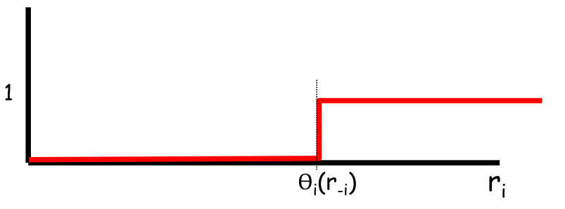

# Il punto di partenza: L'Asta per un Singolo Oggetto

Mostriamo un piccolo promemoria per fissare le idee. Qua rappresentiamo lo scenario più semplice possibile che abbiamo in Teoria dei Giochi: l'asta per un singolo indivisibile oggetto (ad esempio, un quadro).

- **I Giocatori:** Ci sono diverse persone interessate all'oggetto. Ognuno ha nella propria testa un valore massimo che è disposto a pagare, chiamato **tipo privato $t_i$**.
- **Il Gioco:** I giocatori inseriscono la loro offerta ($r_i$) in una busta chiusa.
- **L'Utilità:** Se il giocatore vince e paga un prezzo $p$, la sua utilità (il suo "livello di felicità" o profitto) è la differenza tra quanto lo valutava e quanto ha pagato: **$u_i = t_i - p$**. Se perde, l'utilità è $0$.
- **L'Obiettivo (Social-choice function):** Il banditore vuole che l'oggetto finisca nelle mani della persona che gli attribuisce il _vero_ valore più alto ($t_i$), indipendentemente dalle bugie scritte nelle buste.

# L'Asta Combinatoria: Molteplici oggetti e "Pacchetti"

Introduciamo la vera complessità del mondo reale. Non stiamo più vendendo un solo quadro, ma un insieme di oggetti diversi (birra, pizza, patatine, torta).

- **I Pacchetti (Bundles):** La grande differenza qui è che i giocatori non vogliono necessariamente un singolo oggetto, ma desiderano delle **combinazioni specifiche**. Ad esempio, il Giocatore 1 vuole il pacchetto "Pizza + Birra + Patatine".
- **L'Interdipendenza:** Per il Giocatore 1, ricevere solo la pizza o solo le patatine potrebbe non avere alcun valore. Il suo valore privato $t_i$ (es. $20$) è associato _esclusivamente_ all'ottenimento dell'intero pacchetto che desidera.
- **La Sfida del Banditore (Compatibilità):** Il meccanismo deve ora scegliere un insieme di vincitori (chiamato insieme $W$) in modo da massimizzare il valore totale generato. Ma c'è un vincolo fisico invalicabile: **la compatibilità**. Non puoi assegnare lo stesso trancio di pizza a due persone diverse. I pacchetti assegnati ai vincitori non devono avere oggetti in comune.

## Definizione Formale: Il caso "Single-Minded"

Prendiamo l'intuizione precedente e trasformiamola in un rigoroso problema matematico in input. Per rendere il problema trattabile, ci concentriamo su un caso specifico e molto studiato: i compratori **single-minded** (a singola preferenza).

- **L'Input:**
    
    - Abbiamo $n$ compratori (buyers) e $m$ oggetti indivisibili.
    - Essere "single-minded" significa che ogni compratore $i$ è interessato a **un solo e unico sottoinsieme di oggetti $S_i$**. Se gli dai $S_i$ è felice, se gli dai qualsiasi altra cosa (o una parte di $S_i$) per lui vale zero.
    - Il compratore ha un valore reale $t_i$ per quel pacchetto $S_i$.
- **La Soluzione:** L'output del nostro algoritmo deve essere un sottoinsieme di compratori vincenti, chiamato **$W \subseteq \{1,...,n\}$**. Il vincolo di compatibilità è scritto matematicamente in modo molto elegante: per ogni coppia di vincitori $i$ e $j$ presenti in $W$, l'intersezione dei loro pacchetti desiderati deve essere vuota: **$S_i \cap S_j = \emptyset$**.
- **L'Obiettivo (Measure to maximize):** Vogliamo trovare l'insieme $W$ compatibile che massimizza la somma dei veri valori dei vincitori: $\sum_{i \in W} t_i$. 

### Il Gioco Strategico (CA Game)

Non stiamo solo risolvendo un problema algoritmico, ma stiamo giocando contro esseri umani egoisti.

- **L'Asimmetria Informativa:** Il pacchetto che un utente desidera ($S_i$) è un'informazione **pubblica**. Tutti sanno cosa vuoi comprare. Quello che è un segreto assoluto è il **valore reale $t_i$** che sei disposto a sborsare per averlo.
- **Il Ruolo del Meccanismo:** Poiché gli utenti sono egoisti e mentiranno per pagare meno, dobbiamo progettare un meccanismo che:
    
    1. Chieda a ogni compratore di dichiarare un valore (l'offerta $r_i$).
    2. Usi un **algoritmo di output $g(\cdot)$** per calcolare l'allocazione vincente basandosi sulle dichiarazioni.
    3. Applichi una **funzione di pagamento $p_i$** per prelevare i soldi dai vincitori, strutturata in modo così intelligente da rendere sconveniente dire bugie.

**Il Modello Matematico**

Formalizziamo quindi il problema dell'Asta Combinatoria Single-Minded all'interno della teoria standard del Mechanism Design, definendo esattamente i parametri che useremo per le dimostrazioni future.

- **Il Tipo ($t_i$):** Il tipo di un agente è esattamente il suo valore segreto $t_i$ per il pacchetto $S_i$. Poiché stiamo parlando di un singolo numero scalare, questo suggerisce che ci troviamo in un potenziale scenario da _Meccanismo One-Parameter_
- **La Valutazione ($v_i$):** Come valuta l'agente un risultato globale $W$?
    - $v_i(t_i, W) = t_i$ se l'agente fa parte dei vincitori ($i \in W$).
    - $v_i(t_i, W) = 0$ altrimenti.
- **L'Obiettivo Finale (SCF):** La Funzione di Scelta Sociale è calcolare una "buona allocazione" degli oggetti rispettando i valori reali, nonostante l'egoismo degli agenti. 

Una volta definito il problema dell'Asta Combinatoria Single-Minded, come la rendiamo _truthful_?

- **L'osservazione matematica:** Calcoliamo il valore totale di una soluzione (un'allocazione di pacchetti $W$ compatibile). Il valore che la società ottiene è semplicemente la somma dei valori privati dei vincitori: $\sum_{i \in W} t_i$.
- Riscrivendo questa somma usando le funzioni di valutazione $v_i$ viste prima (che valgono $t_i$ se $i$ vince, e $0$ se perde), otteniamo: $\sum_i v_i(t_i, W)$.    
- **La conclusione:** La Funzione di Scelta Sociale coincide _esattamente_ con la massimizzazione della somma delle valutazioni degli agenti. Per definizione, **il problema è utilitario**. Di conseguenza, possiamo applicare i meccanismi **VCG**.
#### Il Meccanismo VCG per l'Asta

Costruiamo formalmente il meccanismo $M = \langle g(r), p(r) \rangle$:

- **Regola di allocazione $g(r)$:** L'algoritmo centrale deve cercare tra tutti i possibili sottoinsiemi di vincitori compatibili ($F$) quello che massimizza la somma delle offerte dichiarate: $x^* = \arg\max_{x \in F} \sum_j v_j(r_j, x)$.
- **Regola di pagamento $p_i(r)$:** Usiamo i classici pagamenti di Clarke. Ogni vincitore pagherà un importo pari al "danno" che arreca agli altri rubando quegli oggetti, ovvero la differenza tra il massimo valore che gli altri avrebbero potuto generare se lui non avesse partecipato ($g(r_{-i})$), meno il valore che gli altri generano effettivamente nella soluzione finale ($x^*$).
- **Il problema:** La teoria VCG è ferrea su un punto: per garantire che dire la verità sia la strategia dominante, l'algoritmo $g(r)$ **DEVE calcolare la soluzione ottima esatta**. Se l'algoritmo commette un errore o si accontenta di una stima, i pagamenti di Clarke si sballano e gli agenti torneranno a mentire. La domanda quindi è: il computer _può_ calcolare l'ottimo di questo problema in tempi ragionevoli?

**Il Muro Computazionale**

La risposta alla domanda precedente è un sonoro **NO**. Non solo calcolare l'ottimo esatto è impossibile (il problema è NP-Hard), ma persino trovare un'allocazione che sia una _lontana approssimazione_ dell'ottimo è NP-Hard.

Vale quindi il seguente teorema

>[!teorem]- **Il Teorema**
>Nessun algoritmo efficiente (polinomiale) può garantire di trovare una soluzione il cui valore sia entro un fattore di approssimazione migliore di **$m^{\frac{1}{2 - \epsilon}}$** rispetto all'ottimo reale (dove $m$ è il numero di oggetti in vendita).
>Detto in altri termini: approssimare il problema CA entro un fattore **migliore** di $m^{\frac{1}{2 - \epsilon}}$ è ***NP-Hard***, per ogni $\epsilon\gt0$ fissato

Questo significa che se hai molti oggetti, l'algoritmo migliore che puoi far girare in tempo utile potrebbe darti un valore che è infinitesimale rispetto a quello che potresti teoricamente ottenere. Essendo impossibile trovare l'ottimo, **il meccanismo VCG è inutilizzabile nella pratica per le Aste Combinatorie**.    

**dimostrazione teorema**

La dimostrazione del teorema segue dalla riduzione ad un problema classico della teoria dei grafi notoriamente intrattabile: il **Maximum Independent Set (IS)**.

- **Definizione IS:** Dato un grafo $G=(V,E)$, devi trovare il più grande sottoinsieme di nodi $U$ tale che **nessun nodo in $U$ sia collegato a un altro nodo in $U$ da un arco** (devono essere tutti "indipendenti" o scollegati tra loro, come i nodi rossi in figura).
- **Teorema di Håstad (2002):** Questo è uno dei risultati più celebri della complessità. Håstad ha dimostrato matematicamente che approssimare l'IS entro un fattore migliore di $n^{1-\epsilon}$ (dove $n$ è il numero di nodi) è NP-Hard, per ogni $\epsilon\gt0$ fissato.

Mostriamo quindi la riduzione formale

**La mappatura (Biiezione):**

Prendiamo un'istanza del problema IS (un grafo) e trasformiamola in una finta Asta Combinatoria:

1. Ogni **arco** del grafo diventa un **oggetto indivisibile** in vendita nell'asta.
2. Ogni **nodo $i$** del grafo diventa un **compratore $i$** nell'asta.
3. Cosa vuole il compratore $i$? Il suo pacchetto desiderato ($S_i$) è l'insieme di tutti gli archi che toccano il suo nodo nel grafo.
4. Quanto è disposto a pagare? Tutti i compratori valutano il loro pacchetto esattamente **$t_i = 1$**.    

Il claim è quindi il seguente:

>[!definition]- Claim
>Il gioco CA ha una soluzione di valore totale $\geq k$ **se e solo se** essite un'istanza di IS di dimensione $\geq k$

**La Logica del Vincolo:**

Supponiamo che l'asta dichiari vincitori il compratore A e il compratore B. Essendo vincitori, l'asta assegna loro i pacchetti richiesti.

Ma cosa succede se nel grafo originale A e B erano collegati da un arco? Quel singolo arco farebbe parte sia del pacchetto di A che del pacchetto di B! Poiché gli oggetti nell'asta sono indivisibili, **A e B non possono vincere contemporaneamente**.

In altre parole: un insieme di compratori può vincere l'asta _se e solo se_ nel grafo originale i loro nodi non condividono alcun arco. Ma questa è l'esatta definizione di Independent Set!

**La dimostrazione algebrica finale:**

Massimizzare i vincitori dell'asta equivale a massimizzare i nodi dell'IS.

Sappiamo che in un grafo il numero di archi ($m$) è al massimo il quadrato del numero dei nodi ($m \le n^2$).

Se, per assurdo, avessimo un algoritmo geniale capace di approssimare l'Asta Combinatoria con un fattore di $m^{1/2 - \epsilon}$, potremmo usare questo algoritmo per approssimare l'Independent Set. Sostituendo $m$ con $n^2$, otterremmo un'approssimazione per l'IS pari a:

$(n^2)^{1/2 - \epsilon} = n^{1 - 2\epsilon}$

Ma Håstad ha già dimostrato che è impossibile approssimare l'IS con un fattore di $n^{1 - 2\epsilon}$ (poiché $2\epsilon > 0$). Quindi, l'algoritmo geniale per l'Asta Combinatoria non può esistere.

**Conclusione:**

Abbiamo dimostrato in modo inoppugnabile che l'ottimizzazione dell'Asta Combinatoria è computazionalmente inavvicinabile. $\blacksquare$
#### Il Meccanismo OP

L'approccio con meccanismo VCG non ha portato ad una soluzione effettiva.

Di conseguenza, abbandoniamo l'idea di trovare la soluzione _perfetta_ e cerchiamo una soluzione _sufficientemente buona_, veloce, ma che continui a impedire agli agenti di mentire.

Riassumiamo la problematica, e offriamo la soluzione.

- Sappiamo che il problema è **utilitario** (la funzione sociale massimizza la somma dei valori).
- Sappiamo che il VCG non è calcolabile in tempo polinomiale.
- **Il colpo di scena:** Notiamo che l'asta "single-minded" possiede una caratteristica salvavita: è un problema **One-Parameter**! Questo ci autorizza a buttare via le regole ferree del VCG e ad abbracciare i Teoremi di Myerson, che sono molto più flessibili perché ci permettono di usare algoritmi sub-ottimali, a patto che siano _monotoni_.

**Ritorno alla Binary Demand**

Per usare Myerson, bisogna certificare matematicamente che l'Asta Combinatoria Single-Minded appartenga alla famiglia più ristretta e comoda dei problemi One-Parameter: la **Binary Demand (BD)**.

Ricordiamo che un problema è BD se:

- Il "tipo" privato dell'agente $i$ è un singolo parametro $t_i$ (il suo budget segreto per il pacchetto).
- La sua valutazione è $v_i(t_i, o) = t_i \cdot w_i(o)$.
- Il carico di lavoro $w_i(o)$ è strettamente **binario**: vale $1$ se l'agente vince il suo pacchetto (viene _selezionato_), e $0$ se perde.

**La Monotonia Rovesciata**

Attenzione qui, perché c'è un cambio di prospettiva fondamentale rispetto alle lezioni precedenti (Shortest Path).

Prima stavamo _minimizzando_ dei costi (il percorso di rete più corto). Ora stiamo **massimizzando** un valore (il banditore vuole le offerte più alte).

- **La funzione a gradino si ribalta:** Guarda il grafico rosso. Essendo un problema di massimizzazione, se un agente offre pochissimo (vicino allo 0), viene scartato ($w_i = 0$). Man mano che aumenta la sua offerta $r_i$ (spostandosi verso destra), a un certo punto supererà l'offerta dei concorrenti. In quell'esatto **valore soglia $\Theta_i(r_{-i})$**, il gradino sale: l'agente diventa vincitore e il suo carico di lavoro balza a $1$.
- Un algoritmo per aste BD è **monotono** se la probabilità di vincere non diminuisce mai all'aumentare dell'offerta (la linea rossa non scende mai).
- **Il pagamento:** In questo scenario, per il Teorema di Myerson, se l'agente vince ($r_i \ge \Theta_i$), il suo pagamento sarà esattamente pari al minimo indispensabile che avrebbe dovuto offrire per vincere, ovvero il valore soglia $\Theta_i$.

Il nosto nuovo obiettivo è quindi quellio di inventare un algoritmo $g(\cdot)$ che soddisfi contemporaneamente queste tre condizioni:

1. Deve essere **monotono** (per garantire, tramite Myerson, che dire la verità sia la strategia dominante).
2. Deve restituire una soluzione **"buona"** (visto che l'ottimo esatto è impossibile, ci accontentiamo di una soluzione _approssimata_ che garantisca matematicamente di non essere un disastro totale).
3. Sia l'algoritmo di allocazione $g(\cdot)$ che il calcolo dei pagamenti $p(\cdot)$ devono girare in **tempo polinomiale** 

##### L'Algoritmo di allocazione $g(\cdot)$ (Greedy )

Vediamo la soluzione pratica: un elegante **algoritmo greedy** inventato dai ricercatori Lehmann, O'Callaghan e Shoham. Questo algoritmo rispetta i tre pilastri visti sopra e garantisce di trovare un'allocazione che vale almeno $1/\sqrt{m}$ rispetto all'ottimo irraggiungibile. (l'algoritmo è infatti una $\sqrt{m}$-approssimazione)

L'algoritmo funziona in 4 passi semplicissimi:

1. **L'ordinamento (Il trucco):** Invece di guardare solo chi offre di più, il banditore calcola una "densità di valore" modificata. Prende l'offerta dell'agente ($r_i$) e la divide per la _radice quadrata_ del numero di oggetti che compongono il suo pacchetto ($\sqrt{|S_i|}$). Gli agenti vengono poi messi in fila dal valore più alto al più basso. _(Questa divisione penalizza chi chiede pacchetti enormi, favorendo chi paga molto per pochi oggetti)_.
	1. otteniamo quindi che $$\frac{r_{1}}{\sqrt{|S_1|}}\geq\frac{r_{2}}{\sqrt{|S_2|}}\geq\dots\geq\frac{r_{n}}{\sqrt{|S_n|}}$$
2. **Inizializzazione:** L'insieme dei vincitori ($W$) e l'insieme degli oggetti già assegnati ($X$) sono inizialmente vuoti.
3. **La scansione greedy:** Il banditore scorre la lista ordinata dal primo all'ultimo. Per ogni agente $i$:
    
    - Guarda il pacchetto richiesto $S_i$.
    - Se **nessuno** degli oggetti in $S_i$ è già stato dato a qualcun altro ($S_i \cap X = \emptyset$), allora l'agente $i$ è dichiarato vincitore ($W \leftarrow W \cup \{i\}$) e i suoi oggetti vengono tolti dal mercato ($X \leftarrow X \cup S_i$).
    - Se c'è anche un solo oggetto in comune con un pacchetto già venduto, l'agente $i$ viene scartato e si passa al successivo        
4. **Fine:** Restituisce l'insieme dei vincitori $W$.

Essendo un algoritmo basato su un semplice ordinamento e una scansione lineare, è **velocissimo** (tempo polinomiale).

lo pseudocodice è quindi il seguente:

Per poter usare la formula dei pagamenti di Myerson (e rendere l'asta a prova di bugia), l'algoritmo _deve_ essere monotono. 

Dimostriamolo, usando il seguente lemma

>[!teorem]- **Il Lemma:**
>L'algoritmo greedy $g()$ è monotono.

**dimostrazione:** 

L'algoritmo ordina gli agenti in base al loro "punteggio" (score), calcolato come l'offerta diviso la radice quadrata della grandezza del pacchetto: $\frac{r_i}{\sqrt{|S_i|}}$. 

Se un agente $i$ è già tra i vincitori e decide di dichiarare un'offerta _più alta_ ($r_i$ aumenta), il suo punteggio matematicamente sale. Salendo di punteggio, l'agente si sposterà solo verso l'alto nella lista ordinata. Venendo valutato prima, avrà ancora meno probabilità di trovare i suoi oggetti già presi da qualcun altro.

**Conclusione:** Aumentare l'offerta rende solo _più facile_ vincere. La probabilità di vincere non scende mai all'aumentare dell'offerta. L'algoritmo è perfettamente  monotono.  $\blacksquare$

##### L'Idea dei Pagamenti

Essendo in un problema a _Binary Demand_ con un algoritmo monotono, sappiamo già dal Teorema di Myerson che un vincitore deve pagare esattamente il suo **valore soglia**.

- **La domanda:** Quanto vale fisicamente questa soglia? Ovvero: _"Di quanto il compratore $i$ può abbassare la sua offerta prima di essere scartato dall'algoritmo?"_

**Il Calcolo Esatto del Pagamento**

Vediamo quindi la "ricetta" algoritmica per calcolare la soglia e prelevare i soldi.

Mettiti nei panni del banditore. L'agente $i$ ha vinto. Per scoprire quanto deve pagare, fai finta che l'agente $i$ non esista e guarda il resto della fila:

1. Prendi la lista degli altri agenti ordinati col metodo greedy.
2. Trova il **primo agente (chiamiamolo $j$)** che verrebbe selezionato come vincitore e che richiede un pacchetto di oggetti che si sovrappone a quello di $i$ ($S_j \cap S_i \neq \emptyset$).
	- **L'ostacolo:** L'agente $j$ è colui che "ruba" il posto a $i$. Affinché $i$ vinca, il suo punteggio _deve_ essere maggiore o uguale al punteggio di $j$: $$\frac{r_i}{\sqrt{|S_i|}} \ge \frac{r_j}{\sqrt{|S_j|}}$$
	- **La Formula Finale ($p_i$):** Isolando $r_i$ in questa disequazione, troviamo l'offerta minima indispensabile (il valore soglia). Questo è il pagamento: $$p_i = r_j \frac{\sqrt{|S_i|}}{\sqrt{|S_j|}}$$_(Nota: se non esiste nessun agente $j$ interessato a quegli oggetti, non c'è competizione e l'agente $i$ paga semplicemente $0$)._

Abbiamo un meccanismo veloce e _truthful_.
Ma la domanda a cui dobbiamo rispondere è: questa è una "buona" soluzione? 

Per rispondere a questa domanda, introduciamo e dimostriamo il seguente lemma

>[!teorem]- **Il Lemma** 
>La somma delle offerte dei vincitori della soluzione ottima irraggiungibile ($OPT$) è minore o uguale a $\sqrt{m}$ volte la somma delle offerte dei nostri vincitori greedy ($W$).
>Ovvero: $$\sum\limits_{i\in OPT}r_{i}\leq\sqrt{m}\sum\limits_{i\in W}r_{i}$$
>

**dimostrazione**

Ogni vincitore ottimo in $OPT$ è stato "bloccato" da qualche vincitore del nostro algoritmo greedy (altrimenti lo avremmo preso anche noi). 
Definiamo $OPT_i$ come l'insieme di tutti i vincitori ottimi che sono stati bloccati dal nostro vincitore greedy $i$ (perché valutati dopo di lui e in conflitto con i suoi oggetti). 
- Formalmente, abbiamo che $$\forall i\in W\to OPT_i=\{j\in OPT:j\geq i\land S_j\cap S_{i}\neq\emptyset\}$$
A questo punto, dato che l'insieme di tutti gli $OPT_i$ copre l'intera soluzione ottima, ovvero $\bigcup_{i\in W}OPT_i=OPT$, è sufficiente dimostrare che $$\sum\limits_{j\in OPT_i}r_{j}\leq\sqrt{m}\cdot r_{i},\forall i\in W$$
**Osservazione cruciale**

Prendiamo un vincitore ottimo $j$ che appartiene al gruppo dei bloccati $OPT_i$.

- Perché è stato bloccato da $i$? Perché nella lista greedy veniva dopo. Questo significa che il punteggio del nostro vincitore $i$ era superiore a quello dell'ottimo $j$.
- Di conseguenza, vale che: $\frac{r_j}{\sqrt{|S_j|}} \le \frac{r_i}{\sqrt{|S_i|}}$. Spostando i termini, troviamo un limite massimo per l'offerta dell'agente ottimo, pari a : $$r_j \le \frac{r_i \sqrt{|S_j|}}{\sqrt{|S_i|}}$$

Sostituendo il limite appena trovato nella somma di tutti gli agenti bloccati, otteniamo che: $$\sum_{j \in OPT_i} r_j \le \frac{r_i}{\sqrt{|S_i|}} \sum_{j \in OPT_i} \sqrt{|S_j|}$$ ^e31461
- Ora interviene la **Disuguaglianza di Cauchy-Schwarz**. Applicandola (ponendo i termini $x=1$ e $y=\sqrt{|S_j|}$), possiamo dare un bound a $\sum_{j \in OPT_i} \sqrt{|S_j|}$, ottenendo: $$\sum_{j \in OPT_i} \sqrt{|S_j|}\le \underbrace{\sqrt{|OPT_i|}}_{\leq|S_{i}|} \cdot \underbrace{\sqrt{\sum_{j \in OPT_i} |S_j|}}_{\leq m}$$
- **L'intuizione grafica:** Guarda i cerchietti in basso. L'insieme $OPT_i$ è formato da vincitori ottimi. Essendo una soluzione valida, i loro pacchetti ($S_{j_1}, S_{j_2} \dots$) _non si sovrappongono mai tra loro_. Però, per essere stati bloccati da $i$, _tutti_ devono toccare almeno un oggetto del pacchetto grande $S_i$.
    - Quanti possono essere al massimo i tizi bloccati ($|OPT_i|$)? Al massimo quanti sono gli oggetti in $S_i$. Quindi: $\mathbf{|OPT_i| \le |S_i|}$.
    - Quanti oggetti ci sono in totale nei loro pacchetti sommati? Al massimo tutti gli oggetti in vendita nel mondo ($m$). Quindi: $\mathbf{\sum |S_j| \le m}$.
- **Il Gran Finale:** Sostituiamo questi limiti visivi nella disuguaglianza di Cauchy-Schwarz, e otteniamo che: $$\sum_{j \in OPT_i} \sqrt{|S_j|}\le \sqrt{|OPT_i|} \cdot \sqrt{\sum_{j \in OPT_i} |S_j|} \le \sqrt{|S_i|} \cdot \sqrt{m}$$    

Riprendendo la formula iniziale, e sostituendo con i valori appena ottenuti si ha che: $$\sum_{j \in OPT_i} r_j \le \frac{r_i}{\sqrt{|S_i|}} \sum_{j \in OPT_i} \sqrt{|S_j|}\leq \frac{r_i}{\sqrt{|S_i|}} \cdot \left(\sqrt{|S_i|} \cdot \sqrt{m}\right)$$

Le radici di $S_i$ si semplificano, e rimane quindi: $$\boxed{\sum_{j \in OPT_i} r_j \le r_i \sqrt{m}}$$

Sommando questo per tutti i nostri vincitori greedy, abbiamo dimostrato che il valore della soluzione ottima irraggiungibile ($OPT$) non potrà mai superare di oltre $\sqrt{m}$ volte il valore trovato dal nostro velocissimo algoritmo. Il meccanismo perfetto è servito. $\blacksquare$
