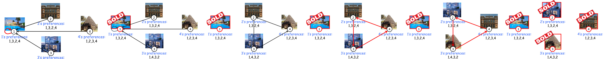

# Mechanism Desing Without Money

Cambiamo totalmente scenario

Finora abbiamo usato uno strumento potentissimo per far dire la verità agli agenti: i **soldi**. Se menti, ti faccio pagare una tassa (o ti tolgo il bonus) e la tua utilità crolla.

Ma ci sono situazioni critiche nel mondo reale in cui **non possiamo usare il denaro**. Come ci mostra questo pacchetto di slide, si entra nel campo del **Mechanism Design without money**.

**Motivazioni e Applicazioni**

Perché studiare meccanismi senza soldi?

- **Motivazione:** Semplicemente, a volte usare il denaro è **infattibile o illegale**.
- **Applicazioni reali:** Pensa alle votazioni politiche (non puoi vendere o comprare voti), alla donazione di organi (il mercato nero degli organi è illegale e immorale), o all'assegnazione degli studenti alle scuole pubbliche.
- **Il problema teorico:** L'assenza di denaro rimuove l'unica leva che avevamo per bilanciare le utilità. In questo campo dominano i cosiddetti _teoremi di impossibilità_ (è stato dimostrato che spesso è matematicamente impossibile avere meccanismi perfetti). Tuttavia, esistono alcune eccezioni brillanti, i "greatest hits" del Mechanism Design. Uno di questi è l'algoritmo TTC.

## Il Problema della House Allocation

Formalizziamo il nostro scenario di studio.

- **L'Input:** Abbiamo $n$ agenti. Inizialmente, ogni agente possiede un oggetto (chiamiamolo "casa"). C'è un diritto di proprietà iniziale inalienabile.
- **I Tipi Privati:** L'informazione segreta di ogni agente non è più un singolo numero (il budget), ma un **ordinamento totale** (una classifica) di tutte le $n$ case disponibili. Nota bene: a un agente potrebbe benissimo piacere di più la casa di un altro rispetto alla propria.
- **Gli Obiettivi:** 
	1. _Riallocare_ le case per rendere gli agenti più felici (efficienza paretiana: facciamo scambi reciprocamente vantaggiosi).
    2. _Truthfulness:_ L'algoritmo di scambio deve essere costruito in modo tale che a nessuno convenga mentire sulla propria classifica delle preferenze.

La soluzione a questo enigma è il **Top Trading Cycle (TTC) algorithm**

### Algoritmo TTC
#### L'Idea 

L'algoritmo procede per iterazioni. Vediamo il primo giro basato sull'esempio delle slide.

- **La Regola:** Ogni agente guarda le case _ancora disponibili_ sul mercato e "punta il dito" verso la sua casa preferita in assoluto.
- **Formazione del Grafo:** Nel nostro esempio, l'Agente 1 ha come prima scelta (nel suo ranking 1,3,2,4) esattamente la sua stessa casa. Punta a se stesso (creando un _self-loop_). L'Agente 2 punta alla casa 4, l'Agente 4 punta alla 3, e l'Agente 3 punta alla 2.
- **Risoluzione dei Cicli:** L'algoritmo cerca dei "cicli" chiusi. L'Agente 1 forma un ciclo chiuso da solo. Poiché punta a se stesso, l'algoritmo gli assegna la sua stessa casa e lo **rimuove dal mercato**. La casa 1 non è più disponibile per i turni successivi.

Ora che l'Agente 1 se n'è andato, inizia il secondo giro per gli agenti rimasti ($2, 3, 4$).

- **La Regola:** Ripuntano il dito verso la loro casa preferita _tra quelle rimaste_.
- **Formazione del Grafo:** L'Agente 2 (preferenze 1,3,2,4) voleva la casa 1, ma ora non c'è più! Quindi scende nella sua classifica e punta alla sua seconda scelta: la casa 3. (Aspetta, guardando la tua slide 6 l'esempio è leggermente diverso: l'Agente 2 punta direttamente alla 4, il 4 alla 3, il 3 alla 2. Seguiamo la freccia rossa della slide).
- **Il Ciclo Perfetto:** Si è formato un grande ciclo: $2 \to 4 \to 3 \to 2$. Nessuno ha la sua casa ideale, ma tutti vogliono quella del vicino in un cerchio perfetto.
- **Risoluzione:** L'algoritmo "esegue" il ciclo. L'Agente 2 si trasferisce nella casa 4, l'Agente 4 nella 3, l'Agente 3 nella 2. Tutti ottengono esattamente la casa che stavano indicando. Le case vengono vendute e gli agenti rimossi. Il mercato è vuoto, l'algoritmo termina.

#### Definizione Formale del TTC

Lo pseudocodice rigoroso dell'algoritmo TTC è il seguente:

1. **Inizializzazione:** Metti tutti gli agenti in un set $N$.
2. **Ciclo While ($N \neq \emptyset$):** Finché ci sono agenti nel mercato:
    
    - Costruisci un grafo diretto $G$. Disegna un arco $(i, \ell)$ se la casa preferita (ancora disponibile in $N$) dell'agente $i$ è attualmente di proprietà dell'agente $\ell$.
    - Calcola tutti i cicli diretti $C_1, \dots, C_h$ del grafo $G$ (ricorda: puntare a se stessi conta come un ciclo!).
    - Per ogni arco $(i, \ell)$ all'interno di un ciclo, rialloca formalmente la casa di $\ell$ all'agente $i$.
    - Rimuovi tutti gli agenti soddisfatti (quelli nei cicli $C_1 \dots C_h$) dall'insieme $N$.

**Proprietà Topologiche Fondamentali:**

Perché l'algoritmo non si "blocca" mai?

- **Out-degree = 1:** Ogni agente punta sempre e solo a _una_ casa (la sua preferita). In teoria dei grafi, se ogni nodo di un grafo finito ha esattamente un arco uscente, attraversando i nodi finirai **sempre e matematicamente per chiudere almeno un ciclo**.    
- **Cicli Disgiunti:** Proprio per il fatto che puoi puntare a una sola casa, è impossibile che tu faccia parte di due cicli chiusi contemporaneamente. I cicli sono perfettamente separati e possono essere risolti simultaneamente senza conflitti.

A questo punto mostreremo due risultati fondamentali: la dimostrazione che **a nessuno conviene mentire** e la dimostrazione che il TTC trova la **situazione di mercato perfetta e inattaccabile**.

Analizziamo i teoremi e le dimostrazioni passo dopo passo.

**Il Lemma Fondamentale e la Truthfulness**

Per studiare l'algoritmo, dividiamo gli agenti in gruppi in base al momento in cui ottengono la casa e lasciano il mercato. Definiamo **$N_k$** come l'insieme degli agenti rimossi durante l'iterazione $k$.

>[!teorem]- **Il Lemma** 
>Un agente che viene rimosso al turno $k$ (quindi appartiene a $N_k$) riceve la sua casa preferita in assoluto tra tutte quelle che non sono già state prese dai gruppi precedenti ($N_1 \cup \dots \cup N_{k-1}$). Inoltre, il proprietario originale di quella casa viene rimosso anch'esso nello stesso turno $k$ (perché fanno parte dello stesso ciclo). 

>[!teorem]- **Il Teorema della Veridicità** 
>Il TTC rende la sincerità una strategia dominante per tutti gli agenti.
  

**La Dimostrazione** 

Fissiamo un agente $i$ che, dicendo la verità, verrebbe rimosso al turno $k$ ($i \in N_k$). Potrebbe mentire per ottenere una casa migliore?

Una casa "migliore" per lui significa una casa che è stata venduta nei turni _precedenti_ (a un gruppo $N_j$ con $j < k$). Ma per rubare quella casa, l'agente $i$ dovrebbe riuscire a formare un ciclo con qualcuno di quel gruppo $N_j$.

Questo è **topologicamente impossibile**.
Perché? Perché se un agente nel gruppo $N_j$ avesse voluto la casa di $i$, l'agente $i$ sarebbe stato tirato dentro il ciclo già al turno $j$.
Visto che $i$ è arrivato fino al turno $k$, significa che _nessuno_ nei turni precedenti puntava alla sua casa. Mentendo sulle proprie preferenze, l'agente $i$ può cambiare le frecce che escono da lui, ma **non può creare frecce che puntano verso di lui**.
- Ergo, non può creare un ciclo con qualcuno nel gruppo $N_{j}$

Risultato: non c'è trucco che tenga. Il massimo che $i$ può fare è prendere la casa migliore tra quelle rimaste al turno $k$, che è esattamente ciò che l'algoritmo gli dà se dice la verità. $\blacksquare$

Il fatto che nessuno menta è fantastico, ma c'è un'altra domanda: il risultato finale è "giusto"? Per capirlo, introduciamo un concetto fondamentale dell'economia:

- **Coalizione Bloccante (Blocking Coalition):** Immagina che, finito l'algoritmo, un gruppo di agenti si riunisca in disparte e dica: _"Sapete che c'è? L'assegnazione che ci ha dato il sistema fa schifo. Riprendiamoci le nostre case originali e scambiamocele solo tra di noi. Così facendo, almeno uno di noi starà meglio, e nessuno di noi starà peggio"_. Se un gruppo del genere esiste, l'allocazione non è stabile: il mercato collassa per via dei "ribelli".
- **Allocazione Core (Nucleo):** È un'assegnazione finale talmente perfetta che **non ammette alcuna coalizione bloccante**. Nessun gruppo, né piccolo né grande, può separarsi dal sistema per ottenere un affare migliore scambiando in privato.

Di conseguenza, vale il seguente teorema

>[!teorem]- **Il Teorema Supremo** 
>L'algoritmo TTC calcola _l'unica_ allocazione Core possibile per quel mercato.

Enunciamo anche i seguenti Claim, che verranno dimostrati subito sotto

>[!definition]- Claim 1 - 2
>**Claim 1** : Ogni allocazione che è diversa dall'allocazione del TTC ***NON*** è una **core allocation**
>**Claim 2** : L'allocazione del TTC è una **core allocation**

**Dimostrazione - Claim 1**

Come dimostriamo che qualsiasi assegnazione diversa dal TTC fallisce miseramente? Con l'induzione.

1. Guarda il gruppo $N_1$ (quelli che vincono al primo turno). Loro ottengono la loro **prima scelta assoluta** nell'intero mercato. Se un'altra allocazione prova a dargli qualcosa di diverso, il gruppo $N_1$ forma immediatamente una coalizione bloccante: si tengono le loro case originali, fanno lo scambio del ciclo TTC tra di loro, e ottengono il massimo. Quindi, qualsiasi allocazione Core **deve** essere identica al TTC per il gruppo $N_1$.
2. Guarda il gruppo $N_2$. Loro ottengono la loro prima scelta tra le case rimaste fuori da $N_1$. Siccome abbiamo appena stabilito che le case di $N_1$ sono intoccabili, se provi a dare a $N_2$ un'allocazione diversa, $N_2$ formerà una coalizione bloccante.
3. Questo ragionamento si estende a cascata. Ne consegue che non c'è spazio per interpretazioni: **ogni allocazione Core deve coincidere al 100% con quella del TTC**.

$\blacksquare$

**Dimostrazione - Claim 2**

Manca l'ultimo passo: dobbiamo dimostrare che il TTC stesso non possa essere "bloccato" da dei ribelli.

Immaginiamo per assurdo che un sottoinsieme $S$ di agenti decida di ribellarsi al TTC e di fare uno scambio interno, formando un nuovo ciclo di scambi $C$.

Cosa succede in questo ciclo ribelle $C$?

- **Caso A:** Il ciclo mischia agenti "ricchi" (usciti presto nel TTC, es. $i\in N_{j}$) e agenti "poveri" (usciti tardi, es. $t\in N_{k}$). Questo significa che un agente del turno $j$ sta prendendo la casa di uno del turno $k$. Ma al turno $j$, l'agente aveva la possibilità di prendersi quella casa, e l'ha **scartata** per prenderne una migliore! Quindi, con questo nuovo scambio ribelle, l'agente $j$ sta ottenendo una casa peggiore rispetto a quella che gli ha dato il TTC. L'agente $j$ si rifiuterà di partecipare alla ribellione 
- **Caso B:** Il ciclo è formato tutto da agenti dello stesso turno $N_k$. Ma se c'era un modo per farli felici tutti al turno $k$, l'algoritmo TTC lo ha già trovato ed eseguito! Se scambiano in modo diverso dal TTC, per forza di cose qualcuno prenderà una casa che non era la sua preferita in quel momento, peggiorando la sua situazione.

**Conclusione:** Qualsiasi tentativo di ribellione fa sì che almeno un agente ci rimetta. Pertanto, nel TTC non esistono coalizioni bloccanti. Il meccanismo non solo spinge tutti a dire la verità, ma chiude il mercato in uno stato di stabilità assoluta.

$\blacksquare$
## Il Problema del Kidney Exchange

