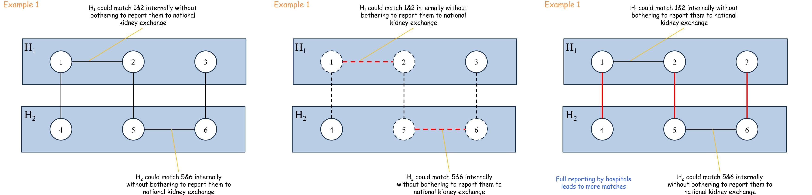

```table-of-contents
title: 
style: nestedList # TOC style (nestedList|nestedOrderedList|inlineFirstLevel)
minLevel: 0 # Include headings from the specified level
maxLevel: 0 # Include headings up to the specified level
include: 
exclude: 
includeLinks: true # Make headings clickable
hideWhenEmpty: false # Hide TOC if no headings are found
debugInConsole: false # Print debug info in Obsidian console
```
# Mechanism Desing Without Money

Cambiamo totalmente scenario

Finora abbiamo usato uno strumento potentissimo per far dire la verità agli agenti: i **soldi**. Se menti, ti faccio pagare una tassa (o ti tolgo il bonus) e la tua utilità crolla.

Ma ci sono situazioni critiche nel mondo reale in cui **non possiamo usare il denaro**. Come ci mostra questo pacchetto di slide, si entra nel campo del **Mechanism Design without money**.

**Motivazioni e Applicazioni**

Perché studiare meccanismi senza soldi?

- **Motivazione:** Semplicemente, a volte usare il denaro è **infattibile o illegale**.
- **Applicazioni reali:** Pensa alle votazioni politiche (non puoi vendere o comprare voti), alla donazione di organi (il mercato nero degli organi è illegale e immorale), o all'assegnazione degli studenti alle scuole pubbliche.
- **Il problema teorico:** L'assenza di denaro rimuove l'unica leva che avevamo per bilanciare le utilità. In questo campo dominano i cosiddetti _teoremi di impossibilità_ (è stato dimostrato che spesso è matematicamente impossibile avere meccanismi perfetti). Tuttavia, esistono alcune eccezioni brillanti, i "greatest hits" del Mechanism Design. Uno di questi è l'algoritmo TTC.

## Il Problema della House Allocation

Formalizziamo il nostro scenario di studio.

- **L'Input:** Abbiamo $n$ agenti. Inizialmente, ogni agente possiede un oggetto (chiamiamolo "casa"). C'è un diritto di proprietà iniziale inalienabile.
- **I Tipi Privati:** L'informazione segreta di ogni agente non è più un singolo numero (il budget), ma un **ordinamento totale** (una classifica) di tutte le $n$ case disponibili. Nota bene: a un agente potrebbe benissimo piacere di più la casa di un altro rispetto alla propria.
- **Gli Obiettivi:** 
	1. _Riallocare_ le case per rendere gli agenti più felici (efficienza paretiana: facciamo scambi reciprocamente vantaggiosi).
    2. _Truthfulness:_ L'algoritmo di scambio deve essere costruito in modo tale che a nessuno convenga mentire sulla propria classifica delle preferenze.

La soluzione a questo enigma è il **Top Trading Cycle (TTC) algorithm**


### Algoritmo TTC
#### L'Idea 

L'algoritmo procede per iterazioni. Vediamo il primo giro basato sull'esempio delle slide.

- **La Regola:** Ogni agente guarda le case _ancora disponibili_ sul mercato e "punta il dito" verso la sua casa preferita in assoluto.
- **Formazione del Grafo:** Nel nostro esempio, l'Agente 1 ha come prima scelta (nel suo ranking 1,3,2,4) esattamente la sua stessa casa. Punta a se stesso (creando un _self-loop_). L'Agente 2 punta alla casa 4, l'Agente 4 punta alla 3, e l'Agente 3 punta alla 2.
- **Risoluzione dei Cicli:** L'algoritmo cerca dei "cicli" chiusi. L'Agente 1 forma un ciclo chiuso da solo. Poiché punta a se stesso, l'algoritmo gli assegna la sua stessa casa e lo **rimuove dal mercato**. La casa 1 non è più disponibile per i turni successivi.

Ora che l'Agente 1 se n'è andato, inizia il secondo giro per gli agenti rimasti ($2, 3, 4$).

- **La Regola:** Ripuntano il dito verso la loro casa preferita _tra quelle rimaste_.
- **Formazione del Grafo:** L'Agente 2 (preferenze 1,3,2,4) voleva la casa 1, ma ora non c'è più! Quindi scende nella sua classifica e punta alla sua seconda scelta: la casa 3. (Aspetta, guardando la tua slide 6 l'esempio è leggermente diverso: l'Agente 2 punta direttamente alla 4, il 4 alla 3, il 3 alla 2. Seguiamo la freccia rossa della slide).
- **Il Ciclo Perfetto:** Si è formato un grande ciclo: $2 \to 4 \to 3 \to 2$. Nessuno ha la sua casa ideale, ma tutti vogliono quella del vicino in un cerchio perfetto.
- **Risoluzione:** L'algoritmo "esegue" il ciclo. L'Agente 2 si trasferisce nella casa 4, l'Agente 4 nella 3, l'Agente 3 nella 2. Tutti ottengono esattamente la casa che stavano indicando. Le case vengono vendute e gli agenti rimossi. Il mercato è vuoto, l'algoritmo termina.


#### Definizione Formale del TTC

Lo pseudocodice rigoroso dell'algoritmo TTC è il seguente:

1. **Inizializzazione:** Metti tutti gli agenti in un set $N$.
2. **Ciclo While ($N \neq \emptyset$):** Finché ci sono agenti nel mercato:
    
    - Costruisci un grafo diretto $G$. Disegna un arco $(i, \ell)$ se la casa preferita (ancora disponibile in $N$) dell'agente $i$ è attualmente di proprietà dell'agente $\ell$.
    - Calcola tutti i cicli diretti $C_1, \dots, C_h$ del grafo $G$ (ricorda: puntare a se stessi conta come un ciclo!).
    - Per ogni arco $(i, \ell)$ all'interno di un ciclo, rialloca formalmente la casa di $\ell$ all'agente $i$.
    - Rimuovi tutti gli agenti soddisfatti (quelli nei cicli $C_1 \dots C_h$) dall'insieme $N$.


**Proprietà Topologiche Fondamentali:**

Perché l'algoritmo non si "blocca" mai?

- **Out-degree = 1:** Ogni agente punta sempre e solo a _una_ casa (la sua preferita). In teoria dei grafi, se ogni nodo di un grafo finito ha esattamente un arco uscente, attraversando i nodi finirai **sempre e matematicamente per chiudere almeno un ciclo**.    
- **Cicli Disgiunti:** Proprio per il fatto che puoi puntare a una sola casa, è impossibile che tu faccia parte di due cicli chiusi contemporaneamente. I cicli sono perfettamente separati e possono essere risolti simultaneamente senza conflitti.

A questo punto mostreremo due risultati fondamentali: la dimostrazione che **a nessuno conviene mentire** e la dimostrazione che il TTC trova la **situazione di mercato perfetta e inattaccabile**.

Analizziamo i teoremi e le dimostrazioni passo dopo passo.

**Il Lemma Fondamentale e la Truthfulness**

Per studiare l'algoritmo, dividiamo gli agenti in gruppi in base al momento in cui ottengono la casa e lasciano il mercato. Definiamo **$N_k$** come l'insieme degli agenti rimossi durante l'iterazione $k$.

>[!teorem]- **Il Lemma** 
>Un agente che viene rimosso al turno $k$ (quindi appartiene a $N_k$) riceve la sua casa preferita in assoluto tra tutte quelle che non sono già state prese dai gruppi precedenti ($N_1 \cup \dots \cup N_{k-1}$). Inoltre, il proprietario originale di quella casa viene rimosso anch'esso nello stesso turno $k$ (perché fanno parte dello stesso ciclo). 


>[!teorem]- **Il Teorema della Veridicità** 
>Il TTC rende la sincerità una strategia dominante per tutti gli agenti.
  

**La Dimostrazione** 

Fissiamo un agente $i$ che, dicendo la verità, verrebbe rimosso al turno $k$ ($i \in N_k$). Potrebbe mentire per ottenere una casa migliore?

Una casa "migliore" per lui significa una casa che è stata venduta nei turni _precedenti_ (a un gruppo $N_j$ con $j < k$). Ma per rubare quella casa, l'agente $i$ dovrebbe riuscire a formare un ciclo con qualcuno di quel gruppo $N_j$.

Questo è **topologicamente impossibile**.
Perché? Perché se un agente nel gruppo $N_j$ avesse voluto la casa di $i$, l'agente $i$ sarebbe stato tirato dentro il ciclo già al turno $j$.
Visto che $i$ è arrivato fino al turno $k$, significa che _nessuno_ nei turni precedenti puntava alla sua casa. Mentendo sulle proprie preferenze, l'agente $i$ può cambiare le frecce che escono da lui, ma **non può creare frecce che puntano verso di lui**.
- Ergo, non può creare un ciclo con qualcuno nel gruppo $N_{j}$

Risultato: non c'è trucco che tenga. Il massimo che $i$ può fare è prendere la casa migliore tra quelle rimaste al turno $k$, che è esattamente ciò che l'algoritmo gli dà se dice la verità. $\blacksquare$


Il fatto che nessuno menta è fantastico, ma c'è un'altra domanda: il risultato finale è "giusto"? Per capirlo, introduciamo un concetto fondamentale dell'economia:

- **Coalizione Bloccante (Blocking Coalition):** Immagina che, finito l'algoritmo, un gruppo di agenti si riunisca in disparte e dica: _"Sapete che c'è? L'assegnazione che ci ha dato il sistema fa schifo. Riprendiamoci le nostre case originali e scambiamocele solo tra di noi. Così facendo, almeno uno di noi starà meglio, e nessuno di noi starà peggio"_. Se un gruppo del genere esiste, l'allocazione non è stabile: il mercato collassa per via dei "ribelli".
- **Allocazione Core (Nucleo):** È un'assegnazione finale talmente perfetta che **non ammette alcuna coalizione bloccante**. Nessun gruppo, né piccolo né grande, può separarsi dal sistema per ottenere un affare migliore scambiando in privato.

Di conseguenza, vale il seguente teorema

>[!teorem]- **Il Teorema Supremo** 
>L'algoritmo TTC calcola _l'unica_ allocazione Core possibile per quel mercato.

Enunciamo anche i seguenti Claim, che verranno dimostrati subito sotto

>[!definition]- Claim 1 - 2
>**Claim 1** : Ogni allocazione che è diversa dall'allocazione del TTC ***NON*** è una **core allocation**
>**Claim 2** : L'allocazione del TTC è una **core allocation**

**Dimostrazione - Claim 1**

Come dimostriamo che qualsiasi assegnazione diversa dal TTC fallisce miseramente? Con l'induzione.

1. Guarda il gruppo $N_1$ (quelli che vincono al primo turno). Loro ottengono la loro **prima scelta assoluta** nell'intero mercato. Se un'altra allocazione prova a dargli qualcosa di diverso, il gruppo $N_1$ forma immediatamente una coalizione bloccante: si tengono le loro case originali, fanno lo scambio del ciclo TTC tra di loro, e ottengono il massimo. Quindi, qualsiasi allocazione Core **deve** essere identica al TTC per il gruppo $N_1$.
2. Guarda il gruppo $N_2$. Loro ottengono la loro prima scelta tra le case rimaste fuori da $N_1$. Siccome abbiamo appena stabilito che le case di $N_1$ sono intoccabili, se provi a dare a $N_2$ un'allocazione diversa, $N_2$ formerà una coalizione bloccante.
3. Questo ragionamento si estende a cascata. Ne consegue che non c'è spazio per interpretazioni: **ogni allocazione Core deve coincidere al 100% con quella del TTC**.

$\blacksquare$

**Dimostrazione - Claim 2**

Manca l'ultimo passo: dobbiamo dimostrare che il TTC stesso non possa essere "bloccato" da dei ribelli.

Immaginiamo per assurdo che un sottoinsieme $S$ di agenti decida di ribellarsi al TTC e di fare uno scambio interno, formando un nuovo ciclo di scambi $C$.

Cosa succede in questo ciclo ribelle $C$?

- **Caso A:** Il ciclo mischia agenti "ricchi" (usciti presto nel TTC, es. $i\in N_{j}$) e agenti "poveri" (usciti tardi, es. $t\in N_{k}$). Questo significa che un agente del turno $j$ sta prendendo la casa di uno del turno $k$. Ma al turno $j$, l'agente aveva la possibilità di prendersi quella casa, e l'ha **scartata** per prenderne una migliore! Quindi, con questo nuovo scambio ribelle, l'agente $j$ sta ottenendo una casa peggiore rispetto a quella che gli ha dato il TTC. L'agente $j$ si rifiuterà di partecipare alla ribellione 
- **Caso B:** Il ciclo è formato tutto da agenti dello stesso turno $N_k$. Ma se c'era un modo per farli felici tutti al turno $k$, l'algoritmo TTC lo ha già trovato ed eseguito! Se scambiano in modo diverso dal TTC, per forza di cose qualcuno prenderà una casa che non era la sua preferita in quel momento, peggiorando la sua situazione.

**Conclusione:** Qualsiasi tentativo di ribellione fa sì che almeno un agente ci rimetta. Pertanto, nel TTC non esistono coalizioni bloccanti. Il meccanismo non solo spinge tutti a dire la verità, ma chiude il mercato in uno stato di stabilità assoluta.

$\blacksquare$
## Il Problema del Kidney Exchange

Abbandoniamo le aste e i cavi di rete per entrare in uno degli scenari più affascinanti e nobili del Mechanism Design: **lo scambio di reni (Kidney Exchange)**. È un esempio perfetto di come la teoria dei giochi e gli algoritmi possano letteralmente salvare delle vite umane quando l'uso del denaro è legalmente e moralmente vietato.
### Il Contesto Medico e l'Idea di Base

Negli Stati Uniti (e nel resto del mondo) ci sono liste d'attesa infinite per i trapianti di rene. A differenza di altri organi, il rene permette la donazione da vivente: una persona sana può donare un rene a un parente malato e vivere benissimo con l'altro.

Spesso, però, c'è un problema di **incompatibilità**: io voglio donare un rene a mio fratello, ma i nostri gruppi sanguigni o tessuti non sono compatibili.

L'idea geniale alla base del sistema è lo **scambio incrociato**:

Se la coppia Paziente 1 - Donatore 1 ($P_1, D_1$) è incompatibile, e la coppia Paziente 2 - Donatore 2 ($P_2, D_2$) è anch'essa incompatibile, possiamo incrociarli. Il Donatore 1 dà il rene al Paziente 2, e il Donatore 2 lo dà al Paziente 1.


Poiché comprare e vendere organi è illegale, la sfida è: **come progettiamo un sistema per massimizzare questi scambi senza usare i soldi?**

### La Prima Idea: Riciclare l'Algoritmo TTC

La primissima intuizione degli economisti è stata quella di prendere il problema medico e "mascherarlo" da problema di House Allocation, per poter usare l'algoritmo **Top Trading Cycle (TTC)** che abbiamo appena studiato e di cui conosciamo l'assoluta affidabilità.

La mappatura è intuitiva:

- **L'Agente** diventa il Paziente.
- **La Casa** (la proprietà iniziale) diventa il Donatore associato al paziente.
- **Le Preferenze:** Ogni paziente stila una classifica (un ordine totale) di tutti i donatori disponibili nel sistema, basata sulla probabilità stimata di successo del trapianto. L'algoritmo TTC cercherebbe i cicli di scambio, garantendo che ogni paziente ottenga un donatore uguale o migliore di quello di partenza, senza alcun incentivo a mentire sui propri dati medici.

Questo approccio elegante sulla carta presenta dei piccoli ostacoli tecnici iniziali:

- Come gestiamo i pazienti in lista d'attesa che _non hanno_ un donatore (agenti senza casa)?
- Come gestiamo i reni provenienti da donatori deceduti (case senza agente)? 

Questi problemi, seppur fastidiosi, si possono risolvere estendendo matematicamente le regole del TTC. Ma i veri problemi sono altri.

**I Problemi Critici e Logistici (Perché il TTC fallisce nella realtà)**

Si evidenziano tre difetti fatali dell'approccio TTC applicato alla chirurgia:

- **Il rischio di ritiro (Reneging) e la Simultaneità:** In uno scambio $P_1-D_1$ con $P_2-D_2$, le operazioni devono avvenire **simultaneamente**. Se facessimo prima il trapianto per $P_1$ usando il rene di $D_2$, il giorno dopo il donatore $D_1$ (il cui parente è ormai guarito) potrebbe tirarsi indietro e rifiutarsi di farsi operare. $P_2$ rimarrebbe senza rene, pur avendo il suo donatore già "pagato" il prezzo.
- **I Cicli Troppo Lunghi:** L'algoritmo TTC non ha limiti sulla lunghezza dei cicli. Se trova un ciclo perfetto di 10 persone, fantastico! Ma logisticamente, un ciclo di 10 coppie richiede **20 sale operatorie e 20 equipe chirurgiche in contemporanea**. È fisicamente impossibile per quasi tutti gli ospedali del mondo. Il caso "really bad" mostra proprio questa catena infinita.
- **Classifiche Inutili (Overkill):** Chiedere a un medico di fare una classifica perfetta dal 1° al 100° donatore è uno spreco di tempo. Nella pratica clinica, le preferenze sono quasi sempre **binarie**: un rene o è compatibile, o non lo è.


Modellare i trapianti come un mercato di case è sbagliato. Dobbiamo cambiare il modello matematico e abbandonare il TTC. Il nuovo approccio si baserà sul **Graph Matching** (l'accoppiamento sui grafi), limitando la lunghezza degli scambi e usando preferenze binarie.
### La soluzione: Graph Matching

Come abbiamo visto, usare l'algoritmo TTC per i trapianti di rene era un'idea teoricamente affascinante ma impraticabile nel mondo reale a causa delle catene di scambio troppo lunghe (che richiederebbero decine di sale operatorie in contemporanea).

Qui illustriamo il cambio di paradigma: abbandoniamo l'approccio dell'asta (House Allocation) e adottiamo la teoria dei grafi puri. Nello specifico, passiamo al **Graph Matching**.

**Il Modello a Grafo e il Matching**

Definiamo quindi la nuova infrastruttura matematica. Dimentichiamo i cicli direzionali infiniti e passiamo a un **grafo non orientato (undirected graph)**.

- **I Nodi (Vertici):** Ogni nodo del grafo rappresenta un'intera coppia incompatibile Paziente-Donatore, che indichiamo con $(P_i, D_i)$.
- **Gli Archi (Edges):** Disegniamo un arco tra il nodo $i$ e il nodo $j$ _se e solo se_ c'è una compatibilità reciproca perfetta. Ovvero: il donatore $D_i$ può salvare il paziente $P_j$, E il donatore $D_j$ può salvare il paziente $P_i$.
- **Il Vantaggio Logistico:** Noti la differenza fondamentale? Un arco non orientato rappresenta uno scambio a due vie. Stiamo forzando matematicamente il sistema a usare **solo cicli di lunghezza 2 (Pairwise Exchange)**. Questo risolve l'incubo logistico: servono solo due sale operatorie.
- **L'Obiettivo (Maximum Size Matching):** Un _matching_ in un grafo è un sottoinsieme di archi che non condividono alcun nodo (non puoi usare lo stesso donatore per due pazienti). L'obiettivo della società è trovare un **Maximum-Cardinality Matching**, ovvero il matching che contiene il maggior numero possibile di archi. Tradotto in termini medici: vogliamo salvare il massimo numero possibile di vite umane.


**La Questione degli Incentivi**

Ora dobbiamo assicurarci che i pazienti dicano la verità. Come può mentire un paziente in questo scenario?

- **L'Asimmetria:** Un paziente $i$ ha un vero insieme di donatori compatibili (chiamiamolo $E_i$). Quando il sistema gli chiede con chi è compatibile, lui riporterà un insieme $F_i$.
- **La Regola Medica:** È fisicamente impossibile fingere di essere compatibili con qualcuno con cui non lo si è. Ma è possibilissimo fare il contrario: **rifiutare un rene compatibile**. Un paziente potrebbe nascondere una compatibilità sperando di "manipolare" il grafo per ottenere un rene che ritiene migliore (ad esempio, da un donatore più giovane). Pertanto, la matematica ci dice che l'insieme dichiarato $F_i$ deve per forza essere un sottoinsieme del vero $E_i$ ($F_i \subseteq E_i$).

Il meccanismo di base raccoglie questi $F_i$, costruisce il grafo e calcola il Maximum Matching. Ma è a prova di bugia? La risposta: _dipende da come gestiamo i pareggi_.


**Il Problema dei Pareggi**

Cosa succede se ci sono più modi diversi per salvare lo stesso numero massimo di persone?

- Guarda gli esempi subito sotto. Nel quadrato in alto, puoi salvare 4 persone usando gli archi verticali (rossi a sinistra) OPPURE usando gli archi orizzontali (rossi a destra). Entrambi sono Maximum Matchings validi.
- Se il sistema scegliesse a caso, un paziente furbetto potrebbe decidere di "tagliare" un arco (dichiarando una falsa incompatibilità) per forzare il sistema a scegliere l'altro matching, dove magari ottiene un rene che preferisce. Se lo fa, il sistema non è più _truthful_.
- **La Soluzione (Prioritizing):** Per eliminare l'incertezza (e quindi le scappatoie strategiche), dobbiamo stabilire una **Priorità** rigorosa tra le coppie. Questo non è un trucco matematico, ma pura pratica clinica: gli ospedali usano già sistemi di priorità basati sull'urgenza medica, sul tempo passato in lista d'attesa o sull'età.

**Esempi**


#### Il Priority Mechanism

L'ultima slide presenta l'algoritmo definitivo. È un meccanismo brillante che unisce il calcolo del massimo salvataggio globale con il rispetto ferreo delle priorità mediche.


Funziona così:

1. Ordina tutti i nodi (i pazienti) dal più urgente (priorità 1) al meno urgente (priorità $n$).
2. Calcola **tutti** i Maximum Matchings possibili del grafo. Chiamiamo questo grande insieme di soluzioni di partenza $M_0$. Tutte queste soluzioni salvano il numero massimo assoluto di vite.
3. Ora inizia a filtrare queste soluzioni partendo dal paziente più urgente ($i=1$ fino a $n$):
    - Prendi le soluzioni valide al momento ($M_{i-1}$) e guarda solo quelle che riescono a trovare un rene per il paziente $i$. Chiamiamo questo sottogruppo $Z_i$. 
    - **Se $Z_i$ non è vuoto** (significa che c'è un modo per salvare questo paziente prioritario senza diminuire il numero totale di vite salvate globale e senza togliere il rene a chi è più urgente di lui), allora scarta tutte le altre soluzioni e tieni solo quelle in $Z_i$ (poni $M_i = Z_i$).
    - **Se $Z_i$ è vuoto** (significa che per salvare lui dovresti rinunciare al salvataggio globale o rubare il rene a un paziente più urgente), allora accetta tristemente di non poterlo salvare e mantieni le soluzioni del passo precedente ($M_i = M_{i-1}$).
4. Alla fine del ciclo, restituisci una qualsiasi delle soluzioni rimaste in $M_n$.

Questo algoritmo è un capolavoro perché non scende mai a compromessi sul numero totale di vite salvate, ma usa le flessibilità del grafo per "spingere" i reni verso i pazienti più bisognosi.

Entriamo nel vivo dell'Informatica Teorica pura per dimostrare l'infallibilità di questo meccanismo, per poi spostarci su un livello di analisi completamente nuovo: il comportamento degli ospedali.

**Il Teorema e la Dimostrazione**

Enunciamo il risultato fondamentale di questo design

>[!teorem]- Teorema
>Nel Priority Mechanism per scambi a coppie, dichiarare in modo veritiero le proprie compatibilità ($E_i$) è **una strategia dominante** per ogni paziente.

**dimostrazione**

L'utilità di un paziente è strettamente binaria: vale $1$ se riceve un rene (viene accoppiato nel matching finale), vale $0$ se non lo riceve.

Supponiamo che sia il turno del paziente $i$ nell'algoritmo

- Dal turno precedente, il sistema ha ereditato un insieme di Maximum Matchings validi, chiamiamolo **$M_{i-1}$**.
- L'agente $i$ possiede un insieme vero di compatibilità **$E_i$**. Tuttavia, essendo strategico, potrebbe decidere di nascondere alcuni donatori dichiarando un sottoinsieme **$F_i \subseteq E_i$** (sappiamo che non può inventare compatibilità inesistenti per motivi medici).
- L'algoritmo guarda in $M_{i-1}$ e cerca quali di queste soluzioni globali ottime riescono a salvare il paziente $i$, usando _solo_ gli archi da lui dichiarati.
- Se l'agente dichiara il vero ($E_i$), l'algoritmo trova un insieme di soluzioni valide che lo salvano: **$Z_i(E_i)$**.
- Se l'agente mente ($F_i$), l'algoritmo trova un insieme di soluzioni valide che lo salvano: **$Z_i(F_i)$**.

Ora, la matematica degli insiemi ci fornisce una verità assoluta: poiché $F_i \subseteq E_i$ (ci sono meno archi a disposizione), le soluzioni che il sistema può trovare mentendo saranno sempre e solo un sottoinsieme delle soluzioni che troverebbe dicendo la verità. Ovvero: **$Z_i(F_i) \subseteq Z_i(E_i)$**.

Cosa comporta questo per l'utilità dell'agente?

1. Se dicendo la verità l'agente **veniva salvato** ($Z_i(E_i)$ non è vuoto), mentendo rischia di far svuotare quell'insieme. Se $Z_i(F_i)$ diventa vuoto a causa degli archi nascosti, l'agente perde il rene. La sua utilità crolla da $1$ a $0$.
2. Se dicendo la verità l'agente **NON veniva salvato** ($Z_i(E_i)$ è vuoto), nascondere archi non potrà _mai e poi mai_ creare magicamente nuove soluzioni. L'insieme $Z_i(F_i)$ resterà irrimediabilmente vuoto e la sua utilità rimarrà $0$.

**Conclusione:** Mentire non offre mai una possibilità di passare da "non salvato" a "salvato", ma espone al rischio fatale di passare da "salvato" a "non salvato". Pertanto, dire la verità su tutte le proprie compatibilità è una strategia dominante.

_(Nota sull'Exercise 2: Abbiamo già visto nelle slide precedenti che, se rompessimo i pareggi a caso invece che con la priorità, l'agente potrebbe nascondere un arco per uccidere un matching concorrente e forzare il sistema a scegliere un altro matching a lui più favorevole. La rigida regola della priorità distrugge proprio questa scappatoia)._

Facciamo ora alcune osservazioni ed analizziamo le nuove direzioni della ricerca medica e algoritmica attuale.

- **La lunghezza dei cicli (Scambi a 3 vie):** Il nostro Priority Mechanism usa scambi a 2 vie (Pairwise). Ma cosa succede se permettiamo cicli di lunghezza 3 ($A \to B \to C \to A$)? Gli studi dimostrano che usare scambi a 3 vie aumenta _drasticamente_ il numero totale di pazienti salvati a livello nazionale, al costo di dover sincronizzare tre sale operatorie. Andare oltre (scambi a 4 o 5 vie) aumenta troppo il rischio logistico di fallimento a fronte di pochissimi pazienti salvati in più.
- **Il Vero Problema - Gli Incentivi degli Ospedali:** Qui c'è un colpo di scena concettuale. Nella realtà, non sono i pazienti a inviare i dati al database nazionale, ma i loro ospedali. L'**agente strategico** del nostro gioco cambia: diventa l'Ospedale. Il problema è che l'obiettivo della Società (salvare più persone possibili in tutta la nazione) **non è perfettamente allineato** con l'obiettivo del singolo Ospedale (salvare più pazienti _del proprio_ ospedale).

Vediamo ora 2 esempi fondamentali
##### Esempio 1: Il Mercato Virtuoso

Illustriamo un caso in cui la cooperazione tra ospedali funziona perfettamente e avvantaggia tutti.

- **Lo Scenario:** Abbiamo due ospedali. L'ospedale $H_1$ ha i pazienti 1, 2 e 3. L'ospedale $H_2$ ha i pazienti 4, 5 e 6. Le linee nere rappresentano tutte le compatibilità mediche reali (gli archi del grafo globale).
- **Il comportamento egoistico:** Mettiamo che gli ospedali non vogliano partecipare al sistema nazionale e facciano solo scambi interni.
    - $H_1$ si accorge che il paziente 1 e 2 sono compatibili tra loro (linea tratteggiata rossa). Li opera internamente e salva **2 pazienti**. Il paziente 3 resta ad aspettare.
    - $H_2$ fa lo stesso: scambia tra 5 e 6. Salva **2 pazienti**. Il 4 resta ad aspettare.
    - Totale salvati senza cooperare: **4 pazienti**.
- **Il comportamento cooperativo:** Ora gli ospedali dichiarano tutti i loro pazienti al database nazionale. Il super-algoritmo nazionale calcola il Maximum Matching sul grafo completo.
    - Scopre che la soluzione ottima globale (linee rosse verticali) è accoppiare (1 con 4), (2 con 5) e (3 con 6).
    - Totale salvati cooperando: **6 pazienti**.



**La morale dell'Esempio 1:** Perché agli ospedali conviene cooperare in questo caso specifico? Semplice: se cooperano, l'ospedale $H_1$ riesce a salvare **3** suoi pazienti invece che 2. L'ospedale $H_2$ riesce a salvare **3** suoi pazienti invece che 2. Entrambi gli "agenti ospedale" hanno aumentato la propria utilità locale. Hanno tutto l'interesse a dire la verità e condividere i dati.

##### Esempio 2: La Verità Globale e il Dilemma

L'Esempio 1 ci aveva illuso che la cooperazione fosse sempre vantaggiosa per tutti. Questo **Esempio 2** è una doccia fredda e rappresenta un fondamentale **Risultato di Impossibilità (Impossibility Result)** per il Mechanism Design applicato agli ospedali.

Mostriamo la realtà medica oggettiva:

- **L'Ospedale $H_1$** ha i pazienti $\{2, 3, 7\}$.
- **L'Ospedale $H_2$** ha i pazienti $\{1, 4, 5, 6\}$.
- **Le compatibilità (Archi):** Se guardi bene le linee nere, i pazienti formano una singola, lunga catena perfetta: **$1-2-3-4-5-6-7$**.


**Il problema matematico:** La catena ha $7$ nodi (un numero dispari). Un _matching_ può accoppiare i nodi solo a due a due. Qual è il numero massimo di persone che possiamo salvare in una catena di 7? Il massimo è **3 coppie (6 persone)**.

Questo significa una cosa tragica e ineluttabile: in qualsiasi Maximum Matching globale che il sistema nazionale decida di applicare, **un paziente $x$ rimarrà sempre e per forza senza rene**.

Il paziente sacrificato $x$ apparterrà necessariamente all'ospedale $H_1$ oppure all'ospedale $H_2$. E qui nasce il movente per il "delitto".

**Il Comportamento Strategico di $H_1$**

Supponiamo che il sistema centrale calcoli il Maximum Matching e la sfortuna voglia che il paziente lasciato fuori sia il numero $7$ (appartenente a $H_1$). In questo scenario, $H_1$ salva solo $2$ dei suoi $3$ pazienti.

- L'ospedale $H_1$ guarda i propri dati interni e pensa: _"Perché devo rimetterci? Io ho i pazienti 2 e 3 che sono compatibili tra loro!"_
- **La Bugia:** $H_1$ decide di manipolare il sistema. Chiude i pazienti 2 e 3 in una sala operatoria interna (linea tratteggiata rossa) e **non li dichiara** al database nazionale. Dichiara solo il paziente $7$.
- **La conseguenza sul grafo:** Il sistema nazionale ora vede solo un grafo spezzato: il nodo $1$ da solo, e la sottocatena $4-5-6-7$.
- **Il nuovo calcolo:** Il sistema è obbligato a trovare il Maximum Matching su questo grafo mutilato. L'unica soluzione ottima per salvare più gente possibile ora è accoppiare $(4,5)$ e accoppiare $(6,7)$.
- **Il Risultato per $H_1$:** Ha salvato $2$ e $3$ internamente. Il sistema nazionale ha appena salvato il $7$ (usando il $6$). $H_1$ ha salvato **TUTTI (3 su 3)** i suoi pazienti. Mentire ha premiato!


**Il Comportamento Strategico di $H_2$**

Cosa succede se invece il sistema centrale, nella situazione iniziale, avesse lasciato fuori un paziente di $H_2$ (ad esempio il numero $1$)?

- Anche $H_2$ nota una compatibilità interna tra i suoi pazienti $5$ e $6$.
- **La Bugia:** $H_2$ nasconde $5$ e $6$ (li opera di nascosto, linea tratteggiata rossa) e dichiara al sistema solo $1$ e $4$.
- **La conseguenza sul grafo:** Il sistema nazionale ora vede la catena $1-2-3-4$ e il nodo $7$ isolato.
- **Il nuovo calcolo:** L'algoritmo calcola il Maximum Matching su $1-2-3-4$. L'unica soluzione per non lasciare fuori nessuno in questa sotto-catena è accoppiare $(1,2)$ e $(3,4)$.
- **Il Risultato per $H_2$:** Ha salvato $5$ e $6$ internamente. Il sistema nazionale ha appena accoppiato il suo $1$ (col $2$) e il suo $4$ (col $3$). $H_2$ ha salvato **TUTTI (4 su 4)** i suoi pazienti. Anche per $H_2$ mentire è la strategia dominante!


Perché un meccanismo sia _truthful_ (veritiero), **nessuno** degli agenti deve avere la tentazione di mentire.

Tuttavia, abbiamo appena dimostrato che:

1. Qualsiasi algoritmo cerchi di estrarre il Maximum Matching dovrà per forza lasciare fuori un ospedale.    
2. L'ospedale lasciato fuori avrà **sempre** sia il movente sia la possibilità pratica (nascondendo archi interni) di ingannare l'algoritmo per forzarlo a salvare tutti i propri pazienti, a discapito della collettività.

Ne consegue quindi che: **"No truthful maximum matching is possible!"** (Non è possibile alcun Maximum Matching veritiero).

Quando gli agenti strategici diventano interi ospedali con proprie compatibilità interne, il sistema perde le sue garanzie matematiche di verità. L'interesse locale devasta l'ottimo globale.