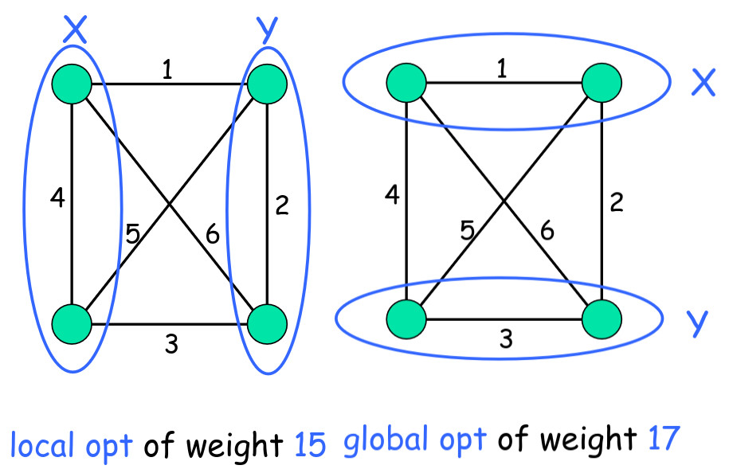

```table-of-contents
title: 
style: nestedList # TOC style (nestedList|nestedOrderedList|inlineFirstLevel)
minLevel: 0 # Include headings from the specified level
maxLevel: 0 # Include headings up to the specified level
include: 
exclude: 
includeLinks: true # Make headings clickable
hideWhenEmpty: false # Hide TOC if no headings are found
debugInConsole: false # Print debug info in Obsidian console
```
# Calcolare l'Equilibrio di Nash di un Congestion Game: la PLS-completezza

Cambiando completamente scenario, entriamo in uno dei territori più affascinanti dell'Algorithmic Game Theory: l'intersezione tra la Teoria dei Giochi e la Complessità Computazionale. Finora abbiamo dato per scontato che, se un Equilibrio di Nash esiste, i giocatori ci arriveranno. Ma quanto tempo ci vuole? E un computer quanto impiega a calcolarlo?

Per rispondere, dobbiamo introdurre una nuova classe di complessità chiamata **PLS (Polynomial Local Search)**. 
## Recap: Il Global Connection Game

Prima di tutto, piccolo recap. Ricorda che il _Global Connection Game_ (dove i giocatori condividono i costi per costruire una rete) è un caso speciale di **Congestion Game**.

Ricordiamo che un Global Connection Game è definito formalmente così

>[!definition]- Modello GCG
>Abbiamo le seguenti strutture:
>- Grafo diretto $G(V,E)$
>- $c_{e}$ = costo non negativo dell'arco $e\in E$
>- $k$ giocatori
>- ogni giocatore $i$ ha un nodo sorgente $s_{i}$ e un nodo pozzo $t_i$
>- l'obiettivo del giocatore $i$-esimo è: creare una rete dove sia possibile arrivare a $t_i$ partendo da $s_{i}$, pagando il meno possibile
>- la strategia di ogni giocatore $i$: un percorso $P_{i}$ che va da $s_i\to t_i$

Inoltre:

- Sappiamo che possiede una **Funzione Potenziale Esatta**.
- Grazie al potenziale, sappiamo con certezza matematica che **esiste sempre almeno un Equilibrio di Nash Puro (PNE)**, e che la dinamica di risposta migliore (i giocatori che cambiano strategia uno alla volta) convergerà _sempre_ a tale equilibrio.
- **La grande domanda:** Ok, convergerà. Ma dopo quanti passi? Se ci vogliono miliardi di anni, l'equilibrio esiste sulla carta ma non nella pratica.

## Definizione Formale di Congestion Game

Per studiare il problema, dobbiamo astrarlo. Dimentichiamo i grafi e generalizziamo la definizione di Congestion Game (CG).

Un CG è definito da una tupla $(N, E, \{S_i\}_{i \in N}, \{c_e\}_{e \in E})$ dove:

- **$N = \{1, \dots, k\}$:** è l'insieme dei $k$ giocatori.
- $E$ è l'insieme delle risorse disponibili (che prima erano gli archi del grafo).
- **Spazio delle strategie $S_i \subseteq 2^E$:** Ogni strategia di un giocatore è un sottoinsieme di risorse. Un giocatore può scegliere un intero "pacchetto" di risorse.
- **Vettore di strategie $S = (S_1, \dots, S_k)$:** È il profilo delle strategie, ovvero le scelte attuali di tutti i giocatori.
- **Congestione $k_e(S)$:** Per ogni risorsa $e$, la congestione è il numero esatto di giocatori che la stanno usando in quello stato $S$. Matematicamente: $k_e(S) = |\{i \in N : e \in s_i\}|$.
- **Costo della risorsa $c_e(\cdot)$:** Una funzione _non decrescente_ che associa un costo in base a quanta gente la sta usando. Più persone ci sono, più si paga.
- **Costo del giocatore $c_i(S)$:** È semplicemente la somma dei costi delle risorse che il giocatore sta usando: $$c_i(S) = \sum_{e \in s_i} c_e(n_e(S))$$
Tra le proprietà più interessanti dei CG troviamo che lui è un **Gioco Potenziale**, la cui funzione potenziale prende il nome di **Funzione Potenziale di Rosenthal**, e matematicamente è:
$$\phi(S)=\sum\limits_{e\in E}\sum\limits_{i=0}^{k_e(S)}c_{e}(i)$$
Inoltre:
- l'esistenza di questa funzione potenziale garantisce l'esistenza di un NE (esiste sempre un NE, dato che ogni minimo locale di $\phi(S)$ è un NE)
- la Better Response Dynamic converge sempre ad un NE

### Il Problema Computazionale CG-NE

Definiamo ora il problema algoritmico nudo e crudo, chiamato **CG-NE**.

- **Input:** Un Congestion Game generico.
- **Output:** Un qualsiasi Equilibrio di Nash Puro (PNE).

**L'Illusione della Complessità**

Un informatico guarderebbe questo problema e si chiederebbe: _"È un problema NP-hard?"_.

Ma c'è un dettaglio cruciale: per via del Teorema di Rosenthal, **la soluzione (il PNE) esiste sempre**. Questo fa del CG-NE un **Total Search Problem** (Problema di Ricerca Totale).

Nella teoria della complessità, i problemi di ricerca totale appartengono alla classe **TFNP**. Se si dimostrasse che un problema in TFNP è anche FNP-hard (la versione di ricerca dell'NP-hard), si implicherebbe che $\text{NP} = \text{co-NP}$, un evento che collasserebbe gran parte dell'informatica moderna.

Di conseguenza, il CG-NE _non può_ essere FNP-hard. Abbiamo bisogno di un modo diverso per misurare la sua intrattabilità.

Piccola digressione sulla classe FNP (Functional NP):

>[!definition]- Classe FNP
>Classe di problemi simili alla classe NP, ma con la differenza che per le istanze SI, la prova va fornita.
>I problemi in questa classe sono anche chiamati search problems


>Non ci si chiede _se_ esiste una soluzione (problema decisionale SÌ/NO), ma si chiede di _trovarla_, sapendo che c'è. Questo colloca il problema all'interno della classe **TFNP** (Total Function NP), che a sua volta è un sottoinsieme della classe **FNP** (la versione "di ricerca" dei problemi NP).


**Riduzione tra Problemi di Ricerca**

Prima di arrivare al teorema, dobbiamo spiegare come funziona una riduzione quando non stiamo affrontando problemi decisionali (SÌ/NO), ma problemi di _ricerca_. Per ridurre un problema di ricerca $L_1​$ a un problema di ricerca $L_2$​, servono **due funzioni calcolabili in tempo polinomiale (f e g)**:

1. **La funzione f (Mappatura dell'istanza):** Prende un'istanza $x$ del problema $L_1​$ e la trasforma in un'istanza $f(x)$ del problema $L_2$​.
2. **La funzione g (Mappatura della soluzione):** Prende l'istanza originale $x$ e una soluzione $y$ trovata per il problema $L_2$​, e le trasforma all'indietro per ottenere una soluzione valida $g(x,y)$ per il problema originario $L_1​$.

Osserviamo che se $L_{2}$ è **risolvibile in tempo polinomiale**, allora anche $L_{1}$ lo è 

**Il Teorema e la Dimostrazione**

Ora abbiamo tutti i pezzi per il teorema che scardina l'approccio classico.
Vediamo l'enunciato del teorema e la sua dimostrazione

>[!teorem]- Teorema
>Il problema CG-NE non è FNP-hard, a meno che NP = co-NP.

**dimostrazione** Procediamo per assurdo.

Supponiamo che CG-NE sia effettivamente **FNP-hard**. Se fosse così, qualsiasi problema nella classe FNP potrebbe essere ridotto a CG-NE in tempo polinomiale (usando le funzioni f e g appena definite). 
Prendiamo come "cavia" il problema **SAT** (trovare un'assegnazione di verità che soddisfa una formula booleana, che sappiamo essere FNP-completo).

1. Prendiamo un'istanza $\phi$ di SAT che **NON è soddisfacibile** (una formula "NO").
2. Usiamo la funzione f per tradurla in un'istanza di un Congestion Game: $f(\phi)$.
3. Essendo un Congestion Game (Total Search Problem), sappiamo per certo che **deve avere un Equilibrio di Nash $y$**.
4. La funzione g, per definizione di riduzione, dovrebbe prendere questo equilibrio $y$ e mapparci indietro una soluzione per l'istanza originale $\phi$.
5. Ma l'istanza $\phi$ è insoddisfacibile, ergo l'equilibrio $y$ (che troviamo sempre) funge da **certificato verificabile in tempo polinomiale del fatto che la formula $\phi$ sia insoddisfacibile**.
6. Essere in grado di verificare in tempo polinomiale le istanze "NO" (l'insoddisfacibilità) di un problema NP-completo significa dimostrare che il problema appartiene a **co-NP**.
7. Questo porterebbe alla conclusione che **NP = co-NP**, un evento ritenuto implausibile dalla teoria della complessità.

**Conclusione:** L'ipotesi iniziale è falsa. Il problema CG-NE non può essere FNP-hard.$\blacksquare$
## La classe PLS

Abbiamo visto che la classe FNP non è adatta a descrivere la complessità del calcolo di un equilibrio di Nash nei giochi di congestione, perché questi equilibri esistono sempre (grazie alla funzione potenziale) e la FNP-completezza implicherebbe il collasso della gerarchia polinomiale ($\text{NP = co-NP}$). Per colmare questo vuoto teorico e studiare i problemi in cui la soluzione esiste ma è difficile da trovare tramite algoritmi di ricerca locale, viene introdotta la classe **PLS (Polynomial Local Search)**.

### Definizione e Struttura

Un problema appartiene alla classe PLS se la ricerca di una soluzione si basa su una struttura di "intorni" e su una funzione obiettivo da ottimizzare. Più formalmente, un problema $L \in PLS$ è caratterizzato da:

1. **Un insieme di istanze $D_L$**: l'input del problema.
2. **Un insieme di soluzioni $S_L(x)$**: per ogni istanza $x$, esiste un insieme finito di possibili soluzioni (ad esempio, tutte le possibili partizioni di un grafo o tutti i profili di strategia di un gioco).
3. **Una funzione obiettivo $f_L(x, s)$**: una funzione che assegna un valore numerico a ogni soluzione $s$. L'obiettivo è massimizzare (o minimizzare) questo valore.
4. **Una relazione di intorno $N_L(x, s)$**: per ogni soluzione $s$, viene definito un insieme di soluzioni "vicine".

Perché un problema sia effettivamente in PLS, devono esistere tre algoritmi che girano in tempo polinomiale rispetto alla dimensione dell'input:

- **Algoritmo di Start**: fornisce una soluzione iniziale ammissibile $s_0$.    
- **Algoritmo Val**: calcola il valore della funzione obiettivo $f_L(x, s)$ per una data soluzione.
- **Algoritmo Next**: data una soluzione $s$, restituisce una soluzione vicina $s' \in N_L(s)$ che migliora il valore della funzione obiettivo. Se non esiste un tale $s'$, l'algoritmo segnala che $s$ è un **ottimo locale**.

**Inquadramento tra FNP e TFNP**

La classe PLS occupa una posizione specifica nella gerarchia della complessità. Sappiamo che **$FNP \supseteq TFNP \supseteq PLS$**.


Il motivo per cui **$PLS \subseteq TFNP$** (Total Function NP) è profondo ma intuitivo: in un problema PLS, lo spazio delle soluzioni è finito e ogni passo dell'algoritmo _Next_ migliora strettamente il valore della funzione obiettivo. Di conseguenza, è matematicamente impossibile ciclare all'infinito; l'algoritmo deve necessariamente terminare in un ottimo locale. Poiché un ottimo locale esiste sempre (al limite, l'ottimo globale è anche un ottimo locale), il problema è "totale": la ricerca non fallisce mai nel trovare una risposta.
### L'esempio del Max-Cut

Il problema del **Max-Cut** è l'esempio perfetto per visualizzare come opera la ricerca locale e come si definisce un ottimo in questo contesto. Immaginiamo un grafo pesato $G=(V, E)$ dove ogni arco $e$ ha un peso $w_e > 0$. L'obiettivo è partizionare i nodi in due insiemi, $A$ e $B$, in modo da massimizzare la somma dei pesi degli archi che "tagliano" la partizione, ovvero quegli archi che hanno un estremo in $A$ e l'altro in $B$.
- matematicamente, la misura da massimizzare è la seguente: $$\text{Peso-cut}=\sum\limits_{(x,y)\in E:x\in A,y\in B}w(x,y)$$

Possiamo modellare Max-Cut come un problema PLS definendo i suoi componenti:

- **Soluzioni**: Tutte le possibili partizioni $(A, B)$ dei nodi.
- **Intorno**: Due partizioni sono vicine se differiscono per lo spostamento di un **singolo nodo** da un insieme all'altro.
- **Funzione obiettivo**: Il peso totale del taglio $W(A, B)$.

**L'Euristica Naturale e l'Ottimo Locale**

L'algoritmo di ricerca locale per il Max-Cut (l'euristica naturale) è estremamente semplice: si parte da una partizione arbitraria e, finché esiste un nodo che, se spostato dall'altra parte, aumenta il peso totale del taglio, lo si sposta. Quando non è più possibile muovere alcun singolo nodo per migliorare il risultato, ci troviamo in un **ottimo locale**.



Ma cosa significa, matematicamente, essere in un ottimo locale per il Max-Cut?

Per ogni nodo $v \in A$, la somma dei pesi degli archi che lo collegano a nodi in $B$ (archi esterni al set di $v$) deve essere maggiore o uguale alla somma dei pesi degli archi che lo collegano ad altri nodi in $A$ (archi interni). Se così non fosse, spostare $v$ in $B$ aumenterebbe il valore del taglio, e quindi non saremmo in un ottimo locale.

**Ottimo Locale vs Ottimo Globale**

Una domanda spontanea è: quanto è lontano un ottimo locale dall'ottimo globale?

In un ottimo locale $(A, B)$, per ogni nodo $v$ vale che il peso degli archi del taglio incidenti su $v$ è almeno la metà del peso totale di tutti gli archi incidenti su $v$. Sommando questa proprietà su tutti i nodi, si ottiene un risultato sorprendente: **il valore di un ottimo locale è almeno la metà del peso totale di tutti gli archi del grafo**.

Dato che l'ottimo globale non può superare il peso totale di tutti gli archi, ne consegue che ogni ottimo locale fornisce una **2-approssimazione** dell'ottimo globale. Sebbene la ricerca locale non garantisca di trovare il taglio massimo assoluto, garantisce una soluzione di buona qualità in modo intuitivo.

Il legame con i giochi di congestione è ormai evidente: la ricerca di un equilibrio di Nash puro tramite risposte ottime dei singoli giocatori non è altro che una ricerca locale in uno spazio di soluzioni dove la funzione potenziale agisce come funzione obiettivo. Studiare se Max-Cut è "difficile" in PLS ci aiuterà a capire se trovare un equilibrio di Nash lo è altrettanto.

**Il Problema "Local Max-Cut"**

Anziché cercare disperatamente il taglio massimo assoluto (che sappiamo essere NP-hard), definiamo il problema computazionale del **Local Max-Cut**: data un'istanza del problema (un grafo pesato), l'obiettivo è trovare _un qualsiasi_ ottimo locale.

Questa formulazione è il prototipo perfetto di un problema di ricerca locale. Sorprendentemente, scopriremo a breve che persino accontentarsi di un semplice ottimo locale è un compito computazionalmente arduo.
#### Gli Ingredienti di un Abstract Local Search Problem

Per poter classificare i problemi in base alla loro difficoltà di "ricerca locale", dobbiamo prima astrarre il concetto. Un problema astratto di ricerca locale è definito dalla presenza di tre algoritmi, tutti calcolabili in tempo polinomiale:

1. **L'algoritmo di Inizializzazione:** Prende in input un'istanza del problema e restituisce una qualsiasi soluzione di partenza ammissibile (ad esempio, un taglio casuale nel grafo o un profilo di strategie a caso).
2. **L'algoritmo di Valutazione:** Prende in input l'istanza e una soluzione ammissibile, e restituisce il valore numerico della funzione obiettivo per quella soluzione.
3. **L'algoritmo di Esplorazione (Miglioramento):** Prende in input l'istanza e la soluzione corrente. Qui fa due cose: o certifica che la soluzione è "localmente ottima" (nessuna mossa adiacente la migliora), oppure trova e restituisce una nuova soluzione vicina con un valore obiettivo strettamente migliore.

### La Riduzione PLS ($L_1 \le_{PLS} L_2$)

Esattamente come per la classe NP, per dimostrare che un problema è "difficile" dobbiamo poterlo confrontare con altri. Serve quindi un concetto di riduzione specifico per la classe PLS.

Per ridurre un problema di ricerca locale $L_1$ a un altro problema $L_2$, abbiamo bisogno di due algoritmi polinomiali:

- La funzione **$A_1$** (che mappa le istanze): trasforma un'istanza $x$ del problema $L_1$ in un'istanza $A_1(x)$ del problema $L_2$.
- La funzione **$A_2$** (che mappa le soluzioni ottime): prende un _ottimo locale_ trovato per l'istanza $A_1(x)$ in $L_2$ e lo trasforma all'indietro in un _ottimo locale_ per l'istanza originale $x$ in $L_1$. 

Il principio fondamentale è questo: se $L_2$ fosse risolvibile in tempo polinomiale (ovvero se esistesse un modo veloce per trovare il suo ottimo locale), allora potremmo usare questa riduzione per risolvere velocemente anche $L_1$.
### PLS-Completezza e Teoremi Fondamentali

Siamo ora pronti per la definizione cardine: 

>[!definition]- PLS-Completezza
>Un problema $L$ è **PLS-completo** se appartiene alla classe PLS e _qualsiasi_ altro problema in PLS può essere ridotto a esso. In parole povere, sono i problemi di ricerca locale più difficili in assoluto.

Per il problema del Local Max-Cut (con pesi degli archi non negativi) esistono due risultati storici fondamentali che non dimostriamo, ma che sono pilastri della teoria:

- **Primo Teorema:** Il problema del Local Max-Cut è **PLS-completo**.
- **Secondo Teorema:** Trovare questo ottimo locale usando la classica euristica di spostare un nodo alla volta può richiedere, nel caso peggiore, un numero **esponenziale** di iterazioni. Non importa quanto intelligentemente scegliamo quale nodo spostare, ci sono grafi costruiti appositamente per costringere l'algoritmo a visitare un numero infinito di stati prima di fermarsi.

### CG-NE e PLS-Completezza

Arriviamo al punto di arrivo di tutto questo ragionamento.

>[!teorem]- **Teorema** 
>Il problema CG-NE (trovare un Equilibrio di Nash Puro in un Congestion Game) è PLS-completo.

Questa è la prova definitiva che trovare un equilibrio in un gioco di congestione è intrattabile nel caso peggiore. La dimostrazione si divide in due parti:

**Parte 1: CG-NE appartiene a PLS**

Dobbiamo verificare che il gioco possieda i tre algoritmi polinomiali visti prima.

1. Inizializzazione: Facile, restituiamo un profilo di strategie $S$ qualsiasi.
2. Valutazione: Dato $S$, calcoliamo il valore della Funzione Potenziale di Rosenthal $\Phi(S)$.
3. Esplorazione: Dato $S$, controlliamo se c'è un giocatore che ha una "risposta migliore" (better response). Se sì, restituiamo il nuovo profilo con la sua strategia cambiata. Se nessuno vuole cambiare, dichiariamo che "$S$ è un Equilibrio di Nash" (che coincide con l'ottimo locale del potenziale).

Quindi, CG-NE è a tutti gli effetti un problema di ricerca locale sulla funzione potenziale.  

**Parte 2: Completezza (Riduzione dal Local Max-Cut)**

Per dimostrare che è PLS-completo, costruiamo una riduzione proprio dal Local Max-Cut a un Congestion Game. È una traduzione ingegnosa:

- Creiamo un **giocatore** per ogni nodo $v$ del grafo.
- Per ogni arco $e$ del grafo originario, creiamo **due risorse distinte**, chiamiamole $r_e$ e $\bar{r}_e$.
- Un giocatore $v$ ha a disposizione solo **due strategie**: la strategia $S_v$ (che significa "scelgo tutte le risorse normali $r_e$ degli archi collegati a me") e la strategia $\bar{S}_v$ (che significa "scelgo tutte le risorse barrate $\bar{r}_e$ degli archi collegati a me"). Scegliere la prima equivale a dire "Vado nell'insieme $X$ del taglio", scegliere la seconda equivale a dire "Vado nell'insieme $Y$".
	- Formalmente, abbiamo $$\begin{align}&S_{v}=\{r_{e}:e\in\delta(v)\}\\&\bar{S}_v=\{\bar{r}_e:e\in\delta(v)\}\end{align}$$
- **I Costi:** Impostiamo la funzione di costo delle risorse in modo brillante. Il costo è $0$ se la risorsa è usata da $0$ o $1$ persona. Il costo balza al valore del peso dell'arco $w(e)$ se la risorsa è usata da $2$ persone.
	- anche qui, formalmente abbiamo che il costo della risorsa $r\in{r_{e},\bar{r}_{e}}$ è: $$c_{r}(0)=c_{r}(1)=0\space\land\space c_{r}(2)=w(e)$$

**L'intuizione geometrica:** Se due giocatori (nodi collegati da un arco) scelgono strategie diverse (uno va in $X$ e usa $r_e$, l'altro va in $Y$ e usa $\bar{r}_e$), l'arco viene "tagliato". Nessuna delle due risorse supera il carico di $1$, quindi nessuno paga nulla. Se invece scelgono la stessa strategia (non tagliano l'arco), si ammucchiano sulla stessa risorsa portando il carico a $2$, e pagano una penalità pari al peso dell'arco.

C'è una corrispondenza esatta (biiezione) tra i possibili profili di strategia del gioco e i possibili tagli del grafo. La funzione potenziale del gioco si esprime esattamente come:

$$\Phi(S) =\sum\limits_{r\in R}\sum\limits_{i=0}^{k_{r}(S)}c_{r}(i)= W - W(X_S, Y_S)$$

dove $W$ è la somma totale di tutti i pesi del grafo $\left(W=\sum\limits_{e\in E}w(e)\right)$ e $W(X_S, Y_S)$ è il valore del taglio per quella configurazione.

Poiché $W$ è una costante fissa, **minimizzare il potenziale $\Phi(S)$ equivale matematicamente a massimizzare il valore del taglio $W(X_S, Y_S)$**.

Ne consegue che un profilo di strategie $S$ è un minimo locale per il potenziale (ovvero un Equilibrio di Nash) _se e solo se_ la sua configurazione corrispondente $(X_S, Y_S)$ è un Massimo Locale per il problema del taglio. $\blacksquare$

Abbiamo così dimostrato che risolvere CG-NE è difficile _esattamente quanto_ risolvere il Local Max-Cut. Siccome il Local Max-Cut è PLS-completo e può richiedere tempo esponenziale, calcolare un Equilibrio di Nash in un Congestion Game generale è, a tutti gli effetti pratici, un problema computazionalmente intrattabile.

---
# E se cercassimo NE misti?

Cambiamo di nuovo orizzonte. Finora abbiamo analizzato gli Equilibri di Nash Puri nei giochi di congestione, scoprendo che la loro intrattabilità è intimamente legata all'ottimizzazione e alla ricerca locale (la classe PLS). 

Ma cosa succede se torniamo alle origini della Teoria dei Giochi e cerchiamo un **Equilibrio di Nash Misto (MNE)** in un gioco standard?

Consideriamo il problema algoritmico nella sua forma più pura

>[!definiton]- Problema MNE
>Dato un gioco a due giocatori in forma normale (il classico gioco bimatrice), il nostro obiettivo è trovare un qualsiasi equilibrio in strategie miste.

In questo scenario, il celebre Teorema di Nash ci fornisce una garanzia incrollabile: un equilibrio misto esiste _sempre_. Questa certezza matematica colloca immediatamente il problema computazionale all'interno della classe **TFNP** (Total Function NP), la famiglia dei problemi di ricerca in cui siamo sicuri che una soluzione ci sia. Eppure, nonostante decenni di sforzi da parte della comunità scientifica, nessuno è mai riuscito a trovare un algoritmo capace di calcolare questo equilibrio in tempo polinomiale.

La domanda che ci poniamo è quindi: qual'è la classe corretta per il problema MNE?

Per capire la vera natura di questo ostacolo, dobbiamo confrontare le "regole d'ingaggio" della nostra ricerca. 

Nella classe PLS, il problema astratto si risolve muovendosi in un grafo diretto dove i nodi sono le soluzioni fattibili e gli archi sono le mosse di miglioramento. Si segue un percorso guidato da una funzione obiettivo che migliora costantemente, fino a scivolare inevitabilmente in un nodo pozzo (il sink), che rappresenta il nostro ottimo locale e la fine della ricerca.


Tuttavia, la ricerca di un equilibrio misto non gode di questa comoda struttura di "miglioramento continuo".

Il Teorema di Nash si appoggia su teoremi topologici di punto fisso, che dimostrano l'esistenza della soluzione sfruttando argomentazioni geometriche completamente diverse. Per incapsulare questa specifica forma di complessità, nel 1994 l'informatico Christos Papadimitriou ha coniato una nuova classe, chiamata **PPAD** (Polynomial Parity Argument on a Directed graph).

La classe PPAD descrive problemi che possono essere mappati su un immenso grafo diretto dominato da una regola topologica ferrea: ogni singolo nodo ha un grado di ingresso (in-degree) e un grado di uscita (out-degree) pari al massimo a $1$. Questo significa che il grafo è composto esclusivamente da percorsi lineari non ramificati (senza bivi) e da anelli chiusi.


In questo ambiente, il problema ti fornisce una "sorgente canonica", ovvero un punto di partenza noto che possiede un arco in uscita ma nessuno in entrata.

Per un principio elementare (l'argomento di parità), se inizi a camminare lungo questo sentiero, non potendo mai incontrare biforcazioni o incrociare i tuoi stessi passi, prima o poi dovrai obbligatoriamente sbattere contro un vicolo cieco: un nodo che ha un arco in ingresso ma nessuno in uscita. Quel vicolo cieco è la soluzione del problema.

La differenza concettuale è sottile ma abissale. Se in PLS la ricerca si ferma perché la funzione obiettivo non può migliorare all'infinito, in PPAD la ricerca si ferma perché un sentiero lineare, che parte da un'estremità aperta, deve matematicamente possedere un'altra estremità aperta. PLS e PPAD sono entrambe figlie della grande classe TFNP, ma sono due insiemi che si sovrappongono solo in parte, poiché rappresentano due motivi geometrici diametralmente opposti per cui una soluzione è garantita.


Il culmine di questo ramo dell'Algorithmic Game Theory è stato raggiunto nel 2006. 
Un monumentale teorema congiunto (dimostrato da Daskalakis, Goldberg, Papadimitriou, Chen, Deng e Teng) ha sancito che il calcolo di un qualsiasi Equilibrio di Nash misto in un gioco bimatrice è un problema **PPAD-completo**.

Questo risultato traccia una linea di demarcazione inequivocabile. Certifica che calcolare le probabilità esatte con cui due giocatori dovrebbero randomizzare le proprie mosse non è semplicemente un'operazione "difficile", ma appartiene alla categoria dei problemi di tracciamento di percorsi più duri in assoluto. Ci rivela che, a meno di rivoluzioni impensabili nella teoria della complessità, non avremo mai un algoritmo rapido e universale per trovare gli equilibri misti, costringendoci ad accontentarci di approssimazioni o di studiare classi di giochi molto restrittive.