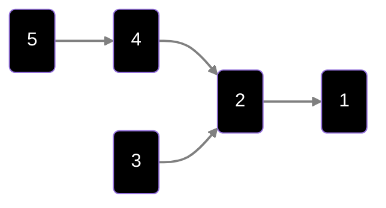

# Modalità di convergenza

Inizia tutto con il concetto di **modello probabilistico** : 

>[!definition]- Modello probabilistico
>Un **modello probabilistico** è una tripla $$\langle\Omega, \mathbb F,P\rangle$$
>Dove: 
>- $\Omega$ = spazio degli eventi
>- $\mathbb F$ = **sigma-algebra**, ovvero una famiglia di sottoinsiemi di $\Omega$
>- $P$ = funzione di probabilità

Segue poi il concetto di **variabile aleatoria**, ovvero una variabile $$X:\Omega\to\mathbb R$$
Parliamo allora di **modalità di convergenza**, ce ne sono 5 tipi

Prendiamo una v.a $X_n$ , che altro non è che una sequenza di v.a.
## 1) Convergenza in distribuzione

Sia $X_n:\Omega\to\mathbb R$

La v.a $X_n$ si dice che ha **distribuzione in convergenza** se vale la seguente:

$$X_n\to_{d}X\iff \lim_{n\to\infty}F_{X_n}(x)\to F_{X}(x)\space\forall\space x\text{ punto di continuità di }F_{X}(\cdot)$$

Osserviamo che: $\forall x\in\mathbb R,F_{X_n}(x)=Pr(X_n\leq x)$, e ricordiamo che $F_X(\cdot)$ è la **funzione di ripartizione della v.a** $X$

Seconda osservazione: non serve che le $X_n$ e $X$ siano distribuite sullo stesso $\Omega$
## 2) Convergenza in probabilità

La v.a $X_n$ si dice che ha **distribuzione in probabilità** se vale la seguente:

$$X_n\to_p X\iff \forall\varepsilon\gt0:\lim_{n\to\infty}Pr\left(|X_{n}-X|\gt\varepsilon\right)=0$$

Osserviamo che, in generale vale che $2)\implies 1)$ ma $1)\centernot\implies2)$ 

Perchè in generale? perchè è possibile trovare un controesempio tale per cui $1)\implies 2)$, e questo quando $X\equiv c$, con $c$ costante

## 3) Convergenza in media r-esima

La v.a $X_n$ si dice che ha **distribuzione in media r-esima** se vale la seguente:

$$X_n\to_{r}X\iff \lim_{n\to\infty}\mathbb E[|X_n-X|^r]=0,\space r\gt0$$

Con $r=2$ otteniamo la convergenza in media **quadratica**

Dimostriamo il perchè $3)\implies 2)$, usando la **disuguaglianza di Markov** [^1] e la **disuguaglianza di Chebychev** [^2]

Scriviamo quindi: 
$$Pr(|X_n-X|\gt\varepsilon)\leq\frac{\mathbb E[|X_n-X|^{r}]}{\varepsilon^r}$$
e questa quantità tende a **zero** $\blacksquare$ 

Come prima, in generale vale che $2)\centernot\implies 3)$, ma anche qui abbiamo un controesempio.

Supponiamo che $X_n\to_p0$ e $\mathbb E[X_{n}]\equiv 1$
Prendiamo $$X_n=\begin{cases}0&1- \frac{1}{n}\\n& \frac{1}{n}\end{cases}$$
Così, vale quindi che $X_n\to_p0$ ma $\mathbb E[|X_{n=}-0|]=n \frac{1}{n}=1$ 

Quindi, se aggiungo ipotesi, posso invertire la freccia fra $3)$ e $2)$ e di conseguenza ottenere $2)\implies 3)$? 
Risposta, sì. 
Infatti, se ho la conv. in probabilità + variabili limitate $\implies$ conv. in media r-esima
## 4) Convergenza quasi certa

La v.a $X_n$ si dice che ha **distribuzione quasi certa** se vale la seguente:

$$X_n\to_{q.c}X\iff Pr\left(\omega:\lim_{n\to\infty}X_n(\omega)=X(\omega)\right)=1$$
In modo equivalente, possiamo riscrivere

$$X_n\to_{q.c}X\iff \lim_{n\to\infty}Pr\left(\bigcup_{m\geq n}|X_n-X|\gt\varepsilon\right)=0\space\forall\varepsilon\gt0$$

Anche qui osserviamo un paio di cose:
1. $3)\centernot\implies 4)$ : perchè la $4)$ non chiede nulla sui momenti
2. $2)\centernot\implies 4)$, ma qui possiamo dare un controesempio

Controesempio di $2)\centernot\implies 4)$ [^3]

Prendiamo $U\sim Unif[0,1]$ (ovvero $U$ è la v.a distribuita uniformemente sull'intervallo $[0,1]$)
Definiamo la sequenza di variabili casuali $X_n$ come:

$$X_n(\omega)= \begin{cases}  1, & \omega \in \left[\frac{k-1}{n}, \frac{k}{n}\right), \text{per un certo } k \\0, & \text{altrove.}\end{cases}  
$$

Più concretamente: dividi l’intervallo $[0,1]$ in $n$ sottointervalli, e fai sì che $X_n$ valga $1$ solo in uno di essi (ad esempio il primo), e $0$ altrove.

- Allora per ogni $n$:  $$\mathbb{P}(X_n = 1) = \frac{1}{n}, \quad \mathbb{P}(X_n = 0) = 1 - \frac{1}{n}.  $$
- Quindi $X_n \to 0$ **in probabilità**, perché  $$  
    \mathbb{P}(|X_n - 0| > \varepsilon) = \mathbb{P}(X_n = 1) = \frac{1}{n} \to 0.$$
- Però **non converge quasi certamente**: per ogni $\omega \in [0,1]$, esistono infiniti $n$ tali che $X_n(\omega) = 1$. Infatti l’intervallo in cui $X_n$ vale $1$ "scorre" su tutto $[0,1]$.  Quindi, fissato $\omega$, $X_n(\omega)$ non si stabilizza mai a 0. Risultato:  $$\mathbb{P}({\omega : X_n(\omega) \to 0}) = 0.$$
## 5) Convergenza completa

La v.a $X_n$ si dice che ha **distribuzione completa** se vale la seguente:

$$X_{n}\to_{c.c}X\iff\forall\varepsilon\gt0:\sum\limits_{n=1}^{\infty}Pr(|X_n-X|\gt\varepsilon)\lt\infty$$
Prossima lezione vedremo perchè $5)\implies 4)$

La situazione è quindi la seguente

[^1]: Markov : $X\geq0:Pr(X\geq a)\leq\frac{\mathbb E[X]}{a}$

[^2]: Chebychev : $X\geq0,\mathbb E[X^2]\lt\infty:Pr(|X-\mathbb E[X]|\gt a)\leq\frac{Var(X)}{a^2}$

[^3]: Nota: dimostrazione presa da Chatgpt
