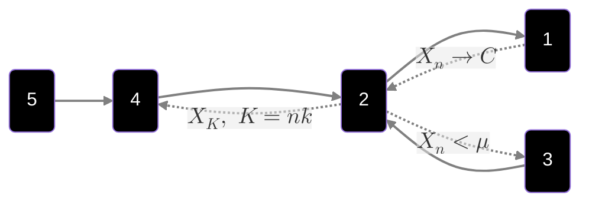
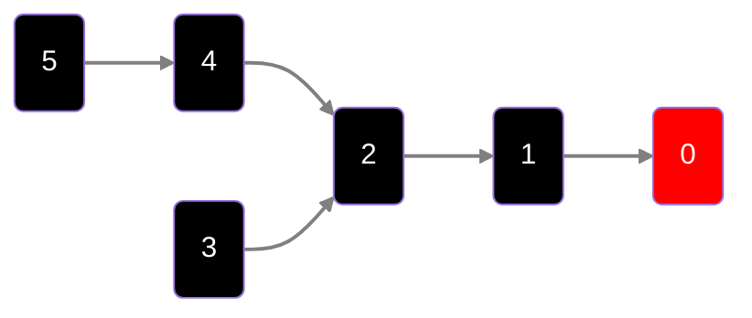

# Continuo sui metodi di convergenza

Riprendiamo la definizione di **convergenza completa**

$$X_{n}\to_{c.c}X\iff\forall\varepsilon\gt0:\sum\limits_{n=1}^{\infty}Pr(|X_n-X|\gt\varepsilon)\lt\infty$$
Mostriamo ora un controesempio di quando vale che $4)$ ma non vale $5)$

Prendiamo la v.a $U\sim[0,1]$ e $X_n=\mathbb{1}_{[0,1]}(U)$

Vale $4)$ perchè pescato il numero, la sequenza da $\frac{1}{n}$ in poi diventa identicamente distribuita come $0$

*Non* vale $5)$ perchè $$Pr(|X_n-0|\gt\varepsilon)\equiv \frac{1}{n}\space\land\space\sum\limits_{n=1}^{\infty} \frac{1}{n}\space\text{non converge}$$
Possiamo affermare che, se vale $5)$ è sicuro che valga $4)$?
La risposta è sì, e la vediamo dalla seguente:

$$\underbrace{\lim_{n\to\infty}Pr\left(\bigcup_{m\geq n}|X_{n}-X|\gt\varepsilon\right)=0}_{(5)}\overbrace{\leq}^{(\star)}\underbrace{\sum\limits_{m\geq n}Pr(|X_{n}-X|\gt\varepsilon)\to^{n\to\infty}0}_{\text{vale per (4)}}$$

Perchè il limite delle unioni è minore/uguale della somma delle stesse? (ovvero il punto $(\star)$)

Questo vale per un concetto probabilistico molto importante, ovvero lo **Union Bound**, che dice che $$Pr(A\cup B)\leq Pr(A)+Pr(B)$$
**osservazione**

In generale, vale che $$X_{n}\to_pX\centernot\implies X_{n}\to_{q.c}X$$
Questo vale solo nel caso in cui prendiamo una sottosequenza di $X_{n}$.
Ad esempio, prendiamo la sottosequenza $$X_{nk}:Pr\left(|X_{nk}-X|\gt\frac{1}{2^{k}}\right)\leq\frac{1}{k^2}$$
Questa sottosequenza converge quasi certamente a $X$, e quindi $$X_{nk}\to_{q.c}X$$
La "nuova" catena delle implicazioni è quindi la seguente: (dico nuova perchè è la vecchia con l'aggiunta delle implicazioni al contrario)

Introduciamo la **proposizione di Skorohod**

>[!teorem]- Proposizione di Skorohod
>Se $X_n\to_{d}X\space\exists(\Omega',\mathbb F',P')\text{ con }X_{n}'\underbrace{:}_{\text{distrubuito su }\Omega'}\Omega'\space\land\space X':\Omega'\to\mathbb R$
>Allora:
>- $X_n'=^{d}X$ (stessa distribuzione) 
>- $X'=^{d}X$
>- $X_n'\to_{q.c}X'$

**Dimostrazione proposizione di Skorohod**

Ricordiamo che $F(x)=Pr(X\leq x)$
Usiamo quindi la **trasformata di Smirnor** (anche chiamata *Trasformazione integrale di probabilità*) [^1]

Iniziamo la dimostrazione

Prendiamo $U\sim Unif[0,1]$ e $Y:=F^{-1}(U)$ (osserviamo che per semplicità $F$ è strettamente crescente e quindi invertibile)

Faremo quindi vedere che $$Pr(Y\leq x)=F(x)$$
Quindi
$$Pr(Y\leq x)=Pr(F^{-1}(U)\leq x)\overbrace{=}^{\text{applico F ambo i lati}}Pr(U\leq F(x))\underbrace{=}_{\text{perchè U è uniforme su [0,1]}}F(x)$$

Dato che vale $1)$ allora $F_{X_n}\to F_{X}$

Prendiamo ora $$(\Omega',\mathbb F',P')=\{[0,1],\mathbb B[0,1],L_{b}\}\quad(\text{definizione formale (semi-inutile)})$$
Dove:
- $\mathbb B[0,1]$ : sottoinsiemi di $[0,1]$
- $L_b$ : lunghezza dell'intervallo

Prendendo ora:
$$X_n'=F_{X_{n}}^{-1}(U)\land X'=F_{X}^{-1}(U)\implies X_{n}'\to_{q.c}X'\quad\blacksquare$$
---

La domanda che ci poniamo ora è : c'è qualcosa di più debole di $1)$?

Ovvero, $\exists (0):(1)\implies(0)$?

Risposta sì (ovviamente), e si chiama **stochastics orders of magnitude**

La catena è quindi: 

# Stochastics Orders of Magnitude

Definiamo quindi questa quantità

>[!definition]- S.O.o.M
>Sia $\langle\Omega, \mathbb F,P\rangle$ e $X_{n}:\Omega\to\mathbb R$
>Prendiamo ***sequenze deterministiche*** $f_{n},g_{n}\gt0$
>I S.O.o.M sono $$X_{n}=O_{p}(f_n)\lor X_n=o_p(g_{n})$$
>Dove:
>- $X_n=o_p(g_n)\iff\frac{X_{n}}{g_{n}}\to_p0$
>- $X_{n}=O_{p}(f_n)\iff\forall\varepsilon\gt0\exists c=c_{\varepsilon}:Pr\left(\frac{|X_n|}{f_{n}}\gt c_{\varepsilon}\right)\lt\varepsilon$

**osservazione**
1. $X_{n}\to_{p}0\iff X_{n}=o_{p}(1)$
2. $X_n\to_p c\implies X_{n}=O_p(1)$

Dimostriamo formalmente il punto $2)$, il punto $1)$ è banale (secondo Marinucci)

Dobbiamo dimostrare che $$\forall\varepsilon\gt0\space\exists d:Pr(|X_{n}|\gt d)\lt\varepsilon$$
Per poterlo dire, prendiamo $d=c+\delta$, in modo da ottenere che $$Pr(|X_n|\gt d)=Pr(|X_{n}-c|\gt d)\leq\varepsilon\quad\blacksquare$$
>[!help]- Esempio
>Un esempio di quando vale che $X_n=O_{p}(1)$ ma non vale che $X_{n}\to_p c$ è quando $X_{n}$ è uniforme su $[0,1]$

Valgono i seguenti lemmi

>[!teorem]- Lemma 1
>Supponiamo che $X_n\to_{d}X$, allora $$X_n=O_p(1)$$

>[!teorem]- Lemma 2
>1. Se $X_{n}=o_p(f_{n})\implies X_n=O_p(f_{n})$
>2. Se $X_{n}=O_p(f_n)\land\frac{f_n}{g_{n}}\to 0\implies X_n=o_p(g_{n})$

**Dimostrazione punto 2 Lemma 2**

Dobbiamo dimostrare che $$Pr\left(\frac{X_n}{g_n}\gt\varepsilon\right)\to0\space\forall\varepsilon\gt0$$
Per farlo, moltiplichiamo e dividiamo per $f_{n}$, ottenendo: 
$$Pr(|X_n|\gt\varepsilon g_n)=Pr\left(|X_{n}|\gt\underbrace{\left[\frac{\varepsilon g_{n}}{f_n}\right]}_{\text{questa quantità tende a }\infty}f_n\right)\to0\quad\blacksquare$$
## Algebra degli S.O

>[!definition]- Algebra degli S.O
>Valgono le seguenti:
>1. Supponiamo che $X_{n}=O_p(f_{n})$ e $Y_{n}=O_p(g_{n})$, allora $$X_{n}Y_n=O_p(f_ng_n),\quad X_{n}+Y_{n}=O_p(\max\{f_n,g_{n}\})$$
>2. Se $X_{n}=o_p(f_{n})$ e $Y_{n}=o_p(g_{n})$ allora $$X_{n}Y_n=o_p(f_ng_n),\quad X_{n}+Y_{n}=o_p(\max\{f_n,g_{n}\})$$
>3. Se $X_{n}=O_p(f_{n})$ e $Y_{n}=o_p(g_{n})$ allora $$X_{n}Y_n=o_p(f_ng_n)$$

**Dimostriamo**
1. Punto 1
	1. Devo dimostrare che $Pr(|X_nY_n|\gt cf_ng_n)$ la posso rendere piccola quanto mi pare. Prendiamo $c=c_{1}c_2$ e da qui ottengo che $$Pr(|X_nY_n|\gt cf_ng_n)\leq Pr(|X_n|\gt c_{1}f_n)+Pr(|Y_n|\gt c_{2}g_n)$$
	2. Devo dimostrare che $Pr(|X_n+Y_n|\gt c\max\{f_n,g_n\})$ la posso rendere piccola quanto mi pare. Prendiamo $c=c_{1}c_2$ e da qui ottengo che $$\begin{align*}Pr(|X_n+Y_n|\gt c\max\{f_n,g_n\})&\leq Pr(|X_n|\gt c_{1}\max\{f_n,g_n\})\\&+Pr(|Y_n|\gt c_{2}\max\{f_n,g_n\})\end{align*}$$
2. Dimostriazioni dei punti 2.1 e 2.2 identiche a sopra
3. Devo dimostrare che $Pr(|X_nY_n|\gt \varepsilon f_ng_n)\to0$ indipendentemente da $\varepsilon$. Per farlo, moltiplico e divido per una costante $M$, quindi ottengo $$Pr\left(|X_nY_n|\gt \frac{\varepsilon}{M}M f_ng_n\right)=Pr(|X_n|\gt Mf_{n})+Pr\left(|Y_{n}|\gt\frac{\varepsilon}{M}g_{n}\right)$$
	1. Per la prima prob. essendo che è $O_p$ allora posso scegliere $M$ tale che il valore della prob. sia $\lt \frac{\delta}{2}$
	2. Stessa cosa per la seconda, ma questa volta è $o_p$

[^1]: https://it.wikipedia.org/wiki/Trasformazione_integrale_di_probabilit%C3%A0
