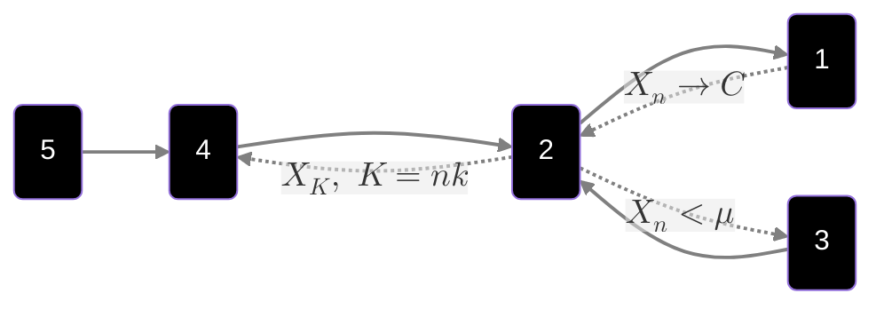

# Continuo sui metodi di convergenza

Riprendiamo la definizione di **convergenza completa**

$$X_{n}\to_{c.c}X\iff\forall\varepsilon\gt0:\sum\limits_{n=1}^{\infty}Pr(|X_n-X|\gt\varepsilon)\lt\infty$$
Mostriamo ora un controesempio di quando vale che $4)$ ma non vale $5)$

Prendiamo la v.a $U\sim[0,1]$ e $X_n=\mathbb{1}_{[0,1]}(U)$

Vale $4)$ perchè pescato il numero, la sequenza da $\frac{1}{n}$ in poi diventa identicamente distribuita come $0$

*Non* vale $5)$ perchè $$Pr(|X_n-0|\gt\varepsilon)\equiv \frac{1}{n}\space\land\space\sum\limits_{n=1}^{\infty} \frac{1}{n}\space\text{non converge}$$
Possiamo affermare che, se vale $5)$ è sicuro che valga $4)$?
La risposta è sì, e la vediamo dalla seguente:

$$\underbrace{\lim_{n\to\infty}Pr\left(\bigcup_{m\geq n}|X_{n}-X|\gt\varepsilon\right)=0}_{(5)}\overbrace{\leq}^{(\star)}\underbrace{\sum\limits_{m\geq n}Pr(|X_{n}-X|\gt\varepsilon)\to^{n\to\infty}0}_{\text{vale per (4)}}$$

Perchè il limite delle unioni è minore/uguale della somma delle stesse? (ovvero il punto $(\star)$)

Questo vale per un concetto probabilistico molto importante, ovvero lo **Union Bound**, che dice che $$Pr(A\cup B)\leq Pr(A)+Pr(B)$$
**osservazione**

In generale, vale che $$X_{n}\to_pX\centernot\implies X_{n}\to_{q.c}X$$
Questo vale solo nel caso in cui prendiamo una sottosequenza di $X_{n}$.
Ad esempio, prendiamo la sottosequenza $$X_{nk}:Pr\left(|X_{nk}-X|\gt\frac{1}{2^{k}}\right)\leq\frac{1}{k^2}$$
Questa sottosequenza converge quasi certamente a $X$, e quindi $$X_{nk}\to_{q.c}X$$
La "nuova" catena delle implicazioni è quindi la seguente: (dico nuova perchè è la vecchia con l'aggiunta delle implicazioni al contrario)

Introduciamo la **proposizione di Skorohod**

>[!teorem]- Proposizione di Skorohod
>Se $X_n\to_{d}X\space\exists(\Omega',\mathbb F',P')\text{ con }X_{n}'\underbrace{:}_{\text{distrubuito su }\Omega'}\Omega'\space\land\space X':\Omega'\to\mathbb R$
>Allora:
>- $X_n'=^{d}X$ (stessa distribuzione) 
>- $X'=^{d}X$
>- $X_n'\to_{q.c}X'$

**Dimostrazione proposizione di Skorohod**

