```table-of-contents
title: 
style: nestedList # TOC style (nestedList|nestedOrderedList|inlineFirstLevel)
minLevel: 0 # Include headings from the specified level
maxLevel: 0 # Include headings up to the specified level
include: 
exclude: 
includeLinks: true # Make headings clickable
hideWhenEmpty: false # Hide TOC if no headings are found
debugInConsole: false # Print debug info in Obsidian console
```
# Dal Web di Documenti al Web di Dati: L'essenza di RDF

***RDF*** (Resource Description Framework) è il linguaggio fondazionale del Web Semantico, lo standard W3C che permette il passaggio dal web dei documenti al web dei dati. 

Se l'HTML serve a descrivere la formattazione dei documenti per i browser web (e quindi per gli umani), RDF serve a descrivere le **risorse** (qualsiasi cosa, concetto, persona o entità) e le relazioni tra di esse in un formato che le macchine possono elaborare, incrociare e "comprendere". 

RDF non è un semplice formato di file, ma un vero e proprio **modello dati**.

## La struttura atomica: La Tripla e il Grafo

L'intera architettura di RDF si basa su una struttura logica elementare ma estremamente flessibile: la **tripla**. Qualsiasi informazione o affermazione in RDF viene scomposta in tre parti:

- **Soggetto:** La risorsa di cui si sta parlando.
    
- **Predicato (o Proprietà):** La caratteristica, l'attributo o la relazione che descrive il soggetto.
    
- **Oggetto:** Il valore di quell'attributo, oppure un'altra risorsa a cui il soggetto è collegato tramite il predicato.
    

Pensala come una frase semplice: _Roma (Soggetto) -> èCapitaleDi (Predicato) -> Italia (Oggetto)_.

Quando inizi a collegare migliaia di queste triple, dove l'Oggetto di una frase diventa il Soggetto di un'altra, la struttura dati che emerge non è una tabella (come nei database relazionali), ma un **Grafo Diretto ed Etichettato** (Directed Labeled Graph). Le risorse sono i nodi del grafo, mentre i predicati sono gli archi direzionati che le uniscono.


## I mattoni di RDF: URI, Literal e Blank Nodes

Per far sì che questo grafo funzioni su scala globale e non generi ambiguità, gli elementi delle triple devono sottostare a regole ferree:

- **URI (Uniform Resource Identifier):** È l'identificatore univoco globale per eccellenza. Il Soggetto e il Predicato _devono obbligatoriamente_ essere risorse identificate da un URI (spesso nella forma di un URL web). Questo evita il problema dell'omonimia: due concetti chiamati "Banca" (l'istituto di credito o la panca di legno) avranno due URI totalmente differenti. L'Oggetto può a sua volta essere un URI.
    
- **Literal (Letterali):** Rappresentano i valori "primitivi" e testuali (stringhe, date, numeri). Possono essere usati **solo come Oggetto** della tripla, mai come Soggetto o Predicato (non puoi far partire un arco da un numero). Spesso sono accompagnati da un _datatype_ (per specificare che "25" è un intero) o da un _language tag_ (es. "Roma"@it).
    
- **Blank Nodes (Nodi Vuoti):** Sono risorse anonime, nodi del grafo sprovvisti di un URI globale. Si usano per rappresentare entità strutturate che non hanno bisogno di un identificatore unico per il resto del mondo (ad esempio, l'indirizzo generico associato a una persona: sai che esiste un'entità "indirizzo" composta da via, CAP e città, ma non ti serve darle un URI assoluto).

Di conseguenza vale la seguente tabella:


| ElementoTripla | TipoDiElemento            |
| -------------- | ------------------------- |
| Soggetto       | IRI o Blank Node          |
| Predicato      | IRI                       |
| Oggetto        | IRI, Blank Node o Literal |


## La Sintassi: Come si "scrive" RDF

Poiché RDF è un modello logico astratto, per poter essere salvato o scambiato ha bisogno di una "sintassi di serializzazione" concreta:

- **RDF/XML:** È stata la primissima sintassi standardizzata, basata su XML. Sebbene sia storicamente fondamentale e processabile da molti parser, risulta molto verbosa, ridondante e faticosa da leggere per un occhio umano.
- **Turtle (Terse RDF Triple Language):** È oggi lo standard di fatto per chi scrive RDF a mano. È estremamente leggibile e compatta: permette di usare dei _prefissi_ per accorciare i lunghi URI e utilizza una punteggiatura intuitiva (punti e virgole, virgole) per raggruppare più predicati e oggetti sotto lo stesso soggetto, evitando di riscriverlo.
- **N-Triples:** È una sintassi basilare dove ogni riga del file di testo rappresenta una tripla completa e indipendente, terminata da un punto. Meno leggibile di Turtle, ma eccellente per il caricamento massivo di dati.
### Perché si usano gli IRI e i Dataset?

Alla base di RDF c'è la necessità di identificare le risorse in modo univoco su scala globale. Per questo si utilizzano gli **IRI** (Internationalized Resource Identifiers). L'uso degli IRI offre diversi vantaggi fondamentali:

- **Vocabolario estendibile e Ambito (scope) Globale:** Ogni occorrenza di un IRI denota sempre e solo la stessa risorsa in tutto il web. Questo evita le cosiddette "collisioni" (dove due entità diverse hanno lo stesso nome) e permette a chiunque di menzionare e riutilizzare risorse definite da altre persone in altre parti del mondo.
- **Proprietà e Referente:** Chi definisce un IRI ne è il "proprietario" e ha il diritto di stabilirne il _referente_ (ovvero, cosa quell'IRI rappresenta effettivamente). Questa specifica può essere fornita proprio tramite un documento RDF.
- **Linked Data:** Se un IRI è _dereferenceable_ (ossia risolvibile tramite protocolli standard come `http://` o `https://`), diventa possibile comunicare la specifica di quella risorsa facendo sì che l'IRI punti direttamente a un documento descrittivo sul web. Questo è il principio cardine dei _Linked Data_.
    

Sempre a livello strutturale, con la **versione 1.1 di RDF** è stata ufficialmente introdotta la nozione di **Dataset** (già presente nel linguaggio di interrogazione SPARQL). Un dataset RDF è un contenitore di grafi e consiste in:

- Un **default graph** (grafo di default), che non possiede un nome.
    
- Zero o più **named graph** (grafi nominati). Ogni named graph è fondamentalmente una coppia formata da un identificatore (che può essere un IRI o un blank node) che funge da "nome" del grafo, e dal grafo RDF stesso. Questo permette di raggruppare e contestualizzare insiemi di triple.
    

### Semantica RDF

La semantica di RDF definisce il modo in cui il linguaggio conferisce "significato" ai dati:

- **Denotazione:** Ciascun IRI o "Literal" (valore letterale, come stringhe o numeri) _denota_ una risorsa. Più nello specifico, si parla di _referente_ per quanto riguarda gli IRI, e di _literal value_ (valore letterale) per quanto riguarda i Literal.
    
- **Le Asserzioni (Statement):** In RDF, l'unità base dell'informazione è la **tripla** (Soggetto, Predicato, Oggetto). Ogni tripla rappresenta un'_asserzione_. Il predicato denota una specifica relazione che intercorre in modo valido tra le risorse denotate dal soggetto e dall'oggetto.
    
- **Il significato del Grafo:** Poiché un grafo RDF non è altro che un insieme di triple, il suo significato complessivo è dato dalla **congiunzione logica (AND)** di tutti gli statement associati a quelle triple. In pratica, se un grafo contiene 10 triple, esso sta affermando che l'asserzione 1 è vera _E_ l'asserzione 2 è vera, _E_ l'asserzione 3 è vera, e così via.
### Potere Espressivo di RDF

RDF è un linguaggio progettato per la rappresentazione della conoscenza, ma ha dei limiti matematici ben precisi. In termini formali, RDF corrisponde al **sottoinsieme esistenziale-congiuntivo della logica del primo ordine**.

Questo significa due cose molto importanti dal punto di vista delle limitazioni:

- **Non ammette la negazione (NOT):** In puro RDF non puoi affermare che una cosa _non è_ un'altra, o che una relazione _non esiste_. Puoi solo fare affermazioni positive.
- **Non ammette la disgiunzione (OR):** Non puoi affermare "X è vero _OPPURE_ Y è vero". Come visto nella semantica, RDF unisce le triple solo tramite la congiunzione (AND).

Tuttavia, RDF ha una caratteristica inusuale (e molto potente) per un linguaggio che restringe la logica del primo ordine: **permette di fare asserzioni riguardanti le relazioni stesse**. 

Ad esempio, puoi definire che "amare" è una relazione sociale (`type(loves, social_relationship)`) e, contemporaneamente, usare quella stessa relazione per un'asserzione tra due individui (`loves(Tom, Mary)`).

### I Blank Node (Nodi Vuoti)

I **blank node** (o _bnode_) sono nodi anonimi all'interno di un grafo RDF, ovvero nodi che non sono identificati da un IRI globale. Essi si comportano esattamente come **variabili quantificate esistenzialmente** (es. la classica `?x` in logica).

- Se scriviamo un'asserzione usando un blank node, come ad esempio `love(?x, Mary)`, stiamo letteralmente dichiarando che _"esiste qualcosa (o qualcuno) che ama Mary"_, senza specificare l'identità precisa di questo soggetto.
    
- Il vero potere dei blank node emerge quando vengono combinati in diverse asserzioni tramite l'_unificazione delle variabili_. Questo permette di esprimere una conoscenza complessa ma non completamente istanziata. Se ad esempio uniamo `gender(?x, male) AND loves(?x, Mary)`, il grafo sta dichiarando: _"Esiste un individuo anonimo che è di genere maschile e che ama Mary"_, ovvero _"Mary è amata da un maschio"_, senza dover necessariamente conoscere l'IRI di quell'uomo.
    

### Rappresentare Relazioni n-arie

Il modello RDF è strettamente **binario** (le triple collegano sempre e solo due nodi tramite un arco direzionato). Tuttavia, nel mondo reale esistono relazioni _n-arie_ (con arità arbitraria, cioè che coinvolgono 3, 4 o più elementi contemporaneamente). Un esempio è l'asserzione: _"L'acqua bolle a 100°C a 1 atmosfera di pressione"_ `boilsAt(water, 100C, 1atm)`.

La sola presenza di relazioni binarie non ci impedisce di rappresentare concetti complessi: per farlo in RDF, si utilizza un pattern architetturale chiamato (spesso) reificazione dell'evento o introduzione di un **nodo intermedio**.

Invece di collegare direttamente l'acqua alla temperatura e alla pressione in un'unica impossibile super-tripla, si crea un nodo centrale (che rappresenta l'istanza specifica dell'evento "bollitura", es. `boil_w_1atm`). Da questo nodo centrale partiranno poi diversi archi binari verso le componenti dell'evento:

- Un arco `type` verso la classe dell'evento (`boiling`).
    
- Un arco `liquid` verso la sostanza (`water`).
    
- Un arco `temp` verso la temperatura (`100 C°`).
    
- Un arco `Press` verso la pressione (`1 atm`).


### Le Sintassi Concrete (I formati di Serializzazione)

RDF è un modello astratto (un grafo matematico). Per scriverlo, salvarlo o trasmetterlo, servono delle sintassi testuali concrete (serializzazioni).

Mentre nella versione RDF 1.0 il formato **RDF/XML** (basato su XML) era l'unico pienamente raccomandato, con **RDF 1.1** sono stati standardizzati numerosi nuovi formati, più leggeri e leggibili, anche per supportare nativamente i dataset (Multiple Graphs).

Ecco le sintassi principali illustrate:

- **RDF/XML:** La serializzazione più vecchia. Maschera la struttura a triple dietro complessi costrutti sintattici XML. Oggi è considerata pesante e spesso difficile da leggere per un umano.
    
- **N-Triples:** È il formato più semplice e fedele al modello astratto. Ogni riga del file corrisponde a una tripla esatta scritta estensamente come _Soggetto Predicato Oggetto_.
    
- **Notation 3 (N3):** Creata per essere leggibile dagli umani. Usa scorciatoie sintattiche per raggruppare triple con lo stesso soggetto, omettendo ripetizioni (es. tramite punti e virgola). Usa i _namespace_ (prefissi) per abbreviare i lunghi IRI. N3 ha però un potere espressivo che va oltre il semplice RDF (permettendo regole logiche).
    
- **Turtle:** È il successore spirituale di N3 per il mondo standard. È un _sottoinsieme di N3_ (non ha le regole extra) ed è un _sovrainsieme di N-Triples_. Mantiene tutte le comode abbreviazioni di N3 ma serve esclusivamente per serializzare grafi RDF standard. **Oggigiorno Turtle è considerata l'alternativa di gran lunga migliore a RDF/XML** per la stesura manuale di vocabolari e ontologie.
    

Per quanto riguarda i Dataset (che contengono più grafi contemporaneamente), sono nati formati estesi specifici:

- **TriG:** È un'estensione diretta di Turtle che permette di racchiudere blocchi di triple tra parentesi graffe per assegnare loro il nome del grafo.
    
- **N-Quads:** È simile a N-Triples, ma aggiunge un quarto elemento a ogni riga (Soggetto Predicato Oggetto Grafo).
    
- **JSON-LD:** Standard basato su JSON, popolarissimo oggi per l'integrazione di dati strutturati direttamente nelle pagine web moderne. Supporta nativamente la gestione di grafi multipli.


#### Esempi Pratici di Sintassi: RDF/XML vs Turtle

Per capire davvero la differenza tra i vari formati, mostriamo un caso d'uso progressivo.

**Il caso semplice in RDF/XML:**

Prendiamo un'asserzione basilare: la pagina `index.html` ha come creatore "Armando Stellato".

Nel formato **RDF/XML**, questo viene tradotto creando un blocco `<rdf:RDF>` che dichiara i namespace (le scorciatoie per gli IRI, come `xmlns:dc` per il Dublin Core). All'interno, si usa un tag `<rdf:Description rdf:about=".../index.html">` e al suo interno si annida la proprietà `<dc:creator>Armando Stellato</dc:creator>`. Funziona, ma è verboso.

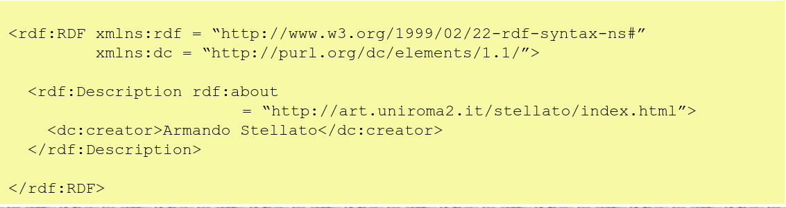


**Un caso più complesso (L'universo di Batman):**

Immaginiamo un piccolo grafo:

- _Robin_ è impiegato da (_employedBy_) _Batman_.
    
- _Batman_ ha un Quartier Generale (_HQ_) che è la "Batcave", un nome ("Bruce Wayne") e un'email (`boss@batman.org`).

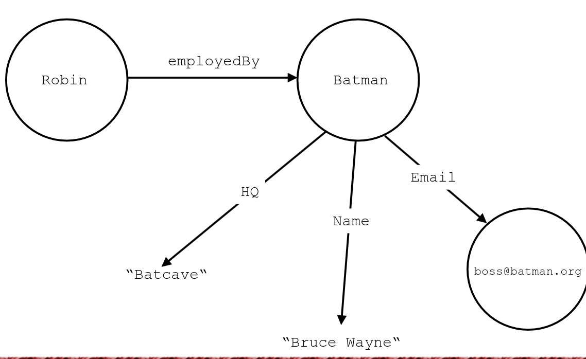

**Come si scrive in RDF/XML?**

La serializzazione RDF/XML di questo grafo diventa rapidamente pesante. Bisogna definire la base (`xml:base`), i namespace, e creare blocchi separati: uno per Robin (che punta a Batman tramite un attributo `rdf:resource`) e uno per Batman, con tutte le sue proprietà annidate come tag XML (`<mySchema:HQ>Batcave</mySchema:HQ>`). 

Questo formato è ottimo per le macchine che già "masticano" XML, ma è faticoso per un occhio umano.

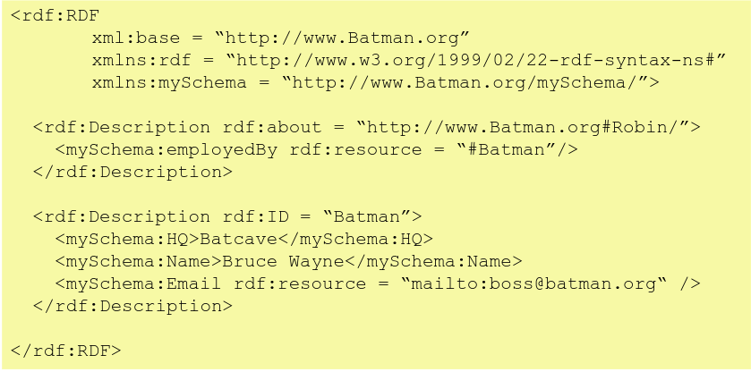


**Come si scrive in Turtle?**

La serializzazione **Turtle** dello stesso grafo è una boccata d'aria fresca. Dopo aver definito i prefissi all'inizio (`@base` e `@prefix`), le triple sono espresse in modo quasi discorsivo:

- `<...#Robin> mySchema:employedBy <#Batman> .` (Nota il punto `.` che chiude la tripla).
    
- Per Batman, Turtle introduce una scorciatoia potentissima: il **punto e virgola (`;`)**. Invece di ripetere il soggetto "Batman" per ogni sua proprietà, si scrive il soggetto una volta sola e si elencano le coppie _predicato-oggetto_ separate da `;`, chiudendo l'intero blocco con un `.`. Il risultato è estremamente compatto, leggibile e focalizzato sui dati reali anziché sulla sintassi.

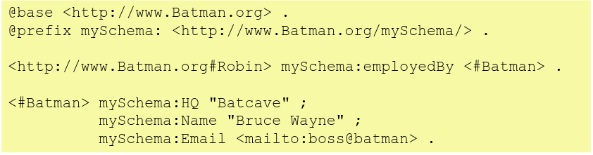

#### TriG: La gestione dei Dataset e dei Named Graph

Come avevamo anticipato, un Dataset RDF può contenere un _default graph_ (senza nome) e vari _named graph_. **TriG** è l'estensione di Turtle creata esattamente per scrivere Dataset completi.

La sintassi di TriG usa le **parentesi graffe `{ }`** per raggruppare le triple e assegnarle a un grafo:

- Se un blocco di triple è racchiuso tra parentesi graffe senza nulla prima (o se le graffe sono omesse del tutto), quelle triple finiscono nel **default graph**.
    
- Se prima delle parentesi graffe c'è un IRI (preceduto opzionalmente dalla keyword `GRAPH`), tutte le triple al suo interno appartengono a quel **named graph** (es. `GRAPH <http://example.org/alice> { ... }`).
    

**Il dettaglio cruciale sui Blank Node in TriG:**

Nelle tue slide c'è un aspetto tecnico molto importante: i _blank node_ (rappresentati con etichette come `_:a` o `_:b`). In un documento TriG, **etichette uguali in diversi named graph identificano lo stesso identico blank node**.

Nell'esempio della slide, il nodo `_:b` è usato sia nel default graph (dove si dice che qualcuno conosce `_:b`) sia nel named graph di Alice (dove si dice che `_:b` si chiama "Alice"). Questo permette di collegare informazioni anonime _attraverso_ grafi diversi all'interno dello stesso dataset.

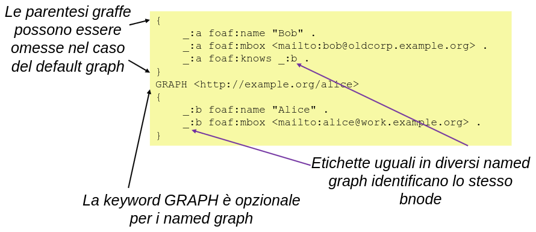

#### Il grande dibattito: XML vs RDF

Perché il W3C ha inventato RDF quando il mondo usava già XML per scambiarsi dati?

I detrattori di RDF spesso sostengono che sia una tecnologia inutilmente complessa che cerca di risolvere problemi che XML (assieme a XML Schema) risolve già. Ma è davvero così?

**Il limite di XML (Sintassi senza Semantica):**

XML è fantastico per strutturare documenti ad albero. Tuttavia, **XML non ha una semantica condivisa**. In XML, un'informazione può essere scritta come un attributo, come un elemento annidato, o in decine di altri modi. Se due sistemi comunicano in XML, devono preventivamente mettersi d'accordo sulle _esatte_ regole sintattiche (lo Schema).

**Il vantaggio di RDF (Il Modello Astratto):**

RDF non è un formato di testo, è un **modello logico a grafo**. Il suo enorme vantaggio è che, non importa se serializzi i dati in XML, in Turtle o in N-Triples: **tutte le serializzazioni possono essere ricondotte univocamente allo stesso identico grafo astratto**. L'informazione "Robin lavora per Batman" rimane la stessa a livello matematico, a prescindere da come la scrivi.

#### Il vero potere di RDF: L'integrazione di risorse distribuite

La prova definitiva della superiorità di RDF su XML per il Web dei Dati è mostrata nelle parti seguenti, che confrontano l'unione (merging) di dati provenienti da fonti diverse (es. GenBank, Gene Ontology e PDB riguardo all'emoglobina umana).

- **L'approccio XML (Incubo di integrazione):** Se hai tre database che esportano dati in frammenti XML usando schemi diversi (uno usa `<sequence>`, uno usa `<is-a>`, l'altro `<structure>`), **non puoi semplicemente incollarli insieme**. Per integrarli, uno sviluppatore deve studiare a fondo tutti gli schemi sorgenti e scrivere complesse trasformazioni _XSLT_ (un linguaggio per trasformare XML) per tradurre tutto in un nuovo super-schema comune. È un lavoro enorme, rigido e che si rompe facilmente se una fonte cambia il suo formato.
    
- **L'approccio RDF (Integrazione naturale):** Poiché RDF è basato su grafi e identificatori globali (IRI), se i tre database usano lo stesso IRI per indicare l'"Emoglobina Umana", l'integrazione è banale. **Basta unire i tre insiemi di triple in un unico contenitore**. I rami del grafo si innesteranno automaticamente e in modo organico sul nodo comune dell'emoglobina, unendo la sequenza, l'ontologia e la struttura 3D senza bisogno di scrivere alcuna complessa regola di traduzione.

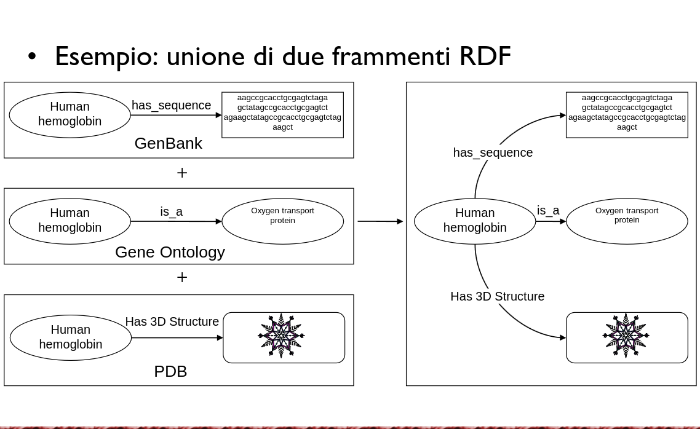

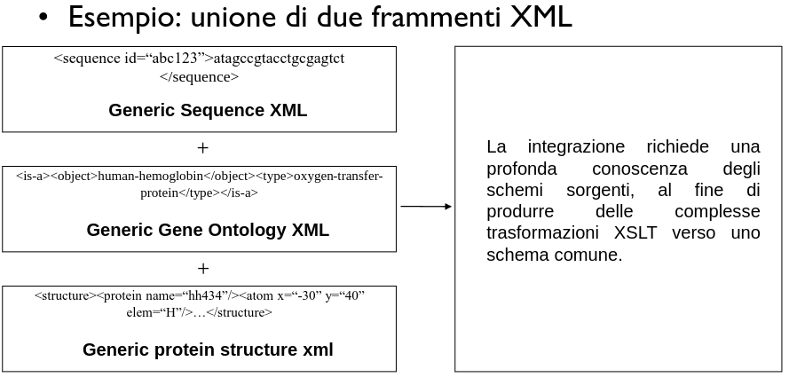

In sintesi: **XML costruisce alberi rigidi (ottimi per i documenti), RDF costruisce reti flessibili (ideali per la conoscenza e l'integrazione dei dati).**
## RDFS (RDF Schema): Aggiungere il Vocabolario e la Semantica

RDF puro è semanticamente "cieco": ti permette di dire che l'URI_A è collegato all'URI_B tramite l'URI_C, ma non ti dà gli strumenti per spiegare alla macchina _cosa siano_ A, B e C.

Qui entra in gioco **RDFS (RDF Vocabulary Description Language)**. RDFS è un vocabolario standard costruito _sopra_ RDF, che fornisce i costrutti per definire la struttura, le gerarchie e la semantica dei tuoi dati. Con RDFS si passa dalla semplice descrizione dei dati alla creazione di vere e proprie tassonomie o "ontologie leggere".

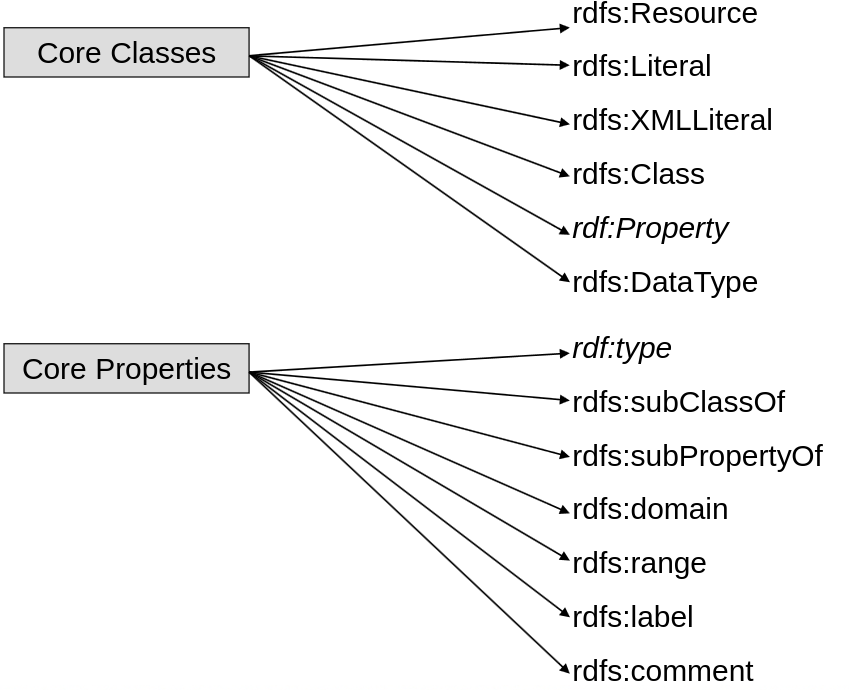
### Classi, Istanze e Proprietà in RDFS

I concetti cardine introdotti da RDFS sono:

- **Le Classi (`rdfs:Class`) e le Istanze (`rdf:type`):** Puoi dichiarare che un certo URI rappresenta una categoria del mondo, ovvero una Classe (es. `Persona`). Utilizzando il predicato fondamentale `rdf:type`, puoi asserire che un Soggetto è un'istanza di quella Classe (es. _Mario -> rdf:type -> Persona_).
    
- **Ereditarietà delle Classi (`rdfs:subClassOf`):** RDFS permette di creare gerarchie. Se definisci che _Studente_ è una sottoclasse di _Persona_ (`Studente rdfs:subClassOf Persona`), entra in gioco il vero potere del Web Semantico: l'inferenza. Il motore logico dedurrà automaticamente che qualsiasi entità di tipo Studente è _anche_ un'entità di tipo Persona.
    
- **Gerarchia delle Proprietà (`rdfs:subPropertyOf`):** Anche i predicati possono avere una gerarchia. Se stabilisci che _haMadre_ è una sotto-proprietà di _haGenitore_, ogni volta che asserisci _Mario -> haMadre -> Anna_, il sistema inferirà l'esistenza della tripla _Mario -> haGenitore -> Anna_.

### Dominio e Codominio (`rdfs:domain` e `rdfs:range`)

RDFS introduce i concetti di Domain e Range per le proprietà, ma funzionano in modo radicalmente diverso rispetto ai classici database:

- **`rdfs:domain` (Dominio):** Indica la Classe a cui appartiene il **Soggetto** della proprietà.
    
- **`rdfs:range` (Codominio/Rango):** Indica la Classe a cui appartiene l'**Oggetto** (o il tipo di dato, se è un literal) della proprietà.
    

**La differenza cruciale (Inferenza vs. Vincoli):**

Nella programmazione ad oggetti o nei database relazionali, dominio e codominio sono _vincoli operativi_ (se provi a inserire un dato sbagliato, il sistema ti restituisce un errore).

Nel Web Semantico (che assume il principio dell'Open World Assumption), `domain` e `range` sono **regole di deduzione logica**.

Se definisci che la proprietà _haScritto_ ha come dominio _Scrittore_ e come range _Libro_, e successivamente inserisci la tripla _Dante -> haScritto -> Divina_Commedia_, il sistema non fa un controllo di validità, ma usa l'inferenza per dedurre e aggiungere automaticamente due nuove triple alla sua base di conoscenza: dedurrà che _Dante è di tipo Scrittore_ e che la _Divina Commedia è di tipo Libro_, anche se tu non lo avevi mai dichiarato esplicitamente!

Vediamo uno schema RDFS di esempio

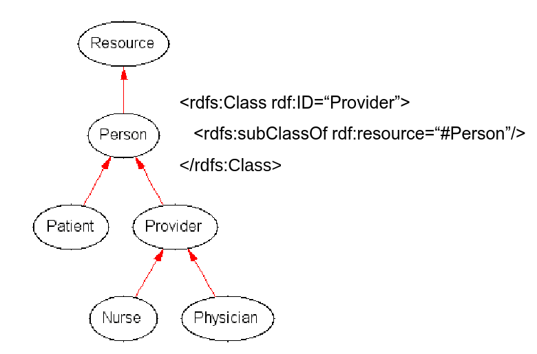

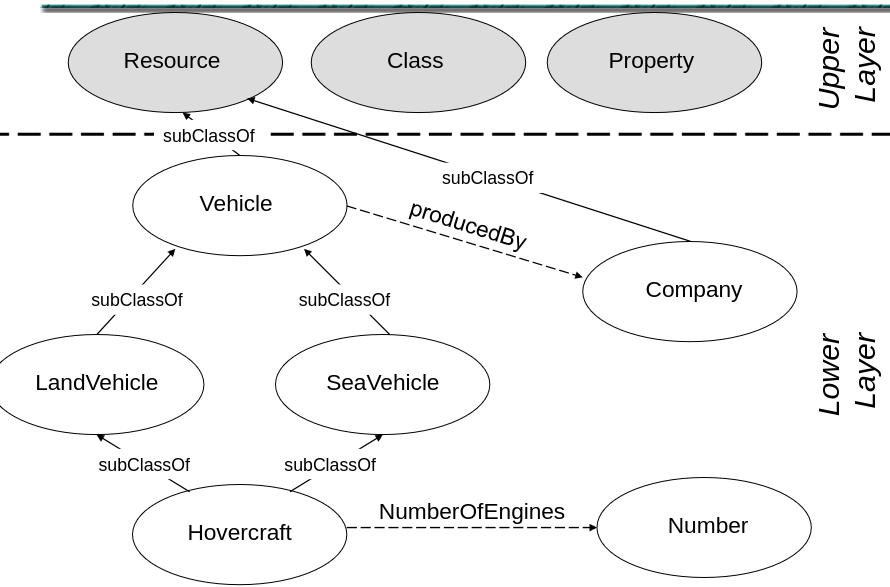

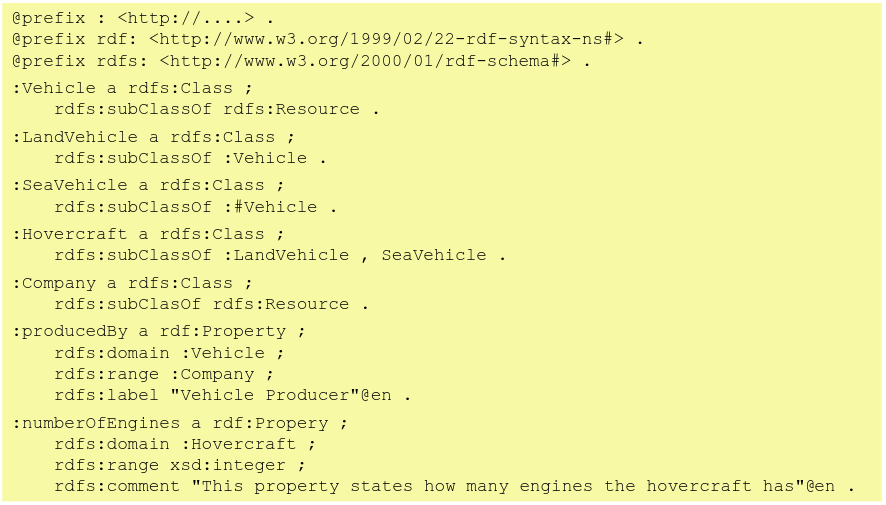

## Le Limitazioni di RDFS

RDFS è un ottimo punto di partenza per creare vocabolari, ma è **troppo debole** per descrivere domini di conoscenza complessi o per stabilire regole ferree. Le sue mancanze principali sono:

- **Nessun vincolo contestualizzato (Domain/Range):** In RDFS, se dici che il range della proprietà `hasChild` (ha figlio) è la classe `Mammifero`, questo vale per tutto. Non puoi specificare che: se applicato a una `Persona`, il figlio deve essere una `Persona`; se applicato a un `Elefante`, il figlio deve essere un `Elefante`. RDFS è troppo "globale".
    
- **Nessun vincolo di Esistenza o Cardinalità:** Con RDFS non puoi esprimere concetti come "Ogni persona ha _esattamente due_ genitori biologici" (cardinalità esatta), oppure "Tutte le istanze di Persona _devono_ avere una madre" (vincolo di esistenza).
    
- **Nessuna caratteristica avanzata delle proprietà:** RDFS non ti permette di dare proprietà matematiche alle relazioni. Ad esempio, non puoi dire che `isPartOf` (è parte di) è **transitiva** (se il dito è parte della mano, e la mano è parte del corpo, allora il dito è parte del corpo), o che `touches` (tocca) è **simmetrica** (se A tocca B, B tocca A), o definire relazioni **inverse** (es. `hasPart` è l'inverso di `isPartOf`).
### La Nascita di OWL

Per superare questi limiti, la comunità ha lavorato a linguaggi più ricchi, basati sulla Logica Descrittiva (DL, _Description Logic_).

La storia si riassume in un progressivo sforzo congiunto:

1. In Europa nasceva **OIL** (Ontology Inference Layer).
    
2. Negli USA nasceva **DAML-ONT** (DARPA Agent Markup Language).
    
3. I due gruppi si sono uniti per creare **DAML+OIL**, un linguaggio potentissimo che estendeva RDFS.
    
4. DAML+OIL è stato infine sottomesso al consorzio W3C (l'ente che standardizza il web), che ha formato il gruppo di lavoro _WebOnt_. Da qui è nato **OWL (Web Ontology Language)**, diventato poi lo standard raccomandato ufficiale per le ontologie sul web.
    
### Il Cambio di Paradigma: La Semantica Inferenzial

Questo è il concetto più importante da capire. I database tradizionali (o i vecchi sistemi a "frame") funzionano tramite il **controllo dei vincoli (constraint checking)**: tu scrivi uno schema, inserisci i dati, e il database controlla se i dati rispettano lo schema. Se non lo rispettano, ti dà un **ERRORE**.

La semantica di RDFS/OWL, invece, è **INFERENZIALE**.

L'ontologia (lo schema) non è vista come un recinto in cui i dati devono stare, ma come una **Teoria del Mondo**. Se i dati che inserisci sembrano violare la teoria, il sistema non ti dà un errore, ma _deduce (inferisce) automaticamente nuove informazioni_ per far sì che la teoria continui a essere vera!

Questo processo è **monotono**: l'aggiunta di nuove informazioni non invalida mai le conclusioni a cui si era giunti in precedenza.
### OWA vs CWA 

Per capire come ragiona OWL, dobbiamo contrapporlo ai database tradizionali:

- **CWA (Closed World Assumption) e Negation-as-Failure (NF):** È come ragionano i database SQL o il Prolog. Significa: _"Se una cosa non è scritta nel mio database o non posso dimostrarla, allora presumo che sia FALSA"_.
    
    - _Esempio (Non-monotonicità):_ Ho un database con scritto solo `woman(MarilynMonroe)`. Chiedo al DB: "Marilyn Manson è un uomo?". Il DB non lo trova, quindi per la CWA risponde **NO**. Domani aggiungo al DB l'informazione `man(MarilynManson)`. Rifaccio la domanda. Ora il DB risponde **SÌ**. La risposta è cambiata! Questa è una visione del mondo _non-monotona_.
        
- **OWA (Open World Assumption):** È come ragiona OWL. Significa: _"Se una cosa non è nel mio grafo, non significa che sia falsa, ma semplicemente che IO NON LA SO"_. Il Web è immenso e distribuito, le informazioni potrebbero benissimo trovarsi su un altro server.
    
- **NUNA (No Unique Name Assumption):** OWL adotta anche questa regola. "Assenza di presunzione di nomi unici". Significa che se tu hai due IRI diversi (es. `istituto1` e `istituto2`), OWL _non dà per scontato che siano due cose diverse_. Fino a prova contraria, potrebbero essere due nomi diversi per la stessa identica entità.
    
### OWL Reasoning in Pratica: Analisi degli Esempi

Vediamo come OWA e NUNA stravolgono il modo in cui il sistema reagisce ai "presunti" errori.

**Esempio 1: Cardinalità Minima e OWA**

- **Regola OWL:** Un `Document` deve avere _almeno 1_ autore (minCardinality 1).
    
- **Dati:** Definisco `myDoc` come un Documento, ma **non scrivo nessun autore**.
    
- **Cosa fa un Database tradizionale?** ERRORE! Hai violato il vincolo.
    
- **Cosa fa OWL?** Nessun problema. Grazie alla **Open World Assumption**, il motore semantico ragiona così: _"So che deve avere un autore, non vedo l'autore qui nel mio grafo locale, ma il Web è aperto: l'autore deve esistere da qualche parte nel mondo"_. La descrizione non è considerata errata, solo incompleta localmente.
    

**Esempio 2: Cardinalità Massima e NUNA**

- **Regola OWL:** Un `Document` può avere _al massimo 1_ detentore di copyright (maxCardinality 1).
    
- **Dati:** Per `myDoc` inserisco due detentori di copyright apparentemente distinti: `institute1` e `institute2`.
    
- **Cosa fa un Database tradizionale?** ERRORE! Ne hai messi due, il limite è uno.
    
- **Cosa fa OWL?** Attiva la **No Unique Name Assumption (NUNA)**. Il ragionatore dice: _"La regola impone che il detentore sia al massimo uno. Tu me ne hai forniti due con nomi diversi. Dato che non presumo che nomi unici indichino entità diverse, affinché la teoria sia rispettata devo INFERIRE che `institute1` e `institute2` siano in realtà la stessa identica cosa (owl:sameAs)"_. Ha appena creato nuova conoscenza logica invece di bloccarsi!
    

**Esempio 3: Restrizioni Universali e Inferenza pura**

- **Regola OWL:** La classe `Document` è _equivalente_ a tutto ciò che ha come autori **SOLO** entità di tipo `Person` (allValuesFrom).
    
- **Caso A (Dati anomali):** Ho `myDoc` il cui autore è `Daffy`. Io so che `Daffy` è un'istanza di `Duck` (Anatra).
    
    - _Risultato:_ Poiché `myDoc` è dichiarato come Documento, le sue regole sono inattaccabili. Il ragionatore dedurrà la cosa logica (anche se strana nella realtà umana): _se myDoc è un documento, tutti i suoi autori devono essere Persone. Daffy è l'autore. Quindi Daffy DEVE ESSERE una Persona._ Inferisce che Daffy è contemporaneamente una `Person` e una `Duck`.
        
- **Caso B (OWA in azione):** Ho `myDoc2` che ha come autore `Dave`. Io so che `Dave` è una `Person`. Posso dedurre automaticamente che `myDoc2` è un `Document`?
    
    - _Risultato:_ **NO!** Qui entra in gioco l'OWA in modo difensivo. So che Dave è una persona, ma nel mondo aperto (OWA) _potrebbero esistere altri autori_ di questo libro che io non conosco ancora, magari uno di loro è un cane. Finché non ho la certezza chiusa che Dave sia _l'unico_ autore (oppure che _tutti_ i potenziali autori siano persone), il sistema non si sbilancia a dichiarare `myDoc2` un `Document`.