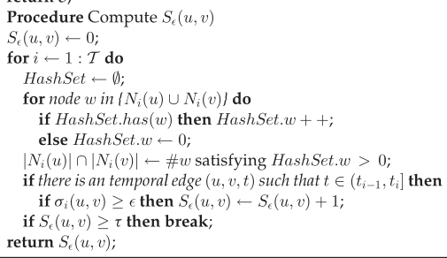

# Analisi Avanzata del Mining di Pattern Frequenti Massimali tramite Apriori e Applicazione nel Framework TSCAN-A per Reti Temporali

## L'Evoluzione dell'Estrazione di Conoscenza nei Big Data

L'estrazione di conoscenza da basi di dati di dimensioni massive, comunemente definita Data Mining nell'ambito dei Big Data, rappresenta un dominio di ricerca la cui rilevanza è cresciuta esponenzialmente in parallelo all'aumento della capacità di archiviazione globale. All'interno di questa vasta disciplina, il Frequent Pattern Mining si distingue come una delle metodologie più sofisticate e computazionalmente esigenti. L'obiettivo primario di questo sotto-settore è l'identificazione di regolarità intrinseche, associazioni ricorrenti e strutture topologiche che si manifestano con una frequenza statisticamente significativa all'interno di un vasto set di transazioni o relazioni.

Storicamente, l'interesse per i pattern frequenti è nato dall'analisi del cosiddetto "carrello della spesa" (market basket analysis), dove gli analisti cercavano di comprendere quali prodotti venissero acquistati congiuntamente dai consumatori. Tuttavia, la maturazione teorica della disciplina ha permesso di astrarre il concetto di "item" e "transazione", estendendo l'applicabilità del Frequent Pattern Mining a domini eterogenei e complessi, quali l'analisi di sequenze genomiche, il monitoraggio del traffico di rete e, in particolare, lo studio delle reti complesse e dei grafi relazionali.

In questo contesto di continua astrazione e scalabilità, l'analisi delle reti temporali ha introdotto una sfida computazionale formidabile. A differenza dei grafi statici tradizionali, in cui un arco rappresenta una connessione immutabile tra due entità, le reti temporali incorporano la dimensione del tempo, registrando interazioni puntuali associate a specifici timestamp. L'estrazione di comunità all'interno di tali strutture richiede non solo la valutazione della densità topologica in un dato istante, ma anche l'analisi della stabilità di tali formazioni nel corso dell'evoluzione temporale della rete.

Il presente documento fornisce una disamina esaustiva delle metodologie algoritmiche sottese alla risoluzione di questo problema. La trattazione inizia con un'analisi profonda dell'algoritmo Apriori, il capostipite storico del Frequent Pattern Mining, esplorandone i limiti strutturali e la sua evoluzione nel Maximal Frequent Itemset Mining. Successivamente, l'analisi si focalizza sull'integrazione di questi concetti transazionali all'interno del framework all'avanguardia TSCAN-A (Temporal Structural Clustering Algorithm for Networks - Advanced), descritto nello studio "Mining Stable Communities in Temporal Networks by Density-Based Clustering". Verranno decostruiti i meccanismi matematici di potatura dello spazio di ricerca (pruning) necessari per rendere trattabile l'applicazione di Apriori su grafi massivi e verranno discussi criticamente i risultati empirici. Infine, verrà esaminata l'architettura delle implementazioni open-source in Python disponibili per l'esecuzione pratica dell'algoritmo.

## Fondamenti Teorici dell'Algoritmo Apriori

L'algoritmo Apriori è stato introdotto formalmente nel 1994 dai ricercatori Rakesh Agrawal e Ramakrishnan Srikant, segnando un punto di svolta fondamentale nella storia del machine learning non supervisionato e del data mining. Il nome stesso dell'algoritmo tradisce la sua natura euristica: esso sfrutta una conoscenza pregressa (a priori) per guidare e limitare l'esplorazione dello spazio delle soluzioni, un approccio che si è rivelato indispensabile per affrontare il problema dell'estrazione di regole di associazione.

Il paradigma operativo di Apriori si fonda sull'elaborazione iterativa di un dataset transazionale per identificare i cosiddetti $k$-itemset, ovvero insiemi composti da $k$ elementi che co-occorrono con una frequenza superiore a una determinata soglia stabilita dall'analista, definita come supporto minimo (min_support). La meccanica algoritmica procede in modo incrementale o esplorazione in ampiezza (breadth-first search): l'algoritmo identifica inizialmente tutti gli item singoli frequenti (1-itemset), per poi combinare tali elementi al fine di generare candidati di lunghezza 2 (2-itemset), verificandone successivamente la frequenza nel database. Questo processo di generazione e verifica (generate-and-test) viene reiterato per i livelli successivi, utilizzando i $k$-itemset frequenti per forgiare i candidati di dimensione $k+1$, finché non risulta più possibile generare alcun nuovo insieme frequente.

### La Proprietà di Chiusura Verso il Basso

Il cuore teorico che rende computazionalmente possibile l'esecuzione dell'algoritmo Apriori risiede in una proprietà matematica nota come Proprietà Apriori, Principio di Anti-Monotonia o Downward Closure Property. Questo principio postula un assioma ineludibile: se un determinato insieme di elementi è classificato come frequente all'interno di un dataset, allora ogni suo possibile sottoinsieme non vuoto deve obbligatoriamente possedere una frequenza uguale o superiore, risultando anch'esso frequente. In termini logici inversi, e in modo ancor più cruciale per l'ottimizzazione algoritmica, se un qualsiasi sottoinsieme di elementi viene identificato come infrequente, l'algoritmo deduce con certezza assoluta che ogni suo super-insieme sarà inevitabilmente infrequente.

L'applicazione rigorosa di questo principio consente di implementare una drastica strategia di potatura, o pruning, dello spazio di ricerca. Durante la fase di transizione tra il livello $k$ e il livello $k+1$, l'algoritmo non costruisce tutte le combinazioni possibili. Al contrario, esso procede a una scansione preventiva della struttura dei candidati: se un candidato $k+1$-itemset contiene al suo interno un sottoinsieme di lunghezza $k$ che non appartiene alla lista degli insiemi frequenti calcolata nell'iterazione precedente, quel candidato viene eliminato istantaneamente. Questa operazione logica viene eseguita in memoria, abbattendo la necessità di interrogare il database transazionale per validare combinazioni palesemente destinate al fallimento.

### Complessità Temporale e Spaziale nel Modello Base

Nonostante l'enorme vantaggio conferito dalla Downward Closure Property, l'algoritmo Apriori originale mostra limiti strutturali severi quando applicato in contesti di Big Data caratterizzati da un'elevata densità di item e transazioni lunghe. Lo spazio delle soluzioni teoriche per un database contenente $m$ item distinti ammonta a $2^m$, delineando una complessità temporale intrinsecamente esponenziale nel caso pessimo.

La complessità temporale è dominata dal collo di bottiglia dell'I/O. L'architettura di Apriori richiede che l'intero database venga scansionato ripetutamente da zero per ciascun livello di esplorazione dimensionale. Se l'insieme frequente di lunghezza massima all'interno del dataset è composto da 12 elementi, l'algoritmo sarà costretto a eseguire 12 passaggi completi di lettura sequenziale su memorie di massa. Questo comportamento iterativo degrada inesorabilmente le prestazioni complessive all'aumentare della lunghezza delle catene frequenti.

Parimenti critica risulta la complessità spaziale. Per dataset ad alta dimensionalità o con soglie di supporto minime settate a valori molto bassi, la fase iniziale di generazione dei candidati, in particolare la fusione dal livello 1 al livello 2, produce un volume combinatorio di candidati massivo. L'algoritmo assume che le strutture di tracciamento hash table o hash tree utilizzate per conteggiare i supporti risiedano permanentemente nella memoria principale (RAM) del sistema operativo. Il superamento dei limiti di memoria fisica porta spesso a fenomeni di trashing e blocchi di sistema prima ancora che le scansioni di verifica siano terminate, dimostrando che la sola riduzione analitica dei candidati non è sufficiente per dati massivi e ad alta correlazione.

|**Algoritmo**|**Complessità Temporale Desunta**|**Complessità Spaziale Desunta**|**Scansioni Database**|
|---|---|---|---|
|**Apriori Base**|Esponenziale $\mathcal{O}(2^m)$|Estremamente Alta (Ritenzione Candidati)|$\mathcal{O}(k)$ per pattern max lunghi $k$|
|**FP-Growth**|Lineare sul numero di transazioni|Alta (Costruzione FP-Tree globale)|2 (Fisse)|
|**Maximal (Es. MFIF)**|Molto Inferiore ad Apriori|Bassa (Nessun subset tracking)|Variabile ma ridotta (es. 2-3)|

## La Transizione al Maximal Frequent Pattern Mining

Per ovviare alla ridondanza strutturale e ai collassi prestazionali descritti, la ricerca accademica ha focalizzato gli sforzi su una formulazione più rigorosa ed essenziale: il Maximal Frequent Itemset Mining. In molti scenari analitici, estrarre l'elenco completo di ogni singola sotto-combinazione frequente rappresenta uno spreco sia computazionale sia cognitivo per l'analista finale. Qualora si individui una regola forte che unisce un blocco di 100 elementi co-occorrenti, l'algoritmo Apriori classico procederebbe a elencare meticolosamente i $2^{100} - 1$ sottoinsiemi interni implicitamente frequenti, oscurando il reale valore informativo dell'aggregato principale.

Il Maximal Frequent Pattern Mining interviene alterando l'obiettivo della ricerca: l'algoritmo si prefigge di isolare unicamente quei pattern che, pur possedendo la qualifica di insiemi frequenti, non fungono da sottoinsieme per nessun altro insieme frequente. In termini insiemistici rigorosi, un pattern $P$ è considerato frequente massimale se supera la soglia di supporto e, parallelamente, per ogni suo possibile super-insieme $P \cup C(P)$ generabile nel dominio, la frequenza di quest'ultimo scende al di sotto del supporto minimo richiesto.

Questa restrizione assiomatica trasforma radicalmente le tempistiche di esecuzione e la complessità spaziale. Evitando di enumerare compulsivamente l'intera gerarchia del reticolo (lattice) sottostante a un pattern lungo, algoritmi specializzati in quest'area introducono logiche di superset-based pruning. Non appena una discendenza dimostra di essere solida e frequente fino a un vertice massimale, l'intero sotto-albero gerarchico generato dai nodi intermedi può essere scartato dai cicli di verifica, inducendo veri e propri "salti" vettoriali nello spazio di ricerca in netto contrasto con l'incedere metodico bottom-up dell'Apriori classico. Test empirici tra varianti MFIF (Maximal Frequent Itemset Format) e algoritmi standard dimostrano deviazioni temporali eccezionali; per esempio, in database da 10.000 transazioni, la ricerca massimale conclude i cicli computazionali in decimi di secondo abbattendo il numero di letture dirette del disco rigido.

Tuttavia, il rinvenimento dei pattern massimali preserva intatta la sua natura intrinsecamente combinatoria. Per stabilire inconfutabilmente che un pattern è massimale, l'algoritmo di riferimento (come MAFIA o un derivato Apriori con look-ahead) deve pur sempre interrogare le estensioni locali. Diviene pertanto vitale, specialmente quando calato in contesti reticolari complessi come l'analisi dei grafi, pretrattare i dati con filtri dimensionali severi prima di avviare il motore di mining massimale, per non precipitare nuovamente nella generazione superflua.

## Analisi delle Reti Temporali e delle Comunità Stabili

L'architettura logica e la potenza di potatura del Maximal Frequent Pattern Mining trovano un banco di prova di impareggiabile complessità nello studio delle reti temporali. La scienza dei network ha vissuto un'evoluzione tassonomica: dalle astrazioni topologiche statiche pure, si è passati all'esame dei grafi dinamici (dove l'interesse risiede nel tracciamento dell'evoluzione e mutazione di una struttura comunitaria attraverso epoche), fino ad approdare alle reti temporali propriamente dette.

In una rete temporale rigorosa, l'osservazione primaria non è il nodo, bensì il flusso di interazioni atomiche intercorrenti tra i nodi, ciascuna delle quali è contrassegnata da una marca temporale univoca. Esempi paradigmatici di tali ecosistemi includono le reti di contatti biologici in cui individui si sfiorano per pochi secondi, i network di corrispondenza e-mail strutturati in archivi aziendali o le reti di collaborazione accademica, dove la redazione congiunta di una pubblicazione scientifica definisce un asse collaborativo in un anno solare.

La maggior parte degli algoritmi di rilevamento delle comunità esistenti nella letteratura fallisce in questo ambito poiché procede alla "de-temporalizzazione" coercitiva del dato, aggregando la moltitudine di archi temporizzati in un unico grafo pesato in cui l'informazione cronologica risulta irrimediabilmente collassata. Questo approccio distruttivo impedisce di riconoscere una classe peculiare di formazioni sociali: le comunità stabili. L'obiettivo posto dagli autori dello studio "Mining Stable Communities in Temporal Networks by Density-Based Clustering" è di superare questa cecità algoritmica, formulando un modello matematico in grado di distinguere un gruppo coeso di entità che mantiene una densità relazionale compatta e reiterata nel fluire del tempo, da agglomerati occasionali e transitori.

### Il Paradigma del Graph Clustering Basato sulla Densità

Per conseguire la scoperta di queste strutture stabili, l'approccio prescelto si discosta dall'ottimizzazione globale di metriche astratte come la modularità, abbracciando invece la filosofia del density-based graph clustering. Gli algoritmi fondativi di questa famiglia, in primis il framework SCAN (Structural Clustering Algorithm for Networks) e le sue declinazioni avanzate come PSCAN, introducono l'assunto per cui le comunità reali si cristallizzano non solo laddove vi è un'alta concentrazione di spigoli, ma soprattutto dove i vertici condividono estesi e sovrapponibili vicinati strutturali.

Nello specifico modello teorico adottato nello studio, si definisce un grafo temporale non orientato $\mathcal{G} = (\mathcal{V}, \mathcal{E})$, dove $\mathcal{V}$ rappresenta la moltitudine di nodi e $\mathcal{E}$ ospita le interazioni sotto forma di triplette relazionali $(u, v, t)$ indicanti un contatto tra il vertice $u$ e il vertice $v$ avvenuto esattamente all'istante intero $t$. Per gestire l'asse cronologico, l'algoritmo frammenta la linearità temporale in una serie discreta di $\mathcal{T}$ istantanee o snapshot. Ogni singolo snapshot $\mathcal{G}_i = (\mathcal{V}, \mathcal{E}_i)$ cattura fotograficamente tutte le interazioni manifestatesi in uno specifico arco temporale delimitato da un intervallo finestrato $(t_{i-1}, t_i]$. Affiancato a questa scomposizione per fotogrammi, permane utile definire un grafo statico collassato, denominato grafo de-temporalizzato $G = (V, E)$, costruito ignorando del tutto i metadati cronologici.

Il concetto centrale della valutazione topologica risiede nel calcolo della similarità strutturale $\sigma_i(u,v)$ calcolata separatamente per ogni arco all'interno dello specifico snapshot $\mathcal{G}_i$. Tale parametro quantifica geometricamente l'intersezione dei vicinati estesi dei nodi in questione tramite una normalizzazione di tipo coseno, secondo la rigorosa formula:

$$\sigma_i(u,v) \triangleq \frac{|N_i[u] \cap N_i[v]|}{\sqrt{|N_i[u]| \times |N_i[v]|}}$$

dove la notazione con parentesi quadre $N_i[u]$ indica il vicinato inclusivo del nodo, comprendente i nodi adiacenti uniti al vertice radice stesso. Due nodi vengono elevati al rango di $\epsilon$-vicini nello snapshot analizzato qualora la loro similarità strutturale reciproca eguagli o travalichi un valore soglia parametrico $\epsilon$ imposto a priori.

### L'Astrazione della Stabilità Temporale

L'avanzamento teorico cruciale proposto nello studio è l'estensione vettoriale della metrica di similarità lungo l'asse del tempo, forgiando il concetto innovativo di $\epsilon$-stable similarity, denotata con $S_{\epsilon}(u,v)$. Questa misura non stima la robustezza della connessione statica, bensì esegue un censimento iterativo su tutti gli snapshot calcolando quante volte, nella storia osservata della rete, i nodi in esame hanno confermato un legame superiore alla soglia di similarità strutturale :

$$S_{\epsilon}(u,v) = \sum_{i=1}^{\mathcal{T}} \mathcal{I}(\sigma_i(u,v) > \epsilon)$$

La funzione $\mathcal{I}$ agisce da indicatore booleano, restituendo valore unitario esclusivamente se la condizione metrica è soddisfatta nel singolo frammento temporale. Da questa sommatoria discende l'identificazione degli archi connessi in maniera robusta e persistente: un legame all'interno della topologia de-temporalizzata viene battezzato $(\tau, \epsilon)$-connected edge qualora il punteggio di similarità stabile cumulata sia almeno pari a un coefficiente arbitrario di continuità temporale $\tau$ ($S_{\epsilon}(u,v) \ge \tau$).

## Formalizzazione del Core Stabile e Intersezione con l'Algoritmo Apriori

L'architettura algoritmica di SCAN espande le comunità irradiandosi da nodi centrali dotati di una forza attrattiva eccezionale, definiti core. Nel contesto temporale, la qualifica di centralità deve essere supportata da un vincolo di comparsa simultanea e duratura. Il paper istituisce la complessa Definizione 1: un vertice $u$ viene designato formalmente quale $(\mu, \tau, \epsilon)$-stable core se, e solo se, è possibile isolare un sottoinsieme del suo vicinato globale $\overline{N}(u) \subseteq N(u)$ che aderisca congiuntamente a tre postulati severi :

1. La dimensione del sottoinsieme deve includere un numero minimo di nodi periferici almeno pari a $\mu$ ($|\overline{N}(u)| \ge \mu$).
    
2. Deve palesarsi una sincronicità temporale tale per cui la medesima architettura a stella, radicata in $u$ e formata esattamente dai nodi dell'insieme $\overline{N}(u)$, esista simultaneamente in un numero minimo di snapshot distinti non inferiore a $\tau$.
    
3. All'interno di ciascuno dei fotogrammi in cui la comparsa è accertata, il coefficiente di similarità strutturale tra la radice $u$ e ogni singola terminazione periferica $v$ deve attestarsi al di sopra della soglia prescritta $\epsilon$.
    

La definizione delineata traccia un ponte concettuale e matematico perfetto, e per certi versi inaspettato, verso il dominio del Maximal Frequent Pattern Mining. Delineare se un vertice $u$ detenga o meno lo status di core stabile equivale a trasformare la sua storia strutturale in un database transazionale. In questa prospettiva traslata, ogni singolo snapshot temporale $\mathcal{G}_i$ assume il ruolo di una "transazione", e l'insieme dei nodi con cui $u$ contrae una relazione di similarità $\ge \epsilon$ in quel frammento cronologico costituisce gli "item" contenuti nella transazione.

Il quesito se esiste un blocco fisso di $\mu$ nodi compresenti costantemente in almeno $\tau$ istantanee si traduce letteralmente nell'interrogazione algoritmica: _esiste all'interno di questo database cronologico un Maximal Frequent Itemset la cui lunghezza (numero di item) sia uguale o superiore a $\mu$, dato un requisito di supporto minimo transazionale impostato a $\tau$?_.

Questa equazione formale, tuttavia, genera un imponente blocco computazionale. Come analizzato precedentemente, l'algoritmo Apriori per il pattern mining massimale è perseguitato dalla maledizione della dimensionalità. Nel framework basico (chiamato TSCAN-B dagli autori), per classificare le comunità, l'architettura dovrebbe instanziare e invocare l'algoritmo Apriori per ciascun singolo vertice della rete, ripetendo il processo combinatorio esaustivo $n$ volte (con $n$ indicante l'ordine totale del grafo). Considerata la mole dei Big Data moderni, unita al fatto che un'esecuzione pessimistica di frequent pattern implica $\mathcal{O}(2^m)$ verifiche interne e calcoli intersezionali eseguiti $\mathcal{T}$ volte, il calcolo della configurazione di base su un set di nodi milionario richiederebbe tempi epocali e risorse mnemoniche aliene alla tecnologia odierna.

## La Strategia di Ottimizzazione nel Framework TSCAN-A

Il nucleo dell'innovazione scientifica presentata in TSCAN-A non risiede nella sostituzione del motore Apriori per il rilevamento del Maximal Frequent Pattern, ma nella sua protezione e isolamento preventivo tramite l'edificazione di un doppio argine algoritmico basato su euristiche di potatura (pruning techniques) matematicamente infallibili. L'idea fondante è di pre-filtrare radicalmente i nodi del grafo escludendo senza possibilità d'errore tutti coloro che non hanno i requisiti minimi per formare pattern stabili, bypassando del tutto il calcolo Apriori e confinando l'onere combinatorio a una manciata di vertici altamente promettenti.

### Il Primo Livello di Filtraggio Algoritmico: Weak Core Pruning

La prima barriera di potatura fa affidamento a un postulato lapalissiano trasformato in un teorema di riduzione (Lemma 1 del documento): _qualsiasi vertice destinato a essere validato come $(\mu, \tau, \epsilon)$-stable core deve preliminarmente rispettare i requisiti inferiori di Weak Core_.

La Definizione 6 inquadra il Weak Core come un nodo $u$ per il quale il grado degli adiacenti legati da un arco robusto $(\tau, \epsilon)$-connesso sia almeno pari a $\mu$ nel panorama del grafo schiacciato staticamente. Il razionale logico postula che, affinché una costellazione rigida di nodi coesista solidamente per innumerevoli stagioni, i singoli fili che legano la stella al nucleo devono essere intrinsecamente resilienti presi nella loro singolarità, a prescindere dalla contemporaneità delle apparizioni degli altri vicini.

L'implementazione efficiente di questo filtro (Algoritmo 2, WeakCore) esibisce una tecnica superba di bounding algoritmico bidirezionale, progettato per sospendere le letture non appena l'esito diviene matematicamente inevitabile. Il sistema inizializza due contatori per ogni vertice in analisi: un limite inferiore $cd(u)$ posizionato a zero e un limite superiore $\overline{cd}(u)$ impostato cautelativamente sul numero complessivo dei vicini topologici posseduti dal nodo. Attraversando le coppie di nodi, il motore processa computazionalmente la similarità incrementale on-demand. Qualora si accerti che la connessione supera il threshold temporale $\tau$, il contatore inferiore avanza; qualora l'arco fallisca la verifica storica, è il margine superiore a retrocedere inesorabilmente. L'eleganza dell'algoritmo risiede nel suo criterio di interruzione anticipata (early termination): nel momento esatto in cui $cd(u)$ tocca quota $\mu$, il nodo viene certificato come debole-centrale e le simulazioni sui vicini rimanenti vengono annullate per risparmiare cicli di processore. Per converso, se i fallimenti abbassano il limite superiore $\overline{cd}(u)$ sotto la linea di galleggiamento $\mu$, il nodo è condannato all'esclusione matematica dal prosieguo dell'analisi, piallando intere sezioni dello spazio di indagine.

### Il Secondo Livello di Filtraggio Algoritmico: Strong Core Pruning

Il set residuale dei Weak Core viene instradato verso un setaccio ulteriore e ancor più stringente, basato sul Lemma 2, che statuisce che _qualsiasi $(\mu, \tau, \epsilon)$-stable core possiede le qualità obbligatorie per essere uno Strong Core_.

L'identità di uno Strong Core (Definizione 7) aggiunge una clausola temporale al paradigma precedente: un Weak Core mantiene il suo status solo se è possibile rintracciare all'interno della finestra cronologica globale almeno $\tau$ snapshot disgiunti nei quali, preso l'istante singolarmente, il nodo vanta una pletora di $\epsilon$-vicini la cui somma grezza eguaglia o supera $\mu$. È fondamentale comprendere l'astrazione e la differenziazione formale di questa clausola rispetto all'obiettivo finale Apriori: lo Strong Core non pretende, differentemente dallo Stable Core, che i $\mu$ satelliti individuati nell'istante temporale $t_1$ coincidano a livello di identità di vertice con i satelliti individuati nel frame $t_2$. L'approccio Strong certifica unicamente la propensione intrinseca di un vertice a mantenere volumi elevati di connessioni qualitative lungo il tempo, agendo da barriera termica contro i falsi positivi generati da nodi ad alto dinamismo ma bassa stabilità.

Parallelamente alla routine precedente, l'Algoritmo 3 (StrongCore) attua una tracciatura upper-lower bound basata sulle variabili $cs(u)$ e $\overline{cs}(u)$ applicata trasversalmente agli snapshot temporali per inibire i cicli superflui su porzioni di tempo palesemente sterili. L'efficacia di questa doppia filtrazione strutturale si dimostrerà letale contro la maledizione dimensionale nei test sperimentali successivi.

## Invocazione di Apriori e Analisi delle Complessità Architetturali

Il conseguimento della lista ridotta degli Strong Core consente infine al framework TSCAN-A di evocare in totale sicurezza il nucleo duro del sistema: l'algoritmo di Maximal Frequent Pattern Mining.

La sintassi operativa di innesco risiede nell'Algoritmo 4, intitolato esplicitamente StableCore. Il modulo in ingresso riceve l'assortimento degli Strong Core setacciati in precedenza e il dizionario cache precompilato che annovera l'anamnesi strutturale $\sigma_i(u,v)$ risparmiata per ostacolare il recomputing dispendioso. Per ciascun Strong Core $u$, il sub-sistema compila i dati in forma tabellare-transazionale, mappando gli $\epsilon$-vicini posseduti al variare dell'asse istantaneo e affida il log generato a un package tradizionale di Apriori deputato al rintracciamento dei subset massimali impiegando un limite di supporto prefissato a $\tau$. Esclusivamente i nodi che sopravvivono a questa ricerca esatta estraendo un frequent pattern in cui gli identificativi non mutano per almeno $\tau$ periodi e la cui magnitudine eccede $\mu$, ascendono alla qualifica suprema di Stable Core.

Una volta determinati i core incontestabili del network temporale, il framework delega all'Algoritmo 5 la fase epilogativa: l'aggregazione di densità. Connettendo fisicamente i core stabili attraverso sentieri valicabili di archi $(\tau, \epsilon)$-robusti e fagocitando i nodi periferici satellitari associati a essi (clusterizzazione dei non-core nodi), l'entità emergente costituisce infine la $(\mu, \tau, \epsilon)$-stable community.

### Analisi della Complessità Temporale Integrata

La progettazione euristica della duplice cinta di sbarramento (Weak e Strong pruning) ripara strutturalmente le deficienze asintotiche primordiali esaminate in Apriori. Il paper accademico in esame non fornisce soltanto evidenze concettuali, bensì un inquadramento analitico della limitazione degli inviluppi temporali.

Nel delineare lo scenario estremo (Worst Case scenario) e supponendo assente qualsivoglia modulo di potatura, la complessità collasserebbe in $\mathcal{O}(C_{\mathcal{T}}^{\tau} \cdot m^{\tau})$, un limite spietato dettato dall'obbligo di computare le congiunzioni topologiche ricorsive in serie temporali esponenziali senza l'ausilio strutturale predeterminato. Grazie al design di TSCAN-A, l'incedere dell'elaborazione risulta partizionato. Il caricamento iniziale incrementale delle metriche di similarietà $S_{\epsilon}$ consuma un lasso di tempo calcolabile equamente in $\mathcal{O}(m' m)$, dove $m'$ raffigura la popolazione di spigoli residui confinati nel limite statico e $m$ l'estensione degli spigoli temporali totali. Le procedure di pre-allocazione dei bounds limitanti, in virtù dell'early breaking incapsulato e dei lookup immediati incassati in memoria virtuale temporanea, non esulano tangenzialmente da un limite assimilabile $\mathcal{O}(m' m)$.

Il motore di frequent mining si risveglia in un dominio spaziale microscopico. Indicando con il pedice $|s|$ la cardinalità finale dell'insieme ristretto degli Strong Core sopravvissuti, il costo esplosivo dell'interrogazione viene delimitato e costretto artificialmente all'interno della frontiera controllata $\mathcal{O}(|s| \cdot C_{\mathcal{T}}^{\tau} \cdot |s|^{\tau})$.

Addizionando le costanti computazionali della propaggine di fusione dei sotto-alberi in Algoritmo 5 determinabile in $\mathcal{O}(m)$, l'equazione asintotica temporale onnicomprensiva che sigilla la performance dell'algoritmo TSCAN-A fissa il limite a:

$$\mathcal{O}(m' m + |s| C_{\mathcal{T}}^{\tau} |s|^{\tau})$$

L'elemento di volta dell'intera trattazione accademica si basa sulla sproporzione empirica del parametro $|s|$. Nelle verifiche pratiche la grandezza di questa frazione si frammenta in decimi percentuali, dimostrando come gli aggregati transazionali inoltrati per le istanze di Apriori non costituiscano mai un rischio algoritmico nel workflow operativo reale.

| **Costo dell'Operazione**        | **Stima Asintotica Formale in TSCAN-A**            | **Dipendenza**                              |
| -------------------------------- | -------------------------------------------------- | ------------------------------------------- |
| **Similarità Strutturale**       | $\mathcal{O}(m' m)$                                | Lineare rispetto al cross-link dimensionale |
| **Generazione Core Strutturali** | $\mathcal{O}(m' m)$                                | Vincolata dai lower/upper bounds            |
| **Maximal Frequent Pattern**     | $\mathcal{O}(C_{\mathcal{T}}^{\tau} \|s\|^{\tau})$ | s                                           |
| **Clustering Non-Core**          | $\mathcal{O}(m)$                                   | Valutazione componentistica residua         |

### Analisi della Complessità Spaziale Integrata

Per scongiurare le anomalie legate alla saturazione della RAM indotte dai candidate pattern, TSCAN-A instaura un paradigma ingegneristico di parsimonia fondato sul caching binario booleano. Affrontare il calcolo di similarità a ripetizione richiederebbe cicli continui di estrazione dal grafo de-temporalizzato; l'algoritmo opta per la compilazione in tempo reale di uno stream logico archiviato nella memoria fisica per contenere e mantenere i punteggi valutati $\sigma_i(u,v)$ unitamente al vettore cumulativo $S_{\epsilon}$. Poiché lo strato Apriori necessita unicamente del riconoscimento flag elementare (superamento della barriera epsilon predefinita e non del valore float del calcolo vettoriale puro), la complessità spaziale non espande la sua orma verso le grandezze mostruose attese dal framework base.

A sostegno di tale postulazione matematica, i dati analitici inerenti alla simulazione Exp-9 documentata espongono statistiche eccellenti sul payload hardware. L'overhead mnemonico per il tracciamento del più ostico dei network analizzati (il database collaborativo DBLP recante circa dodici milioni di correlazioni temporali archiviate in ottanta fotogrammi annuali) si arresta alla modesta cifra tecnica di 678.5 MB, garantendo l'esecuzione della ricerca densometrica comunitaria su macchine fisiche provviste di banale e convenzionale equipaggiamento di elaborazione di fascia media.

## Il Ruolo di Apriori in TSCAN-A e Alternative Algoritmiche Moderne

Come delineato in precedenza, l'inserimento dell'algoritmo Apriori all'interno del framework TSCAN-A sfrutta un'equivalenza matematica elegante tra l'analisi delle reti e la "Market Basket Analysis" (l'analisi del carrello della spesa). All'atto pratico, per determinare l'esistenza di uno _stable core_, l'architettura raggruppa gli snapshot temporali trattandoli come singole transazioni, mentre i nodi adiacenti assumono la veste degli "item" acquistati. L'obiettivo diviene individuare un _Maximal Frequent Itemset_ (un pattern frequente non ulteriormente espandibile) di dimensione pari o superiore a $\mu$, utilizzando il requisito temporale $\tau$ come soglia di supporto minimo transazionale. Poiché Apriori non scansiona l'intero grafo, esso viene invocato come modulo isolato (black box) per processare unicamente i log storici associati a quella ristretta cerchia di nodi sopravvissuti alle severissime potature degli _Strong Core_.

Tuttavia, l'implementazione pratica del modulo di mining tramite l'Apriori classico porta con sé i noti limiti di inefficienza: la generazione esplosiva dei candidati e l'obbligo di scansionare il database ripetutamente a ogni livello, appesantendo i calcoli su dataset densi. Oggi, l'algoritmo Apriori può essere sostituito da tecniche avanzate di _Maximal Frequent Itemset Mining_ (MFIM), tra cui:

- **FP-Max (Frequent Pattern Max):** Rappresenta un'alternativa diretta e potentissima. Derivato da FP-Growth, FP-Max elimina del tutto la fase di generazione dei candidati in memoria. Comprime le transazioni in una struttura ad albero (FP-Tree), richiedendo solamente due letture sequenziali del database e garantendo un drastico risparmio di cicli operativi e memoria fisica.
    
- **MAFIA (Maximal Frequent Itemset Algorithm):** Questo approccio adotta una ricerca in profondità (depth-first) e impiega una rappresentazione verticale dei dati tramite mappe di bit (vertical bitmaps). Si rivela un'alternativa eccellente che surclassa gli altri algoritmi quando si opera su dataset con elevata densità e pattern massimali molto lunghi.
    
- **GenMax:** Un algoritmo che sfrutta un motore di ricerca per backtracking abbinato a una tecnica chiamata propagazione dei "diffset" (insiemi di differenze). Questo metodo accelera significativamente il calcolo delle frequenze riducendo le intersezioni in memoria.
    
- **LCMmax (Linear time Closed itemset Miner per pattern massimali):** Un approccio matematico che garantisce una complessità temporale lineare rispetto al numero dei pattern (chiusi o massimali) estratti, fornendo efficienza straordinaria tramite l'estensione per "prefix preserving closure" .
    

## Valutazione Sperimentale e Qualità Topologica dei Risultati

La convalida empirica della teoria esposta assume una posizione preminente all'interno della ricerca. La metodologia adottata dai progettisti dell'architettura si articola in un esteso e rigoroso panorama di sperimentazioni su quatto dataset estratti da scenari del mondo reale aventi eterogenea densità reticolare, periodicità ciclica asimmetrica e grandezze topologiche incrementali :

|**Dataset Analizzato**|**Orizzonte Applicativo**|**Nodi Validi (n)**|**Archi Temporali (m)**|**Frame Registrati (T)**|**Frequenza**|
|---|---|---|---|---|---|
|**Chess**|Network tornei scacchistici|7.301|62.385|99|Mensile|
|**Lkml**|Log comunicazioni Linux Kernel|26.885|328.092|96|Mensile|
|**Enron**|Database contatti interni multinazionale|86.978|499.983|48|Mensile|
|**DBLP**|Network scientifico di co-autorialità accademica|1.729.816|12.007.380|78|Annuale|

L'accertamento qualitativo della configurazione aggregata prodotta necessita l'introduzione di misurazioni oggettive orientate allo studio delle metriche interne alla community detection. A causa della pionieristica unicità dello studio sulle strutture "stabili", gli estensori si vedono forzati a traslare assiomi standard in variabili di analisi temporale. Nel dettaglio, le quattro metriche cruciali selezionate includono:

- **Average Separability (AS):** Una comunità d'eccellenza deve demarcarsi con vigore dal caos reticolare adiacente; AS quantifica analiticamente il tasso proporzionale intercorrente fra le connessioni atomiche scambiate rigorosamente internamente e le connessioni esterne proiettate verso il disordine residuo del network.
    
- **Average Density (AD):** Ispeziona la densificazione topologica misurando il quoziente aritmetico delle interazioni temporalizzate verificate tra il novero dei membri di un cluster specifico contro il bacino degli spigoli disponibili teorici.
    
- **Average Cohesiveness (AC):** Definisce lo spessore dell'intelaiatura strutturale intra-comunitaria stimando la resistenza a una bipartizione o scissione. Concettualmente mutuata dall'analisi di conducibilità nei sub-network, evidenzia quanto sia faticoso provocare un distaccamento fra i componenti della setta.
    
- **Average Clustering Coefficient (ACC):** Certifica la propensione probabilistica alla co-frequentazione, fondata sull'assunto sociologico che, laddove insiste la condivisione di contatti adiacenti tra nodi, vi sia esacerbata disuguaglianza attrattiva verso connessioni trasversali. Un alto ACC testimonia triangolazioni stabili nel fluire ciclico.
    

### Dinamiche Comportamentali e Modulazione Parametrica

Le proiezioni in output divulgate in fase di simulazione decretano la schiacciante e palese egemonia di TSCAN-A sulle istanze base. L'approccio di base di PSCAN-W (che accorpa fittiziamente il dinamismo in un peso temporale immutabile) collassa strutturalmente: gli indici valutativi per AS, AD, e ACC del modello basico risultano scompaginati e del tutto erratici all'avanzare delle annualità nel frame DBLP. Questo prova, in modo assiomatico, che omettere lo scandaglio e la comparazione transazionale fornita da un motore massimale come Apriori espone l'architettura all'abbaglio topologico e a falsi positivi sistemici determinati da aggregazioni saltuarie incidentali.

Il divario tra la soluzione riduttiva (TSCAN-S, che ferma la propria validazione analitica ai soli Strong Core) e la forma canonica (TSCAN-A) manifesta una discrasia statistica millimetrica in termini temporali, tuttavia essenziale a livello concettuale. TSCAN-A purga l'ultima enclave di impurità grazie all'estrazione di _Maximal Frequent Patterns_ e raggiunge percentuali di accuratezza valutativa inequivocabili (raggiungendo la quasi perfezione normalizzata a $1.0$ negli accertamenti AS, AD, e ACC su reti complesse) e statisticamente corroborata da divergenze Bonferroni al di sotto di limiti di scarto inconfutabili.

Un frangente formidabile ai fini della comprensione scientifica dell'interconnessione tra l'ottimizzazione del cluster e il motore Apriori risiede nell'analisi della reattività sensoriale alle modulazioni esterne. L'incremento del requisito di numerosità vicinale $\mu$ o della frequenza ciclica minima $\tau$, rafforzando le richieste costitutive, irrobustisce automaticamente le misurazioni di coesione interna trascinando AS e ACC verso un apice proporzionale asintotico.

Il fenomeno più speculativo, ed elegantemente supportato dall'architettura teorica fin qui dipanata, si rileva tuttavia incrementando forzatamente il parametro $\epsilon$. Aggiungendo rigidità al filtro di similarità strutturale base, l'esito proiettato subisce una divaricazione anti-intuitiva: l'istogramma legato al Coefficiente di Clustering (ACC) spicca il volo verso la sommità della normalizzazione, eppure l'istogramma correlato alla Densità Media (AD) intraprende contemporaneamente una severa discesa retrograda. Qual è la ratio di questa inversione fenomenologica? Incrementando la barriera $\epsilon$, l'insieme dei candidati ammessi alle procedure decresce, provocando l'espulsione forzata dei vertici satellitari in Apriori; ne consegue la caduta irrimediabile del fattore densità complessiva per il minor ammontare dei partner globali. Nondimeno, il sottoinsieme ultra-filtrato risparmiato e immesso in processazione da Apriori incarna perimetri di omogeneità quasi assoluta. Le restanti maglie sopravvissute detengono correlazioni vicinali e convergenze intersezionali impressionanti, spingendo artificialmente il parametro di clustering ai vertici dell'ottimizzazione pura.

### Analisi Applicata: Il Case Study Formale

L'astrattezza delle metriche trova una formidabile controprova topologica qualitativa nella traslazione del caso analitico incentrato sul Prof. Qiang Yang (eminente ricercatore isolato nell'anagrafe scientifica del frame DBLP). Fissando empiricamente i threshold discriminanti a $\tau=3$, $\mu=5$, $\epsilon=0.3$, i grafici a rete diramati restituiscono fotogrammi incontrovertibili delle potenze in azione.

L'algoritmo primordiale senza controllo temporale puntuale (PSCAN-W) produce un agglomerato nebuloso sprovvisto di significato topologico profondo, inglobando collaborazioni effimere disarticolate irrilevanti per lo studio. L'approccio ridotto TSCAN-S estrae un perimetro tangibilmente superiore ma preserva all'interno della costellazione residui impuri ascrivibili alla fallacia concettuale dello Strong Core analizzata in precedenza (la sovrapposizione quantitativa annuale sprovvista di validazione incrociata delle identità anagrafiche dei partner). L'algoritmo integrale TSCAN-A, forgiato all'interno del crogiolo logico del Frequent Pattern Mining e supportato rigorosamente dalla garanzia matematica del pattern massimale, recide la rete temporale portando all'isolamento una cerchia ristrettissima e incorruttibile che, alle ispezioni documentali ex-post incrociate pubblicamente con la homepage accademica, combacia perfettamente con il team dei diretti dottorandi lungamente diretti o con ricercatori associati strutturalmente di lungo corso del professore. L'esattezza logica dell'estrazione sancisce l'infallibilità teorica posta al cuore del sistema e giustifica in toto l'enorme iterazione matematica prodotta a monte per rendere il framework di estrazione trattabile su grafi milionari in lassi operativi di circa un centinaio di secondi effettivi.

## Ecosistema Open Source: Implementazione in Python di TSCAN-A

Oltre al valore intrinseco dello studio accademico pubblicato nei procedimenti internazionali IEEE, il framework è supportato da una preziosissima codifica ingegneristica volta alla trasparenza strutturale e alla disseminazione applicativa nel mondo della Data Science. Gli autori, presieduti nella divulgazione da Hongchao Qin (affiliato all'Istituto di Tecnologia di Pechino e primario contributore del design dei Core in reti temporali incerte), hanno predisposto il deployment strutturato dell'architettura online.

La disamina dell'ambiente di emulazione, allocato fisicamente nel panorama globale dell'hosting dei sorgenti open-source (GitHub), espone le direttive infrastrutturali che regolano l'avvio e il testing operativo. L'URL di posizionamento logico coincide con il repository protocollato sotto la giurisdizione `VeryLargeGraph/TSCAN` (titolo del package formale: SCAN Clustering in Temporal Graphs).

Esplorando le peculiarità informatiche documentate ed estratte dai layer organizzativi della directory base e dei frammenti informativi correlati, l'implementazione delnota specifiche stringenti in merito a linguaggi, librerie di astrazione topologica e paradigmi di utilizzo :

1. **Framework di Linguaggio e Requisiti d'Esecuzione:** Contrariamente ad altri package per matrici pesanti comunemente codificati interamente in layer compilati low-level (come il linguaggio C++, rintracciabile marginalmente nel workspace secondario _HTRUSS_ dello stesso gruppo), il codice operativo delegato alla scansione e alla potatura in questo ecosistema esplicita nativamente il suo sviluppo in linguaggio interpretabile Python. Il vincolo tassativo d'esecuzione indicato nell'"Environment Setup" esige la pre-installazione a livello server di core interpreti di matrice storicizzata, specificatamente `Python 2.7 or later`. Tale indicazione cronologica di versione (antecedente alle ristrutturazioni di base introdotte dalle generazioni Python 3.x moderne) assicura una profonda retro-compatibilità sintattica per le macchine destinate allo scrutinio iterativo puro, bypassando moduli di gestione tipizzata delle variabili non indispensabili all'ottimizzazione brutale delle pipeline booleane utilizzate intensivamente nella tracciatura dell'upper limit $\overline{cs}(u)$ analizzata nelle formule.
    
2. **Schema della Base di Input (Dataset Description):** Per processare e validare in totale sicurezza algoritmica l'edificazione del de-temporalizzato virtuale, gli script codificati pretendono che le serie transazionali vengano alimentate in ingresso con rigida aderenza testuale. La sottomissione dei reticoli massivi avviene fornendo alle procedure una raw edge list destrutturata e linearizzata, ove le triple elementari espongono programmaticamente i terminali di inizio e fine vertice combinati indiscutibilmente all'etichettatura logica intera che rappresenta la granularità temporale dell'incontro. Questo schema garantisce un caricamento immediato dei blocchi per il partizionamento sequenziale degli snapshot storici $\mathcal{G}_i$ prefigurati nella teoria strutturale base, azzerando latenze di trans-codifica spaziale o ridondanze introdotte da framework semantici terzi.
    
3. **Inquadramento del Licencing e Modularità dell'Ecosistema:** La stesura algoritmica ospitata sotto la bandiera del dominio _VeryLargeGraph_ non consiste unicamente nell'isolata repository _TSCAN_. Il workflow logico del team di ricerca vanta moduli paralleli e co-dipendenti preposti al mining ciclico di astrazioni quali i vertici a interazione esplosiva passeggera o i pattern reticolari ciclici alternativi (vedi package _MBC - Mining Bursting Cores in Temporal Networks_ oppure _MPC - Mining Periodic Cliques in Temporal Networks_, egualmente governati da Python). Questa omogeneità d'ecosistema attesta la versatilità ingegneristica dell'astrazione Strong Core. L'intero corredo dei file del package base _TSCAN_ viene elargito e messo a fruizione della platea informatica internazionale scudato dai crismi normativi previsti dalla licenza protettiva Apache License, Version 2.0 (Apache-2.0). Questo statuto formale liberalizza senza riserve le manipolazioni e implementazioni successive in ambienti enterprise privati, ammettendo variazioni concettuali sui filtri Apriori, a patto che non venga meno la citazione intellettuale della primogenitura dell'infrastruttura algoritmica concepita e sviluppata dai fondatori.
    

L'adozione pubblica del prototipo in Python colma fattualmente la cesura tra la dissertazione analitica pura incastonata nel saggio e l'effettiva erogazione dei vantaggi asintotici nel business relazionale massivo contemporaneo. Rende la modellazione delle potature spaziali e temporali operabile, aprendo al subentro degli accademici nella profilatura e test direzionale delle metriche AS, AD, AC su set industriali protetti e non ancora assoggettati al setaccio severo fornito da un paradigma di derivazione Apriori integrato con un Density-based Clustering engine.

## Note Riassuntive sulle Metodologie Analitiche Esaminate

La scomposizione tecnica del protocollo TSCAN-A evidenzia un pregevole e rarissimo connubio fra due campi della statistica computazionale apparentemente destinati a viaggiare in orbite asincrone: la coesione spaziale del Clustering topologico densometrico e la severità transazionale del Maximal Frequent Itemset Mining guidato da regole algoritmiche.

Se utilizzato in contesti puri, orfano di direttive restrittive preliminari, l'algoritmo Apriori si auto-proclama e collassa su se stesso nelle sfide Big Data a causa della sua disastrosa ramificazione esponenziale $\mathcal{O}(2^m)$ indotta dalla moltiplicazione delle combinazioni periferiche superflue. Trasferito nel reame impietoso della reticolazione temporale, dove ogni singolo istante moltiplica lo spazio d'indagine in un frattale esplosivo, la sua efficacia computazionale scivola drammaticamente ai confini dell'impossibilità tecnica.

Nonostante la gravità di queste premesse, l'astrazione e il confezionamento della geniale serie di euristiche in cascata - la retroazione Weak Core e la strozzatura temporale Strong Core - operano una resezione chirurgica sul corpo massivo del Network, escludendo matematicamente ogni possibile candidato spurio e limitando i carichi finali unicamente a una minuscola porzione d'élite topologica. Riducendo drammaticamente e artificialmente i margini del perimetro elaborativo tramite il confinamento stringente in $\mathcal{O}(m' m + |s| C_{\mathcal{T}}^{\tau} |s|^{\tau})$, TSCAN-A redime lo strumento Apriori assoggettandolo e asservendolo, consegnando in conclusione misurazioni inappuntabili e comunità di altissimo livello coesivo certificate su frame ciclici a vastissima tiratura documentale, inaugurando di fatto uno standard formidabile nell'estrazione della persistenza in tracciati grafici temporalizzati di enormi proporzioni.

---

Effettuata dimostrazione che il prblema è NP-Hard in data 02/07/2026, c'è poco da fare

Cambiare direzione? forse fare quella di pepè e straziota?

# Analisi Metriche

**Origine e Adattamento delle Metriche** Le metriche utilizzate in "Paper.pdf" non sono state inventate appositamente da zero, ma sono un adattamento diretto delle metriche di "bontà" (goodness metrics) originali proposte in "Metrics.pdf". In "Metrics.pdf", gli autori definiscono quattro metriche assiomatiche per misurare la qualità delle comunità all'interno di reti statiche. In "Paper.pdf", gli autori hanno preso queste quattro metriche e le hanno specificamente adattate al problema delle reti temporali, estendendo i calcoli per tenere conto dei timestamp degli archi.

Di seguito il confronto dettagliato:

- **Separability (Separabilità):** In "Metrics.pdf", questa metrica quantifica quanto una comunità è ben separata dal resto della rete misurando il rapporto tra il numero di archi interni e il numero di archi esterni. In "Paper.pdf", questa viene adattata nella _Average Separability (AS)_. Questa misura il rapporto tra il numero di archi temporali interni alla comunità e il numero di archi temporali diretti verso l'esterno.
    
- **Density (Densità):** In "Metrics.pdf", la densità calcola la frazione degli archi esistenti rispetto a tutti i possibili archi tra i membri della comunità. In "Paper.pdf", la metrica adattata _Average Density (AD)_ misura invece la media dei gradi temporali dei nodi che appartengono alla comunità.
    
- **Cohesiveness (Coesione):** In "Metrics.pdf", la coesione caratterizza la struttura interna valutando la conduttanza massima del taglio interno, per verificare quanto sia difficile dividere la comunità in due. In "Paper.pdf", la _Average Cohesiveness (AC)_ utilizza lo stesso principio, ma calcola la conduttanza massima basandosi sul sottografo temporale indotto.
    
- **Clustering Coefficient (Coefficiente di Clustering):** In "Metrics.pdf", questa metrica si basa sulla probabilità che coppie di nodi con vicini in comune siano connesse tra loro. In "Paper.pdf", l'_Average Clustering Coefficient (ACC)_ traduce questo concetto calcolando il numero di archi temporali relativi ai vicini in comune diviso per il grado temporale dei nodi all'interno del cluster.

## Analisi Critica delle Metriche: Originali (Statiche) vs. Adattate (Temporali)

Gli autori di "Paper.pdf" hanno preso le metriche assiomatiche di "Metrics.pdf" e le hanno applicate alle reti temporali. Tuttavia, la loro trasposizione presenta delle criticità importanti.

- **Separability / Average Separability (AS)**
    
    - _Definizione originale:_ Rapporto tra archi interni ed esterni.
        
    - _Versione temporale:_ Rapporto tra la somma totale di tutti gli _archi temporali_ (interazioni) interni e quelli esterni al cluster.
        
    - _Giudizio:_ **Discreta, ma limitata.** Ha senso matematico, ma compie un "appiattimento temporale". Un cluster che ha avuto 1000 interazioni in un singolo giorno e zero per i restanti 5 anni avrà lo stesso punteggio di un cluster che ha avuto 1 interazione al giorno per 1000 giorni. Valuta il _volume_ delle interazioni isolate, non la loro stabilità temporale.
        
- **Density / Average Density (AD)**
    
    - _Definizione originale:_ È una vera densità, ovvero una frazione (compresa tra 0 e 1) tra gli archi esistenti e quelli teoricamente possibili.
        
    - _Versione temporale:_ È definita come la media del grado temporale (numero di interazioni) dei nodi all'interno della comunità.
        
    - _Giudizio:_ **Poco sensata (o mal nominata).** Questa non è una densità, è semplicemente il grado medio ponderato! Poiché somma le interazioni nel tempo, non è limitata tra 0 e 1. Un cluster con 3 nodi che si scambiano 1000 mail in un giorno avrà una "Average Density" altissima, mentre la densità topologica reale (se formano un triangolo) viene ignorata. È una metrica di intensità, non di densità strutturale.
        
- **Cohesiveness / Average Cohesiveness (AC)**
    
    - _Definizione originale:_ La difficoltà di "spezzare" la comunità a metà, misurata tramite la massima conduttanza di un taglio interno.
        
    - _Versione temporale:_ Usa la stessa logica, ma sul sottografo indotto pesato in base alle interazioni temporali.
        
    - _Giudizio:_ **Buona dal punto di vista topologico, debole su quello temporale.** Di nuovo, aggregando gli archi temporali, la metrica valuta se il cluster è coeso in senso assoluto, ma non ci dice se questa coesione sopravvive nel tempo. Potrebbe esserci un "ponte" temporale fortissimo in un solo snapshot che tiene unita la comunità agli occhi della metrica.
        
- **Clustering Coefficient / Average Clustering Coefficient (ACC)**
    
    - _Definizione originale:_ Basata sui triangoli formati dai nodi.
        
    - _Versione temporale:_ Valuta la frazione di interazioni temporali tra i vicini di un nodo rispetto alle interazioni totali di quel nodo nel cluster.
        
    - _Giudizio:_ **Buona per valutare l'omofilia.** Risente degli stessi problemi delle altre: favorisce i picchi di interazione brevi ma intensi rispetto a interazioni topologicamente chiuse ma distribuite nel tempo.
        
## 2. Il Giudizio Complessivo: Hanno senso per il Clustering Temporale?

**La risposta breve è: No, non misurano la vera "stabilità temporale".**

La debolezza fatale delle metriche di "Paper.pdf" è che trasformano il grafo temporale in un **multigrafo pesato**, dove il peso di un arco è semplicemente la somma delle volte in cui è apparso nel tempo. L'algoritmo proposto nel paper (TSCAN) si sforza di trovare "stable cores" verificando che la struttura a stella appaia in almeno $\tau$ snapshot distinti. Tuttavia, quando vanno a _valutare_ i cluster generati, usano metriche (AS, AD, AC, ACC) che **non premiano questo sforzo**. Le loro metriche darebbero punteggi altissimi anche a cluster "esplosivi" (bursty), nati e morti in un singolo snapshot con un volume enorme di contatti, fallendo nell'obiettivo di misurare la _stabilità_.

## 3. Spunti per la Tesi Magistrale: Sviluppare un Nuovo Algoritmo

Per presentarti al professore con una marcia in più, puoi usare questa critica per proporre una nuova direzione di ricerca. Ecco tre pilastri su cui basare un nuovo algoritmo e relative metriche di valutazione:

1. **Dalla "Somma" alla "Varianza Temporale" (Temporal Consistency)** Invece di aggregare gli archi temporali, una buona metrica per le reti temporali dovrebbe misurare la _varianza_ della struttura nel tempo. Un cluster è veramente stabile se la sua Densità Strutturale (quella compresa tra 0 e 1 definita in "Metrics.pdf") calcolata nei singoli snapshot $t_1, t_2, ..., t_n$ ha una varianza molto bassa.
    
    - _Idea per algoritmo:_ Sviluppare un approccio che non cerchi solo "cores" frequenti, ma che penalizzi i cluster le cui metriche strutturali subiscono crolli o interruzioni prolungate nel tempo.
        
2. **Superare la Density fuorviante: Temporal Graph Density reale** L'AD di "Paper.pdf" è un grado medio. Dovresti proporre una "True Temporal Density" che valuti la frazione tra i _tempi attivi_ degli archi esistenti e i _tempi attivi_ teoricamente possibili, oppure una densità calcolata come media delle densità statiche dei singoli snapshot in cui il cluster è in vita.
    
3. **Continuità del Taglio (Temporal Cohesiveness)**
    
    La coesione non dovrebbe essere valutata su un grafo collassato. Potresti proporre un concetto in cui un cluster è "Temporalmente Coeso" solo se non esiste alcun snapshot (o sequenza di snapshot) in cui la conduttanza interna crolla rovinosamente. Un cluster è forte quanto il suo momento di massima frammentazione nel tempo.
    
In teoria dei grafi, per comprendere a fondo la **conduttanza massima del taglio interno** (maximum internal cut conductance), è necessario scomporre il concetto in tre parti: cos'è un taglio, cos'è la conduttanza e cosa significa applicare questi concetti all'interno di una singola comunità.

**1. Il concetto di "Taglio" e "Conduttanza" in Teoria dei Grafi**

- **Taglio (Cut):** Dato un grafo, un taglio è una partizione dei suoi nodi in due sottoinsiemi disgiunti. La "dimensione" del taglio equivale al numero di archi che collegano i nodi di un sottoinsieme a quelli dell'altro.
    
- **Conduttanza ($\phi$):** È una misura che valuta quanto un sottoinsieme di nodi sia "isolato" rispetto al resto della rete. Matematicamente, è il rapporto tra il numero di archi del taglio (quelli che escono dal sottoinsieme) e il "volume" del sottoinsieme (la somma dei gradi dei suoi nodi). Una conduttanza _bassa_ indica un'ottima comunità, perché significa che ci sono pochissimi archi che escono verso l'esterno rispetto alla densità interna.
    

**2. Il "Taglio Interno" (Internal Cut)**

Quando parliamo di taglio interno, smettiamo di guardare l'intera rete e isoliamo _soltanto_ i nodi che compongono una specifica comunità. Un taglio interno consiste nel dividere questa singola comunità in due ulteriori sotto-comunità.

La conduttanza calcolata su questo taglio interno ci dice quanto sia "fragile" la comunità: se esiste un taglio interno con pochissimi archi, significa che la comunità è in realtà formata da due blocchi quasi disconnessi, tenuti insieme da un "ponte" debole.

**3. Il legame con la Cohesiveness (Coesione)** Nel documento originale sulle reti statiche, la **Cohesiveness** formalizza l'intuizione che una "buona" comunità debba essere connessa al suo interno in modo forte e uniforme.

- Una comunità coesa dovrebbe essere relativamente difficile da dividere in due sotto-comunità.
    
- Per misurare questa difficoltà, la metrica $g(S)$ calcola il valore massimo della conduttanza tra tutti i possibili sottoinsiemi interni: $g(S) = \max_{S' \subset S} \phi(S')$.
    
- Il calcolo di $\phi(S')$ viene effettuato sul sottografo indotto dai nodi della comunità.
    
- L'intuizione alla base è che una buona comunità richiede l'eliminazione di molti archi prima di potersi frammentare internamente in componenti disconnesse, manifestando quindi un'alta conduttanza interna.
    

**4. Il legame con la Average Cohesiveness (AC)**

Nel secondo documento dedicato alle reti temporali, questa formula viene ereditata per valutare non la singola comunità, ma l'intero risultato dell'algoritmo di clustering (ovvero l'insieme di tutte le comunità trovate).

- La **Average Cohesiveness (AC)** è definita come la somma (o media) della massima conduttanza interna calcolata per ciascuna comunità temporale $C_i$: $\sum_{C_i \in \mathcal{C}} \max_{S \subseteq C_i} \phi(S)$.
    
- Lo scopo di questa metrica è quantificare il numero massimo di archi che permetterebbero di spezzare la comunità $C_i$.
    
- Proprio come nel caso statico, il calcolo della conduttanza $\phi(S)$ viene effettuato valutando le interazioni misurate nel sottografo temporale indotto.

---
# Analisi dei costi di Similarità

Questa è proprio la procedura che si trova nel codice di TSCAN per calcolare la similarità stabile `$S_\epsilon(u, v)$` descritta in "Paper.pdf". Analizzando questo pseudo-codice riga per riga, possiamo capire matematicamente perché il limite superiore della complessità per valutare una singola coppia di nodi è `$O(m)$`.

Ecco lo smontaggio della complessità basato sull'immagine fornita:

### 1. I cicli annidati e l'uso dell'HashSet

L'algoritmo non fa un prodotto cartesiano tra tutti i nodi, ma usa un approccio molto intelligente basato sugli insiemi per calcolare l'intersezione (i vicini in comune).

- **Ciclo esterno:** Il ciclo `for i <- 1 : T` itera attraverso tutti i timestamp disponibili.
    
- **Ciclo interno:** Il ciclo `for node w in {N_i(u) U N_i(v)}` scorre l'unione dei vicini del nodo $u$ e del nodo $v$ nello specifico timestamp $i$.
    
- **Operazione $O(1)$:** All'interno del ciclo, l'operazione `HashSet.has(w)` richiede tempo costante, ovvero `$O(1)$`. Se il nodo $w$ viene visto due volte (una volta come vicino di $u$ e una volta come vicino di $v$), il contatore sale. Alla fine, contando i nodi con contatore maggiore di zero, si ottiene l'intersezione esatta in tempo lineare rispetto al numero dei vicini.
    

### 2. La dimostrazione del costo $O(m)$

Il costo computazionale di questa singola funzione dipende da quante volte viene eseguito il ciclo interno in totale (sommando tutti i timestamp).

- Il numero di iterazioni al timestamp $i$ è pari a $\vert{}N_i(u)\vert{} + \vert{}N_i(v)\vert{}$ (il numero di vicini di $u$ al tempo $i$ più il numero di vicini di $v$ al tempo $i$).
    
- Se sommiamo questo valore per tutti i $\mathcal{T}$ timestamp, otteniamo la formula:
    
    $$\sum_{i=1}^{\mathcal{T}} (\vert{}N_i(u)\vert{} + \vert{}N_i(v)\vert{})$$
    
- Questa somma rappresenta esattamente il **grado temporale totale** del nodo $u$ sommato al grado temporale totale del nodo $v$ lungo l'intera storia della rete.
    
- Nel caso pessimo assoluto (ad esempio, se $u$ e $v$ sono "super-hub" connessi a tutti gli altri nodi in ogni singolo istante di tempo), la somma dei loro gradi temporali non supererà mai il numero totale di archi temporali dell'intero grafo, che in "Paper.pdf" è definito come $m$.
    

Ecco perché una singola chiamata alla funzione `Compute S_e(u, v)` costa al massimo `$O(m)$`.

### 3. Dal costo singolo al costo globale $O(m'm)$

Ora che abbiamo stabilito che calcolare `$S_\epsilon(u, v)$` costa `$O(m)$`, il passaggio finale è capire quante volte viene chiamata questa funzione.

- L'algoritmo non valuta tutte le coppie di nodi possibili (che sarebbero $n^2$), ma **solo i nodi che condividono almeno un arco temporale**.
    
- Il numero di coppie uniche che hanno interagito almeno una volta è pari al numero di archi $m'$ nel grafo statico de-temporalizzato.
    
- Poiché la procedura viene memorizzata (caching) e chiamata **esattamente una volta** per ogni arco statico, il costo totale è $m'$ chiamate moltiplicate per il costo pessimo `$O(m)$` di ciascuna, risultando in `$O(m'm)$`.

Il motivo per cui tutta la complessità dell'algoritmo (escludendo la parte di frequent pattern mining) si riduce a $O(m'm)$ deriva dal modo in cui TSCAN gestisce e memorizza i calcoli per evitare ridondanze.

Ecco la spiegazione dettagliata, passo dopo passo:

### 1. Definizione delle variabili in gioco

Per capire la formula, dobbiamo prima avere chiari i due parametri che descrivono la dimensione della rete:

- $m$: è il numero totale di _archi temporali_ presenti nel dataset. Ogni interazione registrata a un tempo $t$ conta come un arco.
    
- $m'$: è il numero di archi nel grafo _de-temporalizzato_ (statico) $G$, dove $m' \le m$. In pratica, se due nodi interagiscono 100 volte nel tempo, nel grafo de-temporalizzato questo corrisponde a $1$ solo arco, e quindi contribuisce con $1$ al conteggio di $m'$ ma con $100$ al conteggio di $m$.
    

### 2. Il costo del calcolo di una singola similarità

Il cuore dell'Algoritmo 1 è il calcolo della similarità stabile $S_\epsilon(u,v)$ tra due nodi collegati. Per calcolarla, l'algoritmo utilizza una procedura incrementale che sfrutta un HashSet per contare i vicini in comune. Nel caso peggiore in assoluto (che si verifica quando due nodi sono connessi a quasi tutti gli altri nodi in quasi tutti i timestamp), iterare sui vicini per calcolare questa similarità richiede un tempo proporzionale al numero totale di interazioni nella rete. Pertanto, il costo per valutare una singola coppia $(u, v)$ è limitato superiormente da $O(m)$.

### 3. Evitare calcoli ridondanti

Il vero trucco che tiene bassa la complessità è la memorizzazione (caching). Il testo specifica che l'algoritmo TSCAN calcola $S_\epsilon(u,v)$ una sola volta per ogni coppia. Quante sono le coppie da valutare? L'algoritmo valuta solo i nodi che hanno un arco nel grafo statico, i quali sono esattamente $m'$. Quindi, se hai $m'$ calcoli da fare e ognuno di essi costa al massimo $O(m)$, il costo totale di questa fase di elaborazione delle similarità è il prodotto dei due: $O(m'm)$.

### 4. Il costo degli Algoritmi 3 e 5

Il paper giustifica il resto del costo analizzando le altre fasi:

- **Algoritmo 3 (Strong Core):** La ricerca dei "strong core" si basa anch'essa sull'iterazione dei vicini e sul calcolo o recupero delle similarità strutturali $\sigma_i(u,v)$. Utilizzando la stessa logica di memorizzazione e limitazione superiore (upper bounding), il paper afferma che anche il limite di complessità di questa funzione è $O(m'm)$ nel caso peggiore.
    
- **Algoritmo 5 (Clustering):** Una volta trovati i core, l'algoritmo deve unire i nodi nei rispettivi cluster trovando le componenti connesse. Questa operazione di attraversamento del grafo finale richiede un tempo lineare proporzionale al numero di archi totali, che è limitato da $O(m)$.
    

### Conclusione: Il termine dominante

Se sommiamo le complessità di queste fasi (escludendo il data mining pesante con Apriori, che nel caso peggiore costa $O(\vert{}s\vert{}C_T^\tau \vert{}s\vert{}^\tau)$), otteniamo:

$$Costo Totale = O(m'm) + O(m'm) + O(m)$$
